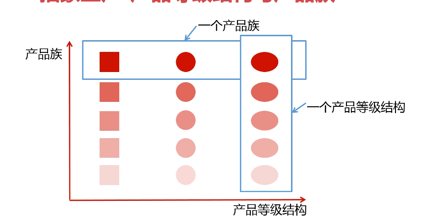

# 抽象工厂

## 定义
  抽象工厂模式提供一个创建一系列相关或相互依赖对象的的接口。无须指定它们具体的类。                     
## 类型
  创建型
## 使用场景
  - 客户端（应用层）不依赖于产品实例如何被创建、实现等细节
  - 强调一系列相关的产品对象（属于同一产品族）一起使用创建对象需要大量重复的代码
  - 提供一个产品类的库，所有的产品以同样的接口出现，从而使客户端不依赖于具体实现。
   
## 优点
  - 应用层代码不和具体的产品发生依赖，只和具体的产品族工厂发生依赖关系，低耦合，高内聚
  - 从具体的产品工厂取出来的肯定是同一产品族，开发的时候逻辑清晰
  - 对于产品族来说，符合开闭原则，增加新的产品族的时候，对扩展开放
## 缺点
  规定了所有可能被创建的产品集合，产品族中扩展新的产品困难，需要修改抽象工程的接口。增加了系统的抽象性和理解难度。 
## 为何有产品族的业务场景宜用抽象工厂设计模式？而不是工厂设计模式
  如果使用工厂设计模式，可能会因为工厂类太多而产生类爆炸的现象
## 产品族和产品等级

- 工厂方法针对的就是产品等级结构，它处理的就是同一类型产品（如：产品类型都是冰箱但是有不同品牌）
- 抽象工厂针对的就是产品族，它处理的就是一系列产品（如：海尔旗下不同的产品）

## 
## 简单场景说明
   一个课程不仅要有视频资料，还需要有对应的笔记,这样两者都存在才是一门课程。

## 抽象工厂演练


**笔记**
```java
package com.design.pattern.abstractfactory;

/**
 * Article
 *
 * @author shunhua
 * @date 2019-09-10
 */
public abstract class Article {
    /**
     * 生产笔记的方法
     */
  public abstract void produce();
}
```

**java笔记**
```java
package com.design.pattern.abstractfactory;

import lombok.extern.slf4j.Slf4j;

/**
 * JavaArticle
 *
 * @author shunhua
 * @date 2019-09-10
 */
@Slf4j
public class JavaArticle extends Article {

    @Override
    public void produce() {
        log.info("生产Java笔记");
    }
}
```
**python笔记**
```java
package com.design.pattern.abstractfactory;

import lombok.extern.slf4j.Slf4j;

/**
 * PythonArticle
 *
 * @author shunhua
 * @date 2019-09-10
 */
@Slf4j
public class PythonArticle extends Article {

    @Override
    public void produce() {
        log.info("生产python笔记");
    }
}
```

**视频资源**
```java
package com.design.pattern.abstractfactory;

/**
 * Video
 *
 * @author shunhua
 * @date 2019-09-10
 */
public abstract class Video {
    /**
     * 生产视频的抽象方法
     */
   public abstract void produce();
}
```

**Java视频资源**
```java
package com.design.pattern.abstractfactory;

import lombok.extern.slf4j.Slf4j;

/**
 * JavaVideo
 *
 * @author shunhua
 * @date 2019-09-10
 */
@Slf4j
public class JavaVideo extends Video {

    @Override
    public void produce() {
        log.info("生成Java视频资源");
    }
}
```

**python视频资源**
```java
package com.design.pattern.abstractfactory;

import lombok.extern.slf4j.Slf4j;

/**
 * PythonVideo
 *
 * @author shunhua
 * @date 2019-09-10
 */
@Slf4j
public class PythonVideo extends Video {

    @Override
    public void produce() {
        log.info("生产python视频");
    }
}
```

**课程工厂（产品族工厂）**
```java
package com.design.pattern.abstractfactory;

/**
 * CourseFactory
 *
 * @author shunhua
 * @date 2019-09-10
 */
public interface CourseFactory {
    /**
     * 生产视频
     * @return
     */
    Video getVideo();
    /**
     * 生产笔记
     * @return
     */
    Article getArticle();
}
```

**Java课程工厂**
```java
package com.design.pattern.abstractfactory;

/**
 * JavaCourseFactory
 *
 * @author shunhua
 * @date 2019-09-10
 */
public class JavaCourseFactory implements CourseFactory {

    @Override
    public Video getVideo() {
        return new JavaVideo();
    }

    @Override
    public Article getArticle() {
        return new JavaArticle();
    }
}
```

**Python课程工厂**
```java
package com.design.pattern.abstractfactory;

/**
 * PythonCourseFactory
 *
 * @author shunhua
 * @date 2019-09-10
 */
public class PythonCourseFactory implements CourseFactory{

    @Override
    public Video getVideo() {
        return new PythonVideo();
    }

    @Override
    public Article getArticle() {
        return new PythonArticle();
    }
}
```

**客户端**
```java
package com.design.pattern.abstractfactory;

import org.junit.Test;

/**
 * Client
 *
 * @author shunhua
 * @date 2019-09-10
 */
public class Client {

    @Test
    public void test(){
        CourseFactory courseFactory = new JavaCourseFactory();
        Video video = courseFactory.getVideo();
        Article article = courseFactory.getArticle();
        video.produce();
        article.produce();
    }
}
```  

## 抽象工厂在源码中的使用

### 连接源码解析
**Connection的两个方法属性同一个产品族，这是一个父类**

```java
// mysql和oracle获取的是同一产品族下的statement和同一产品族下的preparestatement
public interface Connection  extends Wrapper, AutoCloseable {

    Statement createStatement() throws SQLException;

    PreparedStatement prepareStatement(String sql)
        throws SQLException;
    
    // ...
   } 
   
   
// executeQuery方法和execureUpdate方法属于同一个产品族
public interface Statement extends Wrapper, AutoCloseable {

    ResultSet executeQuery(String sql) throws SQLException;

    int executeUpdate(String sql) throws SQLException;

  }
```

### MyBatis的SqlSession源码解析

java.sql.Connection/java.sql.Statement/org.apache.ibatis.session.SqlSessionFactory等 接口就是一个抽象工厂（从同一个抽象工厂中
返回的产品一定属于同一个产品族）它里面有多个工厂方法，它的实现类通过实现不同的工厂方法，来创建出不同的产品。

**SqlSessionFactory**
```java
package org.apache.ibatis.session;

import java.sql.Connection;

/**
 * Creates an {@link SqlSession} out of a connection or a DataSource
 *
 * @author Clinton Begin
 */
public interface SqlSessionFactory {

  SqlSession openSession();

  SqlSession openSession(boolean autoCommit);
  SqlSession openSession(Connection connection);
  SqlSession openSession(TransactionIsolationLevel level);

  SqlSession openSession(ExecutorType execType);
  SqlSession openSession(ExecutorType execType, boolean autoCommit);
  SqlSession openSession(ExecutorType execType, TransactionIsolationLevel level);
  SqlSession openSession(ExecutorType execType, Connection connection);

  Configuration getConfiguration();

}
```
**SqlSessionFactory子类 SqlSessionManager**
**SqlSessionFactory子类 DefaultSqlSessionFactory**
