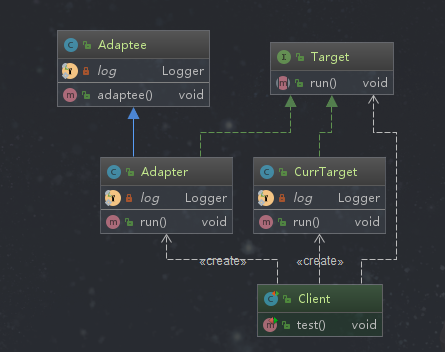
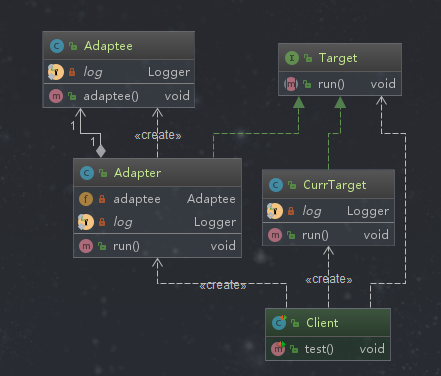

# 适配器模式

## 定义

将一个类（被适配者）转换成客户期望的另一个接口（目标），使原本接口不兼容的类（它们的接口不同）可以一起工作（使用同一接口了）。

## 类型

结构型

## 应用场景

```text
◆已经存在的类，它的方法和需求不匹配时
◆不是软件设计阶段考虑的设计模式，是随着软件维护，由于不同产品、不同厂家造成功能类似而接口不相同情况下的解决方案，是软件维护阶段需要考虑的事情
```

## 优点

```text
◆能提高类的透明性和复用，现有的类复用但不需要改变，解决了现有类和目标类不匹配的问题
◆目标类和适配器类解耦，提高程序扩展性
◆符合开闭原则，具体的操作都在适配者中，客户端只知道适配者，扩展只需对适配者扩展即可
```

## 缺点

```text
◆适配器编写过程需要全面考虑，可能会增加系统的复杂性
◆增加系统代码可读的难度，如我们调用的是A接口实现，其实内部已经被适配成了B接口的实现
```

## 扩展

```text
◆对象适配器（符合组合复用原则，并且使用委托机制）
◆类适配器（通过类继承实现）
```

## 相关的设计模式

适配器模式和外观模式

```text
a 都是现有类现存系统的封装，前者复用原有的接口，后者定义了新的接口
b 前者使原有的两个接口协同工作，后者在现有的系统中提供一个更为方便的访问入口
c 适配力度不同，后者适配整个子系统
```

## 适配器模式演练

```text
类适配器通过 继承关系 达到适配的目的，而对象适配器通过 组合 达到适配目的 
```

### 类适配器模式


*被适配者*
```java
package com.design.pattern.adapter.classadapter;

import lombok.extern.slf4j.Slf4j;

/**
 * Adaptee 被适配者
 *
 * @author shunhua
 * @date 2019-09-21
 */
@Slf4j
public class Adaptee {
    /**
     * 适配方法，想要和目标类一起工作
     */
   public void adaptee(){
       log.info("被适配者...run");
   }
}
```
*适配器（适配者）*
```java
package com.design.pattern.adapter.classadapter;

import lombok.extern.slf4j.Slf4j;

/**
 * Adapter
 *
 * @author shunhua
 * @date 2019-09-21
 */
@Slf4j
public class Adapter extends Adaptee implements Target {
    /**
     * 1、适配者只是实现目标类的接口，并且继承被适配类，这样使得被适配类拥有目标类相容的接口
     * 2、在适配器实现目标接口的方法中调用父类被适配者的方法
     */
    @Override
    public void run() {
        // TODO 这里可以添加其他的操作
        log.info("适配器...run");
        super.adaptee();
    }
}
```

*目标接口*
```java
package com.design.pattern.adapter.classadapter;

/**
 * Target 目标类接口
 *
 * @author shunhua
 * @date 2019-09-21
 */
public interface Target {
    /**
     * 目标操作
     */
    void run();
}
```

*目标类*
```java
package com.design.pattern.adapter.classadapter;

import lombok.extern.slf4j.Slf4j;

/**
 * CurrTarget 目标接口的实现类，可省去，只是作比较
 *
 * @author shunhua
 * @date 2019-09-21
 */
@Slf4j
public class CurrTarget implements Target {

    @Override
    public void run() {
        log.info("目标...run");
    }
}
```

*客户端*
```java
package com.design.pattern.adapter.classadapter;

import org.junit.Test;

/**
 * Client
 *
 * @author shunhua
 * @date 2019-09-21
 */
public class Client {

    @Test
    public void test(){
        // 目标类的操作
        Target target = new CurrTarget();
        // 目标类的方法
        target.run();

        // 被适配者通过适配器进行适配，可以和目标类一起工作
        target = new Adapter();
        // 适配者的方法，内部是被适配者的方法
        target.run();
    }
}
```
### 对象适配模式


*被适配者*
```java
package com.design.pattern.adapter.objectadapter;

import lombok.extern.slf4j.Slf4j;

/**
 * Adaptee 被适配者
 *
 * @author shunhua
 * @date 2019-09-21
 */
@Slf4j
public class Adaptee {
    /**
     * 适配方法，想要和目标类一起工作
     */
   public void adaptee(){
       log.info("被适配者...run");
   }
}
```
*适配器（适配者）*
```java
package com.design.pattern.adapter.objectadapter;

import lombok.extern.slf4j.Slf4j;

/**
 * Adapter
 *
 * @author shunhua
 * @date 2019-09-21
 */
@Slf4j
public class Adapter implements Target {
    /**
     * 通过组合
     */
    private Adaptee adaptee = new Adaptee();

    /**
     * 1 适配器是实现了目标类的接口，为了是被适配者和目标类拥有同一接口
     * 2 通过组合的方法，直接在适配器实现目标接口的方法中调用被适配者实例的方法
     */
    @Override
    public void run() {
        // TODO 可以根据具体业务增加其他的操作
        log.info("适配器...run");
        adaptee.adaptee();
    }
}
```

*目标接口*
```java
package com.design.pattern.adapter.objectadapter;

/**
 * Target 目标类接口
 *
 * @author shunhua
 * @date 2019-09-21
 */
public interface Target {
    /**
     * 目标操作
     */
    void run();
}

```

*目标类*
```java
package com.design.pattern.adapter.objectadapter;

;
import lombok.extern.slf4j.Slf4j;

/**
 * CurrTarget 目标接口的实现类，可省去，只是作比较
 *
 * @author shunhua
 * @date 2019-09-21
 */
@Slf4j
public class CurrTarget implements Target {

    @Override
    public void run() {
        log.info("目标...run");
    }
}
```

*客户端*
```java
package com.design.pattern.adapter.objectadapter;

import org.junit.Test;

/**
 * Client
 *
 * @author shunhua
 * @date 2019-09-22
 */
public class Client {

    @Test
    public void test(){
        // 目标类
        Target target = new CurrTarget();
        target.run();

        // 通过适配器把被适配者转换成目标接口类型
        target = new Adapter();
        // 调用适配器实现目标接口的方法，内部调用的是被适配者的方法
        target.run();
    }

}
```
### 简单需求
```text
手机电源适配器可以把220v交流电转化为5v直流电
```
*目标接口-5v直流电*
```java
package com.design.pattern.adapter.demand;

/**
 * DC5V  目标电压
 *
 * @author shunhua
 * @date 2019-09-22
 */
public interface DC5V {
    /**
     * 5V直流电
     * @return
     */
     int outPutDC5V();
}
```

*需要被适配的类-220v交流电*
```java
package com.design.pattern.adapter.demand;

import lombok.extern.slf4j.Slf4j;

/**
 * AC220V  需要被适配的电压
 *
 * @author shunhua
 * @date 2019-09-22
 */
@Slf4j
public class AC220V {
    /**
     * 220V交流电
     * @return
     */
    public int outputAC220V(){
        return 220;
    }

}
```
*变压器-适配器*
```java
package com.design.pattern.adapter.demand;

import lombok.extern.slf4j.Slf4j;

/**
 * PowerAdapter  电源适配器
 *
 * @author shunhua
 * @date 2019-09-22
 */
@Slf4j
public class PowerAdapter implements DC5V {
    /**
     *  通过组合的方式
     */
   private AC220V ac220V = new AC220V();

    @Override
    public int outPutDC5V() {
        int ac = ac220V.outputAC220V();
        int target = ac/44;
        // 变压处理
        log.info(String.format("适配器处理后，%dV电压变为%dV",220,target));
        return 5;
    }
}
```

*客户端*
```java
package com.design.pattern.adapter.demand;

import org.junit.Test;

/**
 * Client
 *
 * @author shunhua
 * @date 2019-09-22
 */
public class Client {

    @Test
    public void test() {
       DC5V dc5V = new PowerAdapter();
       // 通过PowerAdapter适配，把220V交流转为5V直流电
       dc5V.outPutDC5V();
    }
}
```

## 源码解析

```text
在SpringMVC中，前端控制器接到请求后会通过处理器映射器找处理器，然后返回一个处理器执行链，接着通过匹配处理器适配器来确定哪一个处理器适配器可以适配当前的处理器，确定后执行处理方法，然后返回ModelAndView。
```
```java

	protected void doDispatch(HttpServletRequest request, HttpServletResponse response) throws Exception {
		HttpServletRequest processedRequest = request;
		HandlerExecutionChain mappedHandler = null;
		boolean multipartRequestParsed = false;

		WebAsyncManager asyncManager = WebAsyncUtils.getAsyncManager(request);

		try {
			ModelAndView mv = null;
			Exception dispatchException = null;

			try {
				processedRequest = checkMultipart(request);
				multipartRequestParsed = (processedRequest != request);

				// Determine handler for the current request.
				mappedHandler = getHandler(processedRequest);
				if (mappedHandler == null) {
					noHandlerFound(processedRequest, response);
					return;
				}

				// 找到处理器对应的处理器适配器
				HandlerAdapter ha = getHandlerAdapter(mappedHandler.getHandler());

				// Process last-modified header, if supported by the handler.
				String method = request.getMethod();
				boolean isGet = "GET".equals(method);
				if (isGet || "HEAD".equals(method)) {
					long lastModified = ha.getLastModified(request, mappedHandler.getHandler());
					if (new ServletWebRequest(request, response).checkNotModified(lastModified) && isGet) {
						return;
					}
				}

				if (!mappedHandler.applyPreHandle(processedRequest, response)) {
					return;
				}

				// 实际调用处理器，然后返回ModelAndView
				mv = ha.handle(processedRequest, response, mappedHandler.getHandler());

				if (asyncManager.isConcurrentHandlingStarted()) {
					return;
				}

				applyDefaultViewName(processedRequest, mv);
				mappedHandler.applyPostHandle(processedRequest, response, mv);
			}
			catch (Exception ex) {
				dispatchException = ex;
			}
			catch (Throwable err) {
				// As of 4.3, we're processing Errors thrown from handler methods as well,
				// making them available for @ExceptionHandler methods and other scenarios.
				dispatchException = new NestedServletException("Handler dispatch failed", err);
			}
			processDispatchResult(processedRequest, response, mappedHandler, mv, dispatchException);
		}
		catch (Exception ex) {
			triggerAfterCompletion(processedRequest, response, mappedHandler, ex);
		}
		catch (Throwable err) {
			triggerAfterCompletion(processedRequest, response, mappedHandler,
					new NestedServletException("Handler processing failed", err));
		}
		finally {
			if (asyncManager.isConcurrentHandlingStarted()) {
				// Instead of postHandle and afterCompletion
				if (mappedHandler != null) {
					mappedHandler.applyAfterConcurrentHandlingStarted(processedRequest, response);
				}
			}
			else {
				// Clean up any resources used by a multipart request.
				if (multipartRequestParsed) {
					cleanupMultipart(processedRequest);
				}
			}
		}
	}
	
// 匹配合适的处理器适配器
	/**
	 * Return the HandlerAdapter for this handler object.
	 * @param handler the handler object to find an adapter for
	 * @throws ServletException if no HandlerAdapter can be found for the handler. This is a fatal error.
	 */
	protected HandlerAdapter getHandlerAdapter(Object handler) throws ServletException {
		if (this.handlerAdapters != null) {
			for (HandlerAdapter adapter : this.handlerAdapters) {
				if (adapter.supports(handler)) {
					return adapter;
				}
			}
		}
		throw new ServletException("No adapter for handler [" + handler +
				"]: The DispatcherServlet configuration needs to include a HandlerAdapter that supports this handler");
	}	
```