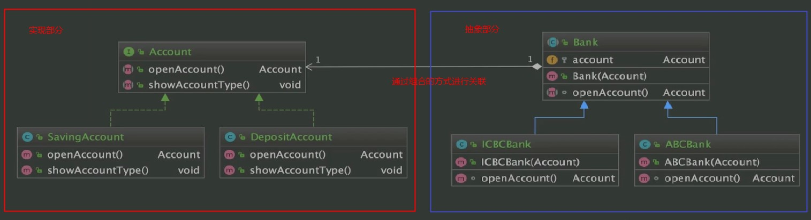

#  桥接模式

## 定义

### 定义

将抽象部分与它的具体实现部分分离开来，使它们都可以独立地变化（这在一定程度上实现解耦）。桥接模式将继承关系转化成关联关系，它降低了类与类之间的耦合度，减少了系统中类的数量，防止类爆炸。从它的命名可以看出，
bridge是桥梁的意思， 将桥两边联系起来。目的就是把两个不同的类之间建立联系，而两个类之间建立联系的方式有很多，而桥接模式是通过组合的方式建立两个不同类之间的关系，而不是继承。这也符合*合成复用原则*：优先
通过组合的方式建立两个类之间联系，而不是继承，继承过多会发生类爆炸的情况。*说明一点:*这里说的抽象部分和具体实现部分，并不局限一个是抽象的，另一个是具体的实现，这只是从概念上去定义。

```
将抽象部分与它的具体实现部分分离，其实这并不是将抽象类与他的派生类分离，而是抽象类和它的派生类用来实现自己的对象。或者说在一个系统的抽象化和实现化之间使用关联关系（组合或者聚合关系）而不是继承关系，从而使两者可以相对独立地变化。
```
### 类型

结构型

### 适用场景

1. 抽象和具体实现之间增加更多的灵活性

   ```
   使用桥接模式就可以避免在这两个层次之间建立静态的继承关系，而是建立关联关系。此外，抽象部分和具体实现部分，它们都可以分别通过继承关系独立扩展，并且互不影响，就可以动态地将一个抽象化子类的对象和一个具体实现化子类的对象进行组合，这样就把抽象化角色和具体实现化角色实现了解耦。
   ```

2. 一个类存在两个（或多个）独立变化的维度，且这两个（或多个）维度都需要独立进行扩展

   ```
   抽象的部分可以独立扩展，具体实现也可以独立扩展
   ```

3. 不希望使用继承，或因为多层继承导致系统类的个数剧增

### 优点

1. 分离抽象部分及其具体实现部分

   ```
   因为桥接模式使用了组合，使用对象间的关联关系，来解耦了抽象和具体实现之间的固有绑定关系，使抽象和实现可以沿着各自的维度进行扩展、变化。也就是说，抽象和实现不在同一个继承层次结构中，从而通过组合来获得多维度的组合对象。
   ```

2. 提高了系统的可扩展性

   ```
   在两个变化维度中，扩展任意一个维度都不需要修改原有的系统
   ```

3. 符合开闭原则

4. 符合合成复用原则

### 缺点

1. 增加了系统的理解与设计难度

   ```
   由于类之间的关系建立在抽象层，要求我们在编码的时候，一开始就要针对抽象层进行设计和编程
   ```

2. 需要正确地识别出系统中两个独立变化的维度


 ### 相关设计模式

1. 组合模式

   ```
   组合模式更强调的是部分和整体间的组合，而桥接模式强调的是平行级别上不同类的组合
   ```

2. 适配器模式

   ```
   适配器模式和桥接模式都是为了让两个东西配合工作，但它们两个的目的不一样，适配器模式是改变已有的接口，让它们之间可以相互配合，而桥接模式是分离抽象和具体实现。也就是说，适配器模式可以把功能上相似但是接口不同的类适配起来，而桥接模式是把类的抽象和类的具体实现分离开，然后在此基础上使这些层次结构结合起来。
   ```
### 关键一点
 桥接模式重要的就是把抽象和具体实现分离开，中间通过组合来搭建它们之间的桥梁

## 案例分析

1. 场景

   ```
   1）有两个银行，分别是ABC和ICBC银行，同时有两个账号，分别是定期账号和活期账号。
   2）使用桥接模式可以 让实现（这里就是账号具体实现）和抽象（这里就是抽象的银行类）分离，银行属性增加修改银行类即可，账号类属性增加修改账号类即可。逻辑清晰，同时也解决了上述类爆炸的情况。
   ```

2. 编码

   - 账号接口 Account

     ```Java
     public interface Account {
         /**
          * 开户
          */
         Account openAccount();
         /**
          * 开户类型
          */
         void showAccountType();
     }
     ```

     ​

   - 账号的两个实现类 SavingAccount和 DepositAccount

     ```Java
     public class SavingAccount implements Account {
         @Override
         public Account openAccount() {
             System.out.println("SavingAccount--开活期账号");
             return new SavingAccount();
         }

         @Override
         public void showAccountType() {
             System.out.println("SavingAccount--这是一个活期账号");
         }
     }
     -----
     public class DepositAccount implements Account {

         @Override
         public Account openAccount() {
             System.out.println("DepositAccount--开定期账号");
             return new DepositAccount();
         }

         @Override
         public void showAccountType() {
             System.out.println("DepositAccouont--这是一个定期账号");
         }
     }
     ```

     ​

   - 银行抽象类 Bank

     ``` java
     public abstract class Bank {

         /**
          * 这里要写成一个抽象的，因为要把Account引入到Bank里面，通
          * 过这种组合的方式，把Account的行为交给Bank的子类来实现，即
          * Bank这个抽象类中的某个行为要委托给Account这个接口的实现，
          * 抽象和具体的实现分离指定的就是这种情况。
          */

         /**
          * 要交给子类，声明为protected，这样只有子类能够拿到
          */
         protected Account account;

         /**
          * 通过构造器把Account传过来，也可以通过setter注入的方式赋值
          */
         public Bank(Account account){
            this.account = account;
         }
         /**
          *  这个方法要参照Account接口中的方法，因为Bank里面的具体方法要委托给Account里面
          *  的openAccount方法，但这里面方法名不要求一定一致
          */
         abstract Account openAccount();

     }
     ```

     ​

   - 银行抽象类的子类 ABCBank和ICBCBank

     ``` java
     public class ABCBank extends Bank  {

         /**
          * 构造的时候传入的是哪个Account就返回哪一个Account(openAccount方法)
          * @param account
          */
         public ABCBank(Account account) {
             super(account);
         }

         /**
          * 这里返回的就是父类中的Account
          * @return
          */
         @Override
         Account openAccount() {
             System.out.println("ABCBank--开户中国农业银行账号");
             // 很重要，要使用父类里组合进来的Account，不然桥接模式就没什么意义了
             account.openAccount();
             return account;
         }
     }
     ---
     public class ICBCBank extends Bank {

         /**
          *  构造的时候传入的是哪个Account就返回哪一个Account(openAccount方法)
          * @param account
          */
         public ICBCBank(Account account) {
             super(account);
         }

         /**
          * 这里返回的就是父类中的Account
          * @return
          */
         @Override
         Account openAccount() {
             System.out.println("ICBC--开户中国工商银行账号");
             // 很重要，要使用父类里组合进来的Account，不然桥接模式就没什么意义了
             account.openAccount();
             return account;
         }
     }
     ```

   - 单元测试 TestDemo

     ``` java
     public class TestDemo {

         public static void main(String[] args) {
             // ICBCBank-DepositAccount
             Bank icbcBank = new ICBCBank(new DepositAccount());
             Account icbcAccount = icbcBank.openAccount();
             System.out.println("**************************");
             icbcAccount.showAccountType();
             System.out.println("--------------------------");
             // ICBCBank-SavingAccount
             Bank icbcBank2 = new ICBCBank(new SavingAccount());
             Account icbcAccount2 = icbcBank2.openAccount();
             System.out.println("**************************");
             icbcAccount2.showAccountType();
             System.out.println("--------------------------");

             // ABCBank-DepositAccount
             Bank abcBank2 = new ABCBank(new DepositAccount());
             Account abcAccount2 = abcBank2.openAccount();
             System.out.println("**************************");
             abcAccount2.showAccountType();
             System.out.println("--------------------------");
             // ABCBank-SavingAccount
             Bank abcBank = new ABCBank(new SavingAccount());
             Account abcAccount = abcBank.openAccount();
             System.out.println("**************************");
             abcAccount.showAccountType();
         }
     }
     ```

### 总结

 

通过桥接模式，把实现部分Account（Account的具体实现类）和抽象部分Bank（Bank抽象类）进行了桥接，使用组合作为一根线连接它们。当然也有聚合的方式实现桥接。
     
     
## 桥接模式在JDK源码中的应用

### 实现部分

```text
java.sql.Driver接口的实现： 如MySQL的Driver，Oracle的Driver

```

*Driver接口*

```Java

package java.sql;

import java.util.logging.Logger;

/**
 * The interface that every driver class must implement.
 * <P>The Java SQL framework allows for multiple database drivers.
 *
 * <P>Each driver should supply a class that implements
 * the Driver interface.
 *
 * <P>The DriverManager will try to load as many drivers as it can
 * find and then for any given connection request, it will ask each
 * driver in turn to try to connect to the target URL.
 *
 * <P>It is strongly recommended that each Driver class should be
 * small and standalone so that the Driver class can be loaded and
 * queried without bringing in vast quantities of supporting code.
 *
 * <P>When a Driver class is loaded, it should create an instance of
 * itself and register it with the DriverManager. This means that a
 * user can load and register a driver by calling:
 * <p>
 * {@code Class.forName("foo.bah.Driver")}
 * <p>
 * A JDBC driver may create a {@linkplain DriverAction} implementation in order
 * to receive notifications when {@linkplain DriverManager#deregisterDriver} has
 * been called.
 * @see DriverManager
 * @see Connection
 * @see DriverAction
 */
public interface Driver {

   
    Connection connect(String url, java.util.Properties info)
        throws SQLException;

    boolean acceptsURL(String url) throws SQLException;

    DriverPropertyInfo[] getPropertyInfo(String url, java.util.Properties info)
                         throws SQLException;

    int getMajorVersion();

   
    int getMinorVersion();


    boolean jdbcCompliant();

    public Logger getParentLogger() throws SQLFeatureNotSupportedException;
}

```

*Driver接口的MySql驱动实现*

```java
package com.mysql.cj.jdbc;

import java.sql.SQLException;

/**
 * The Java SQL framework allows for multiple database drivers. Each driver should supply a class that implements the Driver interface
 * 
 * <p>
 * The DriverManager will try to load as many drivers as it can find and then for any given connection request, it will ask each driver in turn to try to
 * connect to the target URL.
 * 
 * <p>
 * It is strongly recommended that each Driver class should be small and standalone so that the Driver class can be loaded and queried without bringing in vast
 * quantities of supporting code.
 * 
 * <p>
 * When a Driver class is loaded, it should create an instance of itself and register it with the DriverManager. This means that a user can load and register a
 * driver by doing Class.forName("foo.bah.Driver")
 */
public class Driver extends NonRegisteringDriver implements java.sql.Driver {
    //
    // Register ourselves with the DriverManager
    //
    static {
        try {
            // 把驱动注册到DriverManager中
            java.sql.DriverManager.registerDriver(new Driver());
        } catch (SQLException E) {
            throw new RuntimeException("Can't register driver!");
        }
    }

    /**
     * Construct a new driver and register it with DriverManager
     * 
     * @throws SQLException
     *             if a database error occurs.
     */
    public Driver() throws SQLException {
        // Required for Class.forName().newInstance()
    }
}
```

### 抽象部分

```text
java.sql.DriverManager这个类作为抽象部分，它并不是抽象类。再次说明，抽象部分并不一定就是抽象类或接口，只是从桥接模式整体看，把它分为两大部分。registeredDrivers作为实现部分组合到抽象部分。
```
*DriverInfo*
实现部分的父类型接口Driver只是作为DriverInfo的一个属性

```java

class DriverInfo {
   
    final Driver driver;
    DriverAction da;
    DriverInfo(Driver driver, DriverAction action) {
        this.driver = driver;
        da = action;
    }

    @Override
    public boolean equals(Object other) {
        return (other instanceof DriverInfo)
                && this.driver == ((DriverInfo) other).driver;
    }

    @Override
    public int hashCode() {
        return driver.hashCode();
    }

    @Override
    public String toString() {
        return ("driver[className="  + driver + "]");
    }

    DriverAction action() {
        return da;
    }
}

```

*DriverManager*

```Java
  package java.sql;
  
  import java.util.Iterator;
  import java.util.ServiceLoader;
  import java.security.AccessController;
  import java.security.PrivilegedAction;
  import java.util.concurrent.CopyOnWriteArrayList;
  import sun.reflect.CallerSensitive;
  import sun.reflect.Reflection;
  
  
  /**
   * @see Driver
   * @see Connection
   */
  public class DriverManager {
  
  
      // 注册 JDBC driver 的列表
      private final static CopyOnWriteArrayList<DriverInfo> registeredDrivers = new CopyOnWriteArrayList<>();
      private static volatile int loginTimeout = 0;
      private static volatile java.io.PrintWriter logWriter = null;
      private static volatile java.io.PrintStream logStream = null;
      // Used in println() to synchronize logWriter
      private final static  Object logSync = new Object();
  
      /* Prevent the DriverManager class from being instantiated. */
      private DriverManager(){}
  
  
      /**
       * Load the initial JDBC drivers by checking the System property
       * jdbc.properties and then use the {@code ServiceLoader} mechanism
       */
      static {
          loadInitialDrivers();
          println("JDBC DriverManager initialized");
      }
  
      /**
       * The <code>SQLPermission</code> constant that allows the
       * setting of the logging stream.
       * @since 1.3
       */
      final static SQLPermission SET_LOG_PERMISSION =
          new SQLPermission("setLog");
  
      /**
       * The {@code SQLPermission} constant that allows the
       * un-register a registered JDBC driver.
       * @since 1.8
       */
      final static SQLPermission DEREGISTER_DRIVER_PERMISSION =
          new SQLPermission("deregisterDriver");
  
      //--------------------------JDBC 2.0-----------------------------
  
      /**
       * Retrieves the log writer.
       *
       * The <code>getLogWriter</code> and <code>setLogWriter</code>
       * methods should be used instead
       * of the <code>get/setlogStream</code> methods, which are deprecated.
       * @return a <code>java.io.PrintWriter</code> object
       * @see #setLogWriter
       * @since 1.2
       */
      public static java.io.PrintWriter getLogWriter() {
              return logWriter;
      }
      
      public static void setLogWriter(java.io.PrintWriter out) {
  
          SecurityManager sec = System.getSecurityManager();
          if (sec != null) {
              sec.checkPermission(SET_LOG_PERMISSION);
          }
              logStream = null;
              logWriter = out;
      }
  
  
    
      @CallerSensitive
      public static Connection getConnection(String url,
          java.util.Properties info) throws SQLException {
  
          return (getConnection(url, info, Reflection.getCallerClass()));
      }
  
    
      @CallerSensitive
      public static Connection getConnection(String url,
          String user, String password) throws SQLException {
          java.util.Properties info = new java.util.Properties();
  
          if (user != null) {
              info.put("user", user);
          }
          if (password != null) {
              info.put("password", password);
          }
  
          return (getConnection(url, info, Reflection.getCallerClass()));
      }
  
     
      @CallerSensitive
      public static Connection getConnection(String url)
          throws SQLException {
  
          java.util.Properties info = new java.util.Properties();
          return (getConnection(url, info, Reflection.getCallerClass()));
      }
      
  
      /**
       * Attempts to locate a driver that understands the given URL.
       * The <code>DriverManager</code> attempts to select an appropriate driver from
       * the set of registered JDBC drivers.
       *
       * @param url a database URL of the form
       *     <code>jdbc:<em>subprotocol</em>:<em>subname</em></code>
       * @return a <code>Driver</code> object representing a driver
       * that can connect to the given URL
       * @exception SQLException if a database access error occurs
       */
      @CallerSensitive
      public static Driver getDriver(String url)
          throws SQLException {
  
          println("DriverManager.getDriver(\"" + url + "\")");
  
          Class<?> callerClass = Reflection.getCallerClass();
          
          for (DriverInfo aDriver : registeredDrivers) {
              // If the caller does not have permission to load the driver then
              // skip it.
              if(isDriverAllowed(aDriver.driver, callerClass)) {
                  try {
                      if(aDriver.driver.acceptsURL(url)) {
                          // Success!
                          println("getDriver returning " + aDriver.driver.getClass().getName());
                      return (aDriver.driver);
                      }
  
                  } catch(SQLException sqe) {
                      // Drop through and try the next driver.
                  }
              } else {
                  println("    skipping: " + aDriver.driver.getClass().getName());
              }
  
          }
  
          println("getDriver: no suitable driver");
          throw new SQLException("No suitable driver", "08001");
      }
      
      
     /**
         * Registers the given driver with the {@code DriverManager}.
         * A newly-loaded driver class should call
         * the method {@code registerDriver} to make itself
         * known to the {@code DriverManager}. If the driver is currently
         * registered, no action is taken.
         *
         * @param driver the new JDBC Driver that is to be registered with the
         *               {@code DriverManager}
         * @exception SQLException if a database access error occurs
         * @exception NullPointerException if {@code driver} is null
         */
        public static synchronized void registerDriver(java.sql.Driver driver)
            throws SQLException {
    
            registerDriver(driver, null);
        }
    
        /**
         * Registers the given driver with the {@code DriverManager}.
         * A newly-loaded driver class should call
         * the method {@code registerDriver} to make itself
         * known to the {@code DriverManager}. If the driver is currently
         * registered, no action is taken.
         *
         * @param driver the new JDBC Driver that is to be registered with the
         *               {@code DriverManager}
         * @param da     the {@code DriverAction} implementation to be used when
         *               {@code DriverManager#deregisterDriver} is called
         * @exception SQLException if a database access error occurs
         * @exception NullPointerException if {@code driver} is null
         * @since 1.8
         */
        public static synchronized void registerDriver(java.sql.Driver driver,
                DriverAction da)
            throws SQLException {
    
            /* Register the driver if it has not already been added to our list */
            if(driver != null) {
                registeredDrivers.addIfAbsent(new DriverInfo(driver, da));
            } else {
                // This is for compatibility with the original DriverManager
                throw new NullPointerException();
            }
    
            println("registerDriver: " + driver);
    
        }
}

```

   ​

   ​

   ​

   ​

   ​


