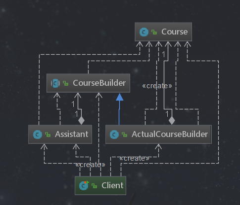
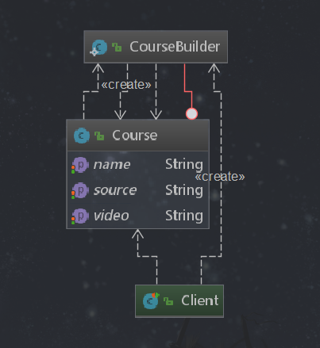

# 建造者模式

## 定义
 将一个复杂对象的构建与它的表示分离，使得同样的构建过程可以创建不同的表示。用户只需指定需要建造的类型就可以得到它们，建造过程及细节不需要知道。
## 类型
  创建型
## 适用场景
 - 如果一个对象有非常复杂的内部结构（很多属性）
 - 想把复杂对象的创建和使用分离
## 优点
 - 封装性好，创建和使用分离
 - 扩展性好、建造类之间独立、一定程度上解耦

## 缺点
 - 产生多余的Builder对象
 - 产品内部发生变化，建造者都需要修改，成本较大

## 建造者模式和工厂模式比较

 - 建造者模式更注重方法的调用顺序，而工厂模式更注重生产产品
 - 创建对象的粒度不同，建造者模式可以创建复杂的产品，有各种复杂的部件组成。而工程模式创建出来的都几乎一个样子
 - 工厂模式注重把产品创建出来，而建造者不仅要创建出产品，还要知道产品有哪些部件组成的
 
## 简单需求说明
 有一个课程需要上线在网站，这个课程需要满足以下条件：课程名、课程的课件资源以及视频资源，只有这个三个组件有了
 才能组装成上线的课程。这里在创建课时，需要有顺序的执行，最终得到一个符合要求的课程。 
 
#### v1 通过中间类实现
uml类图
 

**课程类**
```java
package com.design.pattern.builder;

import lombok.Data;

/**
 * Course
 *
 * @author shunhua
 * @date 2019-09-11
 */
@Data
public class Course {
    /**
     * 课程名
     */
    private String name;
    /**
     * 课程资料
     */
    private String source;
    /**
     * 课程视频
     */
    private String video;

}
```
**建造者抽象类**
```java
package com.design.pattern.builder;

/**
 * CourseBuilder
 *
 * @author shunhua
 * @date 2019-09-11
 */
public abstract class CourseBuilder {
    /**
     * 建造课程名
     * @param name
     */
    public abstract void buildName(String name);

    /**
     * 建造课程资料
     * @param source
     */
    public abstract void buildSource(String source);

    /**
     * 建造课程视频
     * @param video
     */
    public abstract void buildVideo(String video);

    /**
     * 构建课程
     * @return
     */
    public abstract Course buildCourse();
}
```

**建造者实现类**
```java
package com.design.pattern.builder;

/**
 * ActualCourseBuilder  真正的课程创建者
 *
 * @author shunhua
 * @date 2019-09-11
 */
public class ActualCourseBuilder extends CourseBuilder{

    private Course course = new Course();

    @Override
    public void buildName(String name) {
       course.setName(name);
    }

    @Override
    public void buildSource(String source) {
       course.setSource(source);
    }

    @Override
    public void buildVideo(String video) {
       course.setVideo(video);
    }

    @Override
    public Course buildCourse() {
        return course;
    }
}
```

**助教（对课程进行组装）**
```java
package com.design.pattern.builder;

/**
 * Assistant 课程助教
 *
 * @author shunhua
 * @date 2019-09-11
 */
public class Assistant {

    private CourseBuilder courseBuilder;

    public void setCourseBuilder(CourseBuilder courseBuilder){
        this.courseBuilder = courseBuilder;
    }

    /**
     * 课程助教 组装课程
     * @param name
     * @param source
     * @param video
     * @return
     */
    public Course buildCourse(String name,String source,String video){
      this.courseBuilder.buildName(name);
      this.courseBuilder.buildSource(source);
      this.courseBuilder.buildVideo(video);
      return this.courseBuilder.buildCourse();
    }

}
```

**客户端**
```java
package com.design.pattern.builder;

import lombok.extern.slf4j.Slf4j;
import org.junit.Test;

/**
 * Client
 *
 * @author shunhua
 * @date 2019-09-11
 */
@Slf4j
public class Client {

    @Test
    public void test(){
        CourseBuilder courseBuilder = new ActualCourseBuilder();
        Assistant assistant = new Assistant();
        assistant.setCourseBuilder(courseBuilder);
        Course course = assistant.buildCourse("Java进阶","ppt","Java进阶视频");
        log.info(course.toString());
    }
}
```

#### v2 静态内部类演练建造者模式（链式调用）

uml类图


```text
静态内部类builder有3个属性，课程类有相同的3个属性，链式调用的时候，给builder全部或者部分赋值，build的时候，把builder对象传送到course，course获取到builder的属性，然后返回这个course；
```
**Course类**
```java
package com.design.pattern.builder.v2;

import lombok.Data;

/**
 * Course
 *
 * @author shunhua
 * @date 2019-09-11
 */
@Data
public class Course {

    /**
     * 课程名
     */
    private String name;
    /**
     * 课程资料
     */
    private String source;
    /**
     * 课程视频
     */
    private String video;

    public Course(CourseBuilder courseBuilder){
       this.name = courseBuilder.name;
       this.source = courseBuilder.source;
       this.video = courseBuilder.video;
    }

    /**
     * 把实体类与对应的创建类写在一起，这种使用更常见,使用链式调用
     */
    public static class CourseBuilder {
        /**
         * 课程名
         */
        private String name;
        /**
         * 课程资料
         */
        private String source;
        /**
         * 课程视频
         */
        private String video;

        public CourseBuilder buildName(String name) {
            this.name = name;
            return this;
        }

        public CourseBuilder buildSource(String source) {
           this.source = source;
           return this;
        }

        public CourseBuilder buildVideo(String video) {
            this.video = video;
            return this;
        }

        /**
         *
         * @return
         */
        public Course build(){
            return new Course(this);
        }
    }

}
```
**客户端**
```java
package com.design.pattern.builder.v2;

import lombok.extern.slf4j.Slf4j;
import org.junit.Test;

/**
 * Client
 *
 * @author shunhua
 * @date 2019-09-11
 */
@Slf4j
public class Client {
   @Test
    public void test(){
       Course course = new Course.CourseBuilder()
               .buildName("java进阶")
               .buildSource("ppt课件")
               .buildVideo("java进阶视频")
               .build();
      log.info(course.toString());
   }
}
```

 

## 建造者模式在源码中的使用

### jdk的StringBuilder和StringBuffer

```java
// 如StringBuilder的append方法
    @Override
     public StringBuilder append(String str) {
         super.append(str);
         return this;
     }
// 如StringBuffer的append方法
 @Override
    public synchronized StringBuffer append(String str) {
        toStringCache = null;
        super.append(str);
        return this;
    }     
```

### MyBatis的SqlSessionFactoryBuilder

```java
 public SqlSessionFactory build(InputStream inputStream, String environment, Properties properties) {
    try {
      // XML配置的builder 来创建 Configuration 
      XMLConfigBuilder parser = new XMLConfigBuilder(inputStream, environment, properties);
      // parse方法创建Configuration ，SqlSessionFactoryBuilder的build方法创建SqlSessionFactory
      return build(parser.parse());
    } catch (Exception e) {
      throw ExceptionFactory.wrapException("Error building SqlSession.", e);
    } finally {
      ErrorContext.instance().reset();
      try {
        inputStream.close();
      } catch (IOException e) {
        // Intentionally ignore. Prefer previous error.
      }
    }
  }
  // 
  public SqlSessionFactory build(Configuration config) {
    return new DefaultSqlSessionFactory(config);
  }
  
// XMLConfigBuilder#parse
 public Configuration parse() {
    if (parsed) {
      throw new BuilderException("Each XMLConfigBuilder can only be used once.");
    }
    parsed = true;
    parseConfiguration(parser.evalNode("/configuration"));
    return configuration;
  }

  private void parseConfiguration(XNode root) {
    try {
      Properties settings = settingsAsPropertiess(root.evalNode("settings"));
      //issue #117 read properties first
      propertiesElement(root.evalNode("properties"));
      loadCustomVfs(settings);
      typeAliasesElement(root.evalNode("typeAliases"));
      pluginElement(root.evalNode("plugins"));
      objectFactoryElement(root.evalNode("objectFactory"));
      objectWrapperFactoryElement(root.evalNode("objectWrapperFactory"));
      reflectorFactoryElement(root.evalNode("reflectorFactory"));
      settingsElement(settings);
      // read it after objectFactory and objectWrapperFactory issue #631
      environmentsElement(root.evalNode("environments"));
      databaseIdProviderElement(root.evalNode("databaseIdProvider"));
      typeHandlerElement(root.evalNode("typeHandlers"));
      mapperElement(root.evalNode("mappers"));
    } catch (Exception e) {
      throw new BuilderException("Error parsing SQL Mapper Configuration. Cause: " + e, e);
    }
  }  
```
