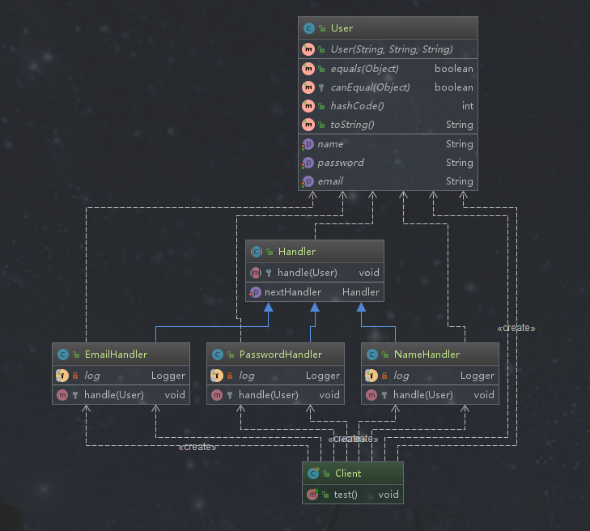

## 责任链模式

### 定义

责任链模式又叫职责链模式。为请求创建一个接收此次请求的对象的链，这个链条由多个对象组成。

### 类型

行为型

### 适用场景

```text
一个请求的处理需要链中一个或多个协作处理
```

### 优点

```text
1.请求的发送者和接收者（请求的处理者）解耦 
2.责任链可以动态组合
3.责任链方便扩展和收缩（增加或减少处理对象）
```

### 缺点

```text
1. 责任链太长或者处理时间过长会影响性能
2. 责任链有可能过多
```

### 相关的设计模式

*责任链模式和状态模式*

```text
责任链模式中各个对象不会指定下一个处理对象是谁，只有在客户端设定链条中的顺序以及元素直到被某个元素处理或整条链结束。状态模式是让每个状态对象知道自己下一个处理的对象是谁，在编译时就设定好了。
```

### 简单需求

在注册网站的时候，我们需要提供用户名、邮箱以及密码，网站会有一个校验流程，分别对用户名、邮箱以及密码进行校验，如果任何一个步骤没有通过就不能注册，只有全部校验通过才能完成注册。

### 责任链模式演练
>责任链的构建是由客户端决定的，责任链的入口也是客户端决定的



*待处理的对象*
```java
package com.design.pattern.chain;

import lombok.AllArgsConstructor;
import lombok.Data;

/**
 * User 待校验的用户
 *
 * @author shunhua
 * @date 2019-10-04
 */
@Data
@AllArgsConstructor
public class User {
    /**
     * 用户名
     */
    private String name;
    /**
     * 邮箱
     */
    private String email;
    /**
     * 密码
     */
    private String password;

}
```

*处理器父类*
```java
package com.design.pattern.chain;

/**
 * Handler 责任链模式的核心
 *
 * 注意：构造责任链是客户端的任务,并且入口也是客户单选择的
 *
 * @author shunhua
 * @date 2019-10-04
 */
public abstract class Handler {

    /**
     * 一个自己类型的对象，一般是子类对象
     */
    protected Handler handler;

    /**
     * 设置下一个处理器
     * @param handler
     */
    public void setNextHandler(Handler handler){
        this.handler = handler;
    }

    /**
     * 交给子类实现，用来校验用户信息是否符合
     * @param user
     */
    protected abstract void handle(User user);

}
```

*名称处理器*
```java
package com.design.pattern.chain;

import lombok.extern.slf4j.Slf4j;
import org.apache.commons.lang3.StringUtils;
import org.springframework.util.ObjectUtils;

/**
 * NameHandler 用户名处理器
 *
 * @author shunhua
 * @date 2019-10-04
 */
@Slf4j
public class NameHandler extends Handler {

    /**
     * 校验用户名
     * @param user
     */
    @Override
    protected void handle(User user) {
        if(StringUtils.isNotBlank(user.getName())){
            log.info("用户名符合要求");
            // 如果有下一个校验器就继续执行，注意这个链的顺序是由客户端决定的
            if(!ObjectUtils.isEmpty(super.handler)){
                super.handler.handle(user);
                return;
            }else {
                log.info("完成注册");
            }
            return;
        }
        log.info("用户名校验不通过，结束校验");
    }
}
```

*邮箱处理器*
```java
package com.design.pattern.chain;

import lombok.extern.slf4j.Slf4j;
import org.apache.commons.lang3.StringUtils;
import org.springframework.util.ObjectUtils;

/**
 * EmailHandler 邮箱校验器
 *
 * @author shunhua
 * @date 2019-10-04
 */
@Slf4j
public class EmailHandler extends  Handler{

    @Override
    protected void handle(User user) {
        if(StringUtils.isNotBlank(user.getEmail())){
           log.info("邮箱符合要求");
           if(!ObjectUtils.isEmpty(super.handler)){
               super.handler.handle(user);
               return;
           }else {
               log.info("完成注册");
           }
           return;
        }
        log.info("邮箱验证不通过，验证结束");
    }
}
```

*密码处理器*
```java
package com.design.pattern.chain;

import lombok.extern.slf4j.Slf4j;
import org.apache.commons.lang3.StringUtils;
import org.springframework.util.ObjectUtils;

/**
 * PasswordHandler 密码验证器
 *
 * @author shunhua
 * @date 2019-10-04
 */
@Slf4j
public class PasswordHandler extends Handler {

    @Override
    protected void handle(User user) {
        if(StringUtils.isNotBlank(user.getPassword()) && user.getPassword().length() >5){
            log.info("密码符合要求");
            if(!ObjectUtils.isEmpty(super.handler)){
                super.handler.handle(user);
                return;
            }else {
                log.info("完成注册");
            }
            return;
        }
        log.info("密码验证不通过，验证结束");
    }
}
```

*客户端*
```java
package com.design.pattern.chain;

import org.junit.Test;

/**
 * Client
 *
 * @author shunhua
 * @date 2019-10-04
 */
public class Client {

    @Test
    public void test(){
        // 创建待验证的用户
        User user = new User("shunhua","gentryhuang.xw@gmail.com","123456");
        // 姓名验证器
        NameHandler nameHandler = new NameHandler();
        // 邮箱验证器
        EmailHandler emailHandler = new EmailHandler();
        // 密码验证器
        PasswordHandler passwordHandler = new PasswordHandler();

        /**
         * 注意：构造责任链是客户端决定的
         *
         * 构建责任链 : NameHandler -> EmailHandler -> PasswordHandler
         */
        nameHandler.setNextHandler(emailHandler);
        emailHandler.setNextHandler(passwordHandler);

        /**
         * 处理请求入口
         */
        nameHandler.handle(user);
    }
}
```
### 责任链在源码中的使用

*过滤器-Filter*

```java
// 以OncePerRequestFilter为例

public abstract class OncePerRequestFilter extends GenericFilterBean {
    public static final String ALREADY_FILTERED_SUFFIX = ".FILTERED";

    public OncePerRequestFilter() {
    }

    public final void doFilter(ServletRequest request, ServletResponse response, FilterChain filterChain) throws ServletException, IOException {
        if (request instanceof HttpServletRequest && response instanceof HttpServletResponse) {
            HttpServletRequest httpRequest = (HttpServletRequest)request;
            HttpServletResponse httpResponse = (HttpServletResponse)response;
            String alreadyFilteredAttributeName = this.getAlreadyFilteredAttributeName();
            boolean hasAlreadyFilteredAttribute = request.getAttribute(alreadyFilteredAttributeName) != null;
            if (!hasAlreadyFilteredAttribute && !this.skipDispatch(httpRequest) && !this.shouldNotFilter(httpRequest)) {
                request.setAttribute(alreadyFilteredAttributeName, Boolean.TRUE);

                try {
                    this.doFilterInternal(httpRequest, httpResponse, filterChain);
                } finally {
                    request.removeAttribute(alreadyFilteredAttributeName);
                }
            } else {
                // 待下一个过滤器处理
                filterChain.doFilter(request, response);
            }

        } else {
            throw new ServletException("OncePerRequestFilter just supports HTTP requests");
        }
    }
  // ...     
}
```
