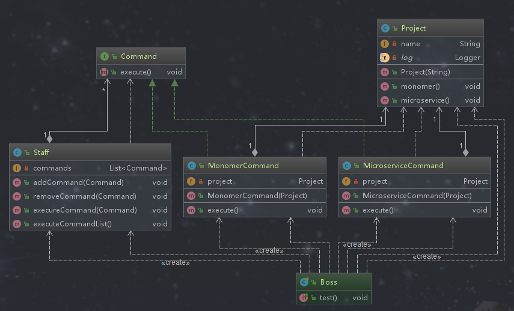

## 命令模式

### 定义

命令模式又叫指令模式，是将“请求”封装成命令对象，即请求以命令的形式包裹在对象中，并传给调用对象。将请求封装成一个个命令，以命令为参数达到请求参数化的目的.我们可以把不同的请求封装成不同请求对象，对于接收者来说这些类型都能识别，然后根据不同的请求对象执行不同的行为。


### 说明

命令模式解决了应用程序中对象的职责以及它们之间的通信方式，命令模式可以使命令发送者和接收者完全解耦，发送者和接收者之间没有直接的引用关系。发送命令的对象只知道如何下命令，不需要知道如何完成命令。

### 类型

行为型

### 使用场景

```text
1. 请求调用者和请求接收者需要解耦，使得调用者和接收者不直接交互
2. 需要抽象出等待执行的行为
```

### 优点

```text
1. 降低耦合
  - 通过命令模式把请求的发送者和请求的接收者进行解耦
2. 容易扩展新命令或者一组命令
```

### 缺点

```text
命令的无限扩展会增加类的数量，提高系统实现复杂度
  - 针对每一个命令我们都要设计并开发一个具体的命令类
```

### 相关的设计模式

*命令模式和备忘录模式*

```text
可以把两者结合使用，使用备忘录模式保存命令的历史记录，这样可以调用之前的命令
```

### 简单需求

一创业公司为了抢占市场，老板对开发部前后下达了两个命令，先使用单例架构快速开发出产品，等到抢占了市场后再扩大规模把单体结构拆成微服务架构。

### 命令模式演练

>把命令抽象成对象，这是命令模式实现的核心



```text
命令扩展很容易，增加命令只需封装一个命令类。如果有命令行为体根据情况修改命令行为体。
```


*命令行为体*

```text
每个命令执行的具体行为在行为体中，但不是必须的，也可以不要行为体，让命令执行变得更灵活。
```
```java
package com.design.pattern.command;

import lombok.extern.slf4j.Slf4j;

/**
 * Project 项目
 *
 * @author shunhua
 * @date 2019-10-04
 */
@Slf4j
public class Project {
    /**
     * 项目名称
     */
    private String name;

    public Project(String name){
        this.name = name;
    }

    /**
     * 使用单体架构开发项目
     */
    public void monomer(){
       log.info(String.format("%s项目使用单体架构开发",this.name));
    }

    /**
     * 使用微服务架构开发项目
     */
    public void microservice(){
        log.info(String.format("%s项目使用微服务架构开发",this.name));
    }

}
```

*命令接口*
```java
package com.design.pattern.command;

/**
 * Command 命令接口
 *
 * @author shunhua
 * @date 2019-10-04
 */
public interface Command {
    /**
     * 执行命令
     */
    void execute();
}

```

*单体架构开发命令*
```java
package com.design.pattern.command;

/**
 * MonomerCommand 单体架构开发命令类，执行的是单体架构开发
 *
 * @author shunhua
 * @date 2019-10-04
 */
public class MonomerCommand implements Command {
    /**
     * 组合，命令对应的行为体 (非必须的，命令的行为可以根据具体业务编写)
     */
    private Project project;

    /**
     * 构造方法
     * @param project
     */
    public MonomerCommand(Project project){
        this.project = project;
    }

    /**
     * 执行命令
     */
    @Override
    public void execute() {
       project.monomer();
    }
}
```

*微服务架构开发命令*
```java
package com.design.pattern.command;

/**
 * MicroserviceCommand  微服务架构开发命令类，执行的是微服务架构开发
 *
 * @author shunhua
 * @date 2019-10-04
 */
public class MicroserviceCommand implements Command {

    /**
     * 组合，命令对应的行为体 (非必须的，命令的行为可以根据具体业务编写)
     */
    private Project project;

    /**
     * 构造方法
     * @param project
     */
    public MicroserviceCommand(Project project){
        this.project = project;
    }

    /**
     * 执行命令
     */
    @Override
    public void execute() {
        project.microservice();
    }
}
```
*命令接收者*
```java
package com.design.pattern.command;

import java.util.ArrayList;
import java.util.List;

/**
 * Staff 命令执行者
 *
 * @author shunhua
 * @date 2019-10-04
 */
public class Staff {
    /**
     * 命令集合，可以接收多个命令
     */
    private List<Command> commands = new ArrayList<>();

    /**
     * 接收命令
     * @param command
     */
    public void addCommand(Command command){
        commands.add(command);
    }

    /**
     * 移除命令
     * @param command
     */
    public void removeCommand(Command command){
        commands.remove(command);
    }

    /**
     * 执行指定的名
     * @param command
     */
    public void execureCommand(Command command){
        command.execute();
    }

    /**
     * 执行命令集
     */
   public void executeCommandList(){
        this.commands.stream().forEach(Command::execute);
        commands.clear();
   }

}
```

*应用层*
```java
package com.design.pattern.command;

import org.junit.Test;

/**
 * Boss 命令的下达者
 *
 * @author shunhua
 * @date 2019-10-04
 */
public class Boss {

    @Test
    public void test() throws InterruptedException {
        // 创建命令的行为体
        Project projectDevelopment = new Project("带你飞");
        // 创建命令对象(老板下达命令)
        MicroserviceCommand microserviceCommand = new MicroserviceCommand(projectDevelopment);
        MonomerCommand monomerCommand = new MonomerCommand(projectDevelopment);

        System.out.println("//-----------------------分别执行命令---------------------------/");

        // 员工接收并执行命令
        Staff staff = new Staff();
        staff.execureCommand(microserviceCommand);
        staff.execureCommand(monomerCommand);

        Thread.sleep(2000);

        System.out.println("//-----------------------统一执行命令集-------------------------/");

        // 员工接收多个命令,统一执行
        staff.addCommand(microserviceCommand);
        staff.addCommand(monomerCommand);
        staff.executeCommandList();

    }
}
```
### 命令模式在源码中的使用

*Runnable接口的实现类*
```text
Runnable可以看成一个抽象的命令，它的实现可以理解为具体的命令实现
```
