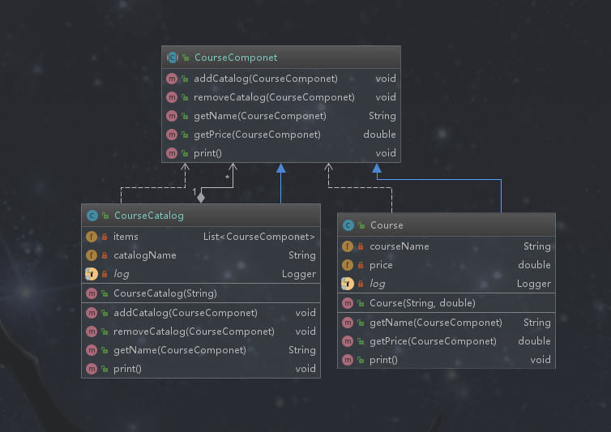

# 组合模式

## 定义

将对象组合成树形结构以表示“部分-整体”的层次结构。作用是使客户端对单个对象和组合对象保持一致的方式处理。*组合模式就是将多个对象组合成一个对象（这些对象具有相同的类型，使用它们的父类型作为统一的对象供客户端访问），简化了对多个对象的访问*

## 类型

结构型

## 使用场景

```text
1. 希望客户端可以忽略组合对象与单个对象的差异时
2. 处理一个树形结构时
```

## 优点

```text
◆清楚地定义了分层次的复杂对象，表示对象的全部或部分层次
◆让客户端忽略了层次的差异，方便对整个层次结构进行控制
◆简化客户端代码
◆符合开闭原则
```

## 缺点

```text
1. 限制类型时会较为复杂，因为它们都具有相同的父类型
2. 使设计变得更加抽象
```

## 相关的设计模式

**组合模式和访问者模式**

> 可以用访问模式访问组合模式的递归结构

## 简单需求

课程分为不同的类型，每一种类型对应一个课程目录，课程目录下又有很多的课程，要求打印出课程的结构

## 组合模式的演练



```text
我们可以通过行为方法进行识别组合模式，组合模式是将相同的抽象类类型或者接口类型转为相同的树状结构，使用抽象作为访问的入口。叶子对象（单个对象）和组合好的对象（包含叶子对象的集合）都要继承或实现相同的父类，这样组合模式才能将它们进行统一处理。
```

*统一抽象类*

```java
package com.design.pattern.composite;

/**
 *  1. 方法中的抛出异常处理，是体现方法不能被使用，因为课程和课程目录使用的方法不同
 *  2. 课程和课程目录使用统一类型供客户端访问
 * @author shunhua
 * @date 2019-09-24
 */
public abstract class CourseComponet {
    /**
     * 扩展课程目录
     * @param courseComponet
     */
    public void addCatalog(CourseComponet courseComponet){
        throw new UnsupportedOperationException("不支持添加课程目录操作");
    }

    /**
     * 删除课程目录
     * @param courseComponet
     */
    public void removeCatalog(CourseComponet courseComponet){
        throw new UnsupportedOperationException("不支持删除课程目录操作");
    }

    /**
     * 获取课程名称
     * @param courseComponet
     * @return
     */
    public String getName(CourseComponet courseComponet){
        throw new UnsupportedOperationException("不支持获取课程名称操作");
    }

    /**
     * 获取课程价格
     * @param courseComponet
     * @return
     */
    public double getPrice(CourseComponet courseComponet){
        throw new UnsupportedOperationException("不支持获取课程价格操作");
    }

    /**
     * 打印信息
     */
    public void print(){
        throw new UnsupportedOperationException("不支持打印操作");
    }
}
```

*课程类*

```ja
package com.design.pattern.composite;

import lombok.extern.slf4j.Slf4j;

/**
 * Course  课程类
 *
 * @author shunhua
 * @date 2019-09-24
 */
@Slf4j
public class Course extends CourseComponet {
    /**
     * 课程名
     */
    private String courseName;
    /**
     * 课程价格
     */
    private double price;

    public Course(String courseName, double price) {
        this.courseName = courseName;
        this.price = price;
    }

    @Override
    public String getName(CourseComponet courseComponet) {
        return this.courseName;
    }

    @Override
    public double getPrice(CourseComponet courseComponet) {
        return this.price;
    }

    @Override
    public void print() {
       log.info("课程名：" + courseName + ", 课程价格：" + price);
    }
}
```

*课程目录类*

```java
package com.design.pattern.composite;

import lombok.extern.slf4j.Slf4j;

import java.util.ArrayList;
import java.util.List;

/**
 * CourseCatalog  课程目录类
 *
 * @author shunhua
 * @date 2019-09-24
 */
@Slf4j
public class CourseCatalog extends CourseComponet {
    /**
     * 课程目录下的课程集合 ，这里使用统一抽象类型表示，这里就组合了课程对象
     */
    private List<CourseComponet> items = new ArrayList<>();
    /**
     * 课程目录名
     */
    private String catalogName;

    public CourseCatalog(String catalogName){
        this.catalogName = catalogName;
    }

    /**
     * 为课程目录添加课程
     * @param courseComponet
     */
    @Override
    public void addCatalog(CourseComponet courseComponet) {
        this.items.add(courseComponet);
    }

    /**
     * 删除课程目录中的课程
     * @param courseComponet
     */
    @Override
    public void removeCatalog(CourseComponet courseComponet) {
      this.items.remove(courseComponet);
    }

    @Override
    public String getName(CourseComponet courseComponet) {
        return this.catalogName;
    }

    /**
     * 打印目录以及目录下的课程
     */
    @Override
    public void print() {
        log.info(catalogName);
        for(CourseComponet courseComponet : items){
            courseComponet.print();
        }
    }
}
```

*客户端*

```ja
package com.design.pattern.composite;

import org.junit.Test;
/**
 * Client 课程目录和课程，对客户端来说都是一个类型的对象
 *
 * @author shunhua
 * @date 2019-09-24
 */
public class Client {

    @Test
    public void test(){
        CourseComponet catalog = new CourseCatalog("课程顶级目录");

        CourseComponet linuxCourse = new Course("鸟哥私房菜",80);
        CourseComponet gitCourse = new Course("Git权威指南",120);

        CourseComponet javaCatalog = new CourseCatalog("Java课程目录");
        CourseComponet spring = new Course("Spring实战",70);
        CourseComponet mybatis = new Course("MyBatis技术内幕",60);

        javaCatalog.addCatalog(spring);
        javaCatalog.addCatalog(mybatis);

        catalog.addCatalog(linuxCourse);
        catalog.addCatalog(gitCourse);
        catalog.addCatalog(javaCatalog);

        // 打印课程目录以及目录下的课程列表
        catalog.print();
    }
}
```
## 组合模式源码解析

**jdk源码之HashMap**
```java
public class HashMap<K,V>
    extends AbstractMap<K,V>
    implements Map<K,V>, Cloneable, Serializable
{

    /**
     *  方法的入参是Map类型，使用Map类型作为统一的接收参数，不需要关注任何之类型的对象
     */
    public void putAll(Map<? extends K, ? extends V> m) {
        int numKeysToBeAdded = m.size();
        if (numKeysToBeAdded == 0)
            return;

        if (table == EMPTY_TABLE) {
            inflateTable((int) Math.max(numKeysToBeAdded * loadFactor, threshold));
        }

        if (numKeysToBeAdded > threshold) {
            int targetCapacity = (int)(numKeysToBeAdded / loadFactor + 1);
            if (targetCapacity > MAXIMUM_CAPACITY)
                targetCapacity = MAXIMUM_CAPACITY;
            int newCapacity = table.length;
            while (newCapacity < targetCapacity)
                newCapacity <<= 1;
            if (newCapacity > table.length)
                resize(newCapacity);
        }

        for (Map.Entry<? extends K, ? extends V> e : m.entrySet())
            put(e.getKey(), e.getValue());
    }
}
```
**jdk源码之ArrayList**
```java
 /**
  * 方法的入参使用统一的父类型Collection，客户端不需要关注具体的子类型对象  
  */
  public boolean addAll(Collection<? extends E> c) {
        Object[] a = c.toArray();
        int numNew = a.length;
        ensureCapacityInternal(size + numNew);  // Increments modCount
        System.arraycopy(a, 0, elementData, size, numNew);
        size += numNew;
        return numNew != 0;
    }
```
**MyBatis源码之SqlNode**
```text
MyBatis的sql语句会被解析成不同的SqlNode类型的对象，这些对象都实现了SqlNode。其中MixedSqlNode是联系不同的SqlNode
的一个核心对象，组合模式可以统一处理的它们。

```
```java
package org.apache.ibatis.scripting.xmltags;

import java.util.List;

public class MixedSqlNode implements SqlNode {
  /**
  * SqlNode不同实现的集合
  */  
  private final List<SqlNode> contents;

  public MixedSqlNode(List<SqlNode> contents) {
    this.contents = contents;
  }

  @Override
  public boolean apply(DynamicContext context) {
    for (SqlNode sqlNode : contents) {
      sqlNode.apply(context);
    }
    return true;
  }
}
```


 


