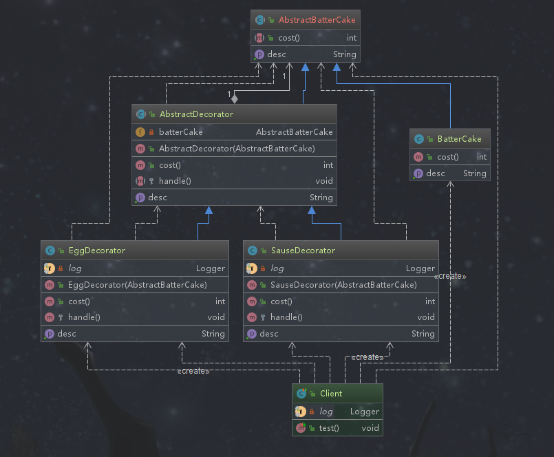
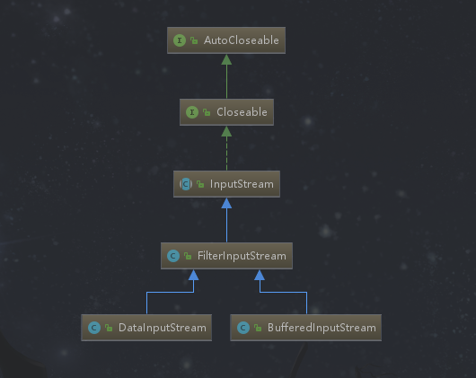

# 装饰者模式

## 定义

在不改变原有对象的基础上，将功能附加到对象上。提供了比继承更有弹性的替代方案（扩展原有对象功能）。

## 类型

结构型

## 应用场景

```tex
◆扩展一个类的功能或给一个类添加附加职责
◆动态的给一个对象添加功能，这些功能可以再动态的撤销
```

## 优点

```tex
◆继承的有力补充，比继承灵活，不改变原有对象的情况下给一个对象扩展功能。一般我们可以使用继承实现功能的扩展，如果需要扩展的功能种类繁多，那么势必会生成很多子类，这无疑增加了系统的复杂性。并且使用继承需要提前预知哪些功能，因为继承关系在编译的时候就确定了。而装饰者模式可以动态地加入。其实装饰者模式也是建立在继承的关系基础之上的，注意，这不意味着就不使用继承了，继承也是扩展形式之一，只是某些时候不一定能达到弹性设计的最佳方式。
◆通过使用不同装饰类以及这些装饰类的排列组合，可以实现不同效果
◆符合开闭原则，装饰者和被装饰者可以独立变化，原有的代码不需要改变。其实装饰者做的是把装饰功能从类中移出去，这样简化了原来被装饰的类，同时把类的核心职责和装饰功能区分开。
```

## 缺点

```t
◆会出现更多的代码，更多的类，增加程序复杂性。装饰者模式可能会比继承方式的使用的类要少，但是对象很多，并且这些对象类型是一样的，因为装饰者会继承被装饰类，而被装饰类又有具体的实体，这些实体对象类型又一样，所有排查问题增加了难度。
◆动态装饰时，多层装饰时会更复杂
```


## 关联的设计模式

*装饰者模式和代理模式*

```te
1 装饰者模式关注动态地添加方法，代理模式关注于控制对对象的访问
2 代理模式中的代理类可以对它的客户隐藏一个对象的具体信息，通常在使用代理模式的时候常常在代理类中创建一个对象的实例，装饰者模式通常把原始对象作为一个参数传入装饰者的构造器，这是使用上的不同。
```

*装饰者模式和适配器模式*

```tex
1 两者都是包装者模式
2 装饰者和被装饰者可以实现相同的接口或者装饰者是被装饰者的子类
3 适配器和被适配的类有不同的接口，也有可能是部分接口是重合的
```

## 简单需求

买煎饼的时候可以根据自身情况要求加鸡蛋或者香肠，卖煎饼的根据需求去做煎饼。

## 装饰者模式演练

### 非装饰者模式

```tex
需求：加一个鸡蛋加一元，一个火腿两元，现在a买一个煎饼，b买加蛋的煎饼，c买加肠的煎饼
方案：通过堆积类完成需求，但是面对众多的需求会类爆炸的。
```


*煎饼类*

```java
package com.design.pattern.decorator.v1;

/**
 * BatterCake 煎饼类
 *
 * @author shunhua
 * @date 2019-09-19
 */
public class BatterCake {
    /**
     * 获取食品描述
     * @return
     */
    public String getDesc(){
        return "煎饼";
    }

    /**
     * 食品单价
     * @return
     */
    public int cost(){
        return 5;
    }
}
```

*鸡蛋煎饼类*

```java
package com.design.pattern.decorator.v1;

/**
 * BatterCakeWithEgg  加鸡蛋的煎饼
 *
 * @author shunhua
 * @date 2019-09-19
 */
public class BatterCakeWithEgg extends BatterCake {

    @Override
    public String getDesc() {
        return super.getDesc() + " 加一个鸡蛋";
    }

    @Override
    public int cost() {
        return super.cost() + 1;
    }
}
```

*香肠煎饼类*

```java
package com.design.pattern.decorator.v1;

/**
 * BatterCakeWithSausage 加香肠的煎饼
 *
 * @author shunhua
 * @date 2019-09-19
 */
public class BatterCakeWithSausage extends BatterCake {
    @Override
    public String getDesc() {
        return super.getDesc() + " 加一个香肠";
    }

    @Override
    public int cost() {
        return super.cost() + 2;
    }
}
```

*客户端*

```java
package com.design.pattern.decorator.v1;

import lombok.extern.slf4j.Slf4j;
import org.junit.Test;

/**
 * Client
 *
 * @author shunhua
 * @date 2019-09-19
 */
@Slf4j
public class Client {

    @Test
    public void test(){
        // 煎饼
        BatterCake batterCake = new BatterCake();
        log.info(batterCake.getDesc() + "销售价格为 " + batterCake.cost());

        // 鸡蛋煎饼
        BatterCakeWithEgg batterCakeWithEgg = new BatterCakeWithEgg();
        log.info(batterCakeWithEgg.getDesc() + "销售价格为 " + batterCakeWithEgg.cost());

        // 香肠煎饼
        BatterCakeWithSausage batterCakeWithSausage = new BatterCakeWithSausage();
        log.info(batterCakeWithSausage.getDesc() + "销售价格为 " + batterCakeWithEgg.cost());
    }
}
```

### 装饰者模式

```tex
需求：现在肠和蛋随机，a  加2蛋2肠 b加1蛋2肠
方案：使用装饰类添加功能，为煎饼加鸡蛋、加香肠
```

>**要求：**
>
>所谓装饰者模式，通用做法要有抽象的实体类和确定的实体类，同时要有抽象的装饰者和确定的装饰者。现在实体类是煎饼，装饰者是鸡蛋和香肠。
>
>**关联：**
>
>煎饼实体类继承煎饼抽象类，装饰者抽象类也继承煎饼抽象类，*通过它们的父类组合来达到煎饼实体类和装饰者抽象类的关系*





*抽象煎饼类*

```java
package com.design.pattern.decorator.v2;

/**
 * AbstractBatterCake  抽象煎饼类（也可以是接口）
 *
 * @author shunhua
 * @date 2019-09-19
 */
public abstract class AbstractBatterCake {
    /**
     * 食品描述
     * @return
     */
    public abstract String getDesc();

    /**
     * 价格
     * @return
     */
    public abstract int cost();
}
```

*煎饼类*

```java
package com.design.pattern.decorator.v2;

/**
 * BatterCake  实体煎饼类
 *
 * @author shunhua
 * @date 2019-09-19
 */
public class BatterCake extends AbstractBatterCake {

    @Override
    public String getDesc() {
        return "煎饼";
    }

    @Override
    public int cost() {
        return 5;
    }
}
```

*抽象装饰类*

```java
package com.design.pattern.decorator.v2;

/**
 *
 *  装饰者同样继承 抽象煎饼类，这是为了方便 ，和煎饼类交互
 *
 *  如果不用构造器的方式，也可以使用set方式
 *
 * @author shunhua
 * @date 2019-09-19
 */
public abstract class AbstractDecorator extends AbstractBatterCake {
    /**
     * 定义煎饼属性，用于注入
     */
    private AbstractBatterCake batterCake;

    public AbstractDecorator(AbstractBatterCake batterCake){
        this.batterCake = batterCake;
    }

    @Override
    public String getDesc() {
        return batterCake.getDesc();
    }

    @Override
    public int cost() {
        return batterCake.cost();
    }

    /**
     * 装饰者实体类特有操作
     */
    protected abstract void handle();
}
```

*鸡蛋装饰类*

```java
package com.design.pattern.decorator.v2;

import lombok.extern.slf4j.Slf4j;

/**
 * EggDecorator
 *
 * @author shunhua
 * @date 2019-09-19
 */
@Slf4j
public class EggDecorator extends AbstractDecorator {

    public EggDecorator(AbstractBatterCake batterCake) {
        super(batterCake);
    }

    @Override
    public String getDesc() {
        return super.getDesc() + " 加一个鸡蛋";
    }

    @Override
    public int cost() {
        return super.cost() + 1;
    }

    @Override
    protected void handle() {
        log.info("鸡蛋装饰者特有的处理");
    }
}
```

*香肠装饰类*

```java
package com.design.pattern.decorator.v2;

import lombok.extern.slf4j.Slf4j;

/**
 * SauseDecorator
 *
 * @author shunhua
 * @date 2019-09-19
 */
@Slf4j
public class SauseDecorator extends AbstractDecorator {

    public SauseDecorator(AbstractBatterCake batterCake) {
        super(batterCake);
    }

    @Override
    public String getDesc() {
        return super.getDesc() + " 加一个香肠";
    }

    @Override
    public int cost() {
        return super.cost() + 2;
    }

    @Override
    protected void handle() {
       log.info("香肠装饰者特有的处理方式");
    }
}
```

*客户端*

```java
package com.design.pattern.decorator.v2;

import lombok.extern.slf4j.Slf4j;
import org.junit.Test;

/**
 * Client
 *
 * @author shunhua
 * @date 2019-09-19
 */
@Slf4j
public class Client {

    @Test
    public void test(){
        AbstractBatterCake batterCake;
        // 装饰煎饼
        batterCake = new BatterCake();
        // 鸡蛋装饰
        batterCake = new EggDecorator(batterCake);
        batterCake = new EggDecorator(batterCake);
        ((EggDecorator) batterCake).handle();
        // 香肠装饰
        batterCake = new SauseDecorator(batterCake);
        ((SauseDecorator) batterCake).handle();
        log.info(batterCake.getDesc() + " 一共卖了" + batterCake.cost() + "元");
    }
}
```

## 装饰者模式在源码中的使用

**BufferedReader**
```java
public class BufferedReader extends Reader {

    private Reader in;
    private char cb[];
    private int nChars, nextChar;
    
    // todo 省略

    /**
     *  对Reader类型的 实例进行包装
     */
    public BufferedReader(Reader in, int sz) {
        super(in);
        if (sz <= 0)
            throw new IllegalArgumentException("Buffer size <= 0");
        this.in = in;
        cb = new char[sz];
        nextChar = nChars = 0;
    }

    /**
     * Creates a buffering character-input stream that uses a default-sized
     * input buffer.
     *
     * @param  in   A Reader
     */
    public BufferedReader(Reader in) {
        this(in, defaultCharBufferSize);
    }

    /**
     *  这里使用Reader 类型对象进行操作
     */
    private void fill() throws IOException {
        int dst;
        if (markedChar <= UNMARKED) {
            /* No mark */
            dst = 0;
        } else {
            /* Marked */
            int delta = nextChar - markedChar;
            if (delta >= readAheadLimit) {
                /* Gone past read-ahead limit: Invalidate mark */
                markedChar = INVALIDATED;
                readAheadLimit = 0;
                dst = 0;
            } else {
                if (readAheadLimit <= cb.length) {
                    /* Shuffle in the current buffer */
                    System.arraycopy(cb, markedChar, cb, 0, delta);
                    markedChar = 0;
                    dst = delta;
                } else {
                    /* Reallocate buffer to accommodate read-ahead limit */
                    char ncb[] = new char[readAheadLimit];
                    System.arraycopy(cb, markedChar, ncb, 0, delta);
                    cb = ncb;
                    markedChar = 0;
                    dst = delta;
                }
                nextChar = nChars = delta;
            }
        }

        int n;
        do {
            n = in.read(cb, dst, cb.length - dst);
        } while (n == 0);
        if (n > 0) {
            nChars = dst + n;
            nextChar = dst;
        }
    }
}

/**
 * 注意Reader是抽象的
 */
public abstract class Reader implements Readable, Closeable {
  // todo 省略
}
```

> InputStream类型作为被装饰类型，它的装饰者有很多，如上图中列出FilerInputStream、BufferedInputStream以及
LineInputStream。在装饰者内部本质上都是使用InputStream的实例操作的。

**BufferedInputStream**
```java
public class BufferedInputStream extends FilterInputStream {

    private static int DEFAULT_BUFFER_SIZE = 8192;

    private static int MAX_BUFFER_SIZE = Integer.MAX_VALUE - 8;

    protected volatile byte buf[];

    private static final
        AtomicReferenceFieldUpdater<BufferedInputStream, byte[]> bufUpdater =
        AtomicReferenceFieldUpdater.newUpdater
        (BufferedInputStream.class,  byte[].class, "buf");

    protected int count;

    protected int pos;

    protected int markpos = -1;

    protected int marklimit;

    private InputStream getInIfOpen() throws IOException {
        InputStream input = in;
        if (input == null)
            throw new IOException("Stream closed");
        return input;
    }
    
     /** 
       * 对InputStream类型进行包装
       */
        public BufferedInputStream(InputStream in) {
            this(in, DEFAULT_BUFFER_SIZE);
        }
    
        /**
         * 对InputStream类型进行包装
         */
        public BufferedInputStream(InputStream in, int size) {
            super(in);
            if (size <= 0) {
                throw new IllegalArgumentException("Buffer size <= 0");
            }
            buf = new byte[size];
        }
}
```

**Servlet的HttpServletRequestWrapper**


>HttpServletRequestWrapper继承了ServletRequestWrapper也实现了HttpServletRequest,它们的
公共父类是ServletRequest.

```java
/**
 * HttpServletRequestWrapper装饰类
 */
public class HttpServletRequestWrapper extends ServletRequestWrapper implements HttpServletRequest {

	/** 
	* 对HttpServletRequest进行装饰，ServletRequestWrapper抽象的装饰者也对HttpServletRequest的父类进行装饰
	*/
    public HttpServletRequestWrapper(HttpServletRequest request) {
	    super(request);
    }
    
    private HttpServletRequest _getHttpServletRequest() {
	return (HttpServletRequest) super.getRequest();
    }

    /**
     * The default behavior of this method is to return getAuthType()
     * on the wrapped request object.
     */

    public String getAuthType() {
	return this._getHttpServletRequest().getAuthType();
    }
   
    /**
     * The default behavior of this method is to return getCookies()
     * on the wrapped request object.
     */
    public Cookie[] getCookies() {
	return this._getHttpServletRequest().getCookies();
    }

    /**
     * The default behavior of this method is to return getDateHeader(String name)
     * on the wrapped request object.
     */
    public long getDateHeader(String name) {
	return this._getHttpServletRequest().getDateHeader(name);
    }
}

/**
* ServletRequestWrapper装饰类
*/
public class ServletRequestWrapper implements ServletRequest {
    private ServletRequest request;

	/**
	* Creates a ServletRequest adaptor wrapping the given request object. 
	* @throws java.lang.IllegalArgumentException if the request is null
	*/

    public ServletRequestWrapper(ServletRequest request) {
	if (request == null) {
	    throw new IllegalArgumentException("Request cannot be null");   
	}
	this.request = request;
    }

	/**
	* Return the wrapped request object.
	*/
	public ServletRequest getRequest() {
		return this.request;
	}
	
	/**
	* Sets the request object being wrapped. 
	* @throws java.lang.IllegalArgumentException if the request is null.
	*/
	
	public void setRequest(ServletRequest request) {
	    if (request == null) {
		throw new IllegalArgumentException("Request cannot be null");
	    }
	    this.request = request;
	}

    /**
     *
     * The default behavior of this method is to call getAttribute(String name)
     * on the wrapped request object.
     */

    public Object getAttribute(String name) {
	return this.request.getAttribute(name);
	}
	
    /**
     * The default behavior of this method is to return getAttributeNames()
     * on the wrapped request object.
     */

    public Enumeration getAttributeNames() {
	return this.request.getAttributeNames();
	}    
}
```

**MyBatis的FifoCache**


>MyBatis的Cache模块中使用大量的装饰者模式，在decorators包下都是的，下面列举最近最少使用策略的装饰类。

```java
/**
* lru算法 最近最少使用
*/
public class LruCache implements Cache {

  private final Cache delegate;
  private Map<Object, Object> keyMap;
  private Object eldestKey;

  public LruCache(Cache delegate) {
    this.delegate = delegate;
    setSize(1024);
  }

  @Override
  public String getId() {
    return delegate.getId();
  }

  @Override
  public int getSize() {
    return delegate.getSize();
  }

  public void setSize(final int size) {
    keyMap = new LinkedHashMap<Object, Object>(size, .75F, true) {
      private static final long serialVersionUID = 4267176411845948333L;

      @Override
      protected boolean removeEldestEntry(Map.Entry<Object, Object> eldest) {
        boolean tooBig = size() > size;
        if (tooBig) {
          eldestKey = eldest.getKey();
        }
        return tooBig;
      }
    };
  }
}
```


