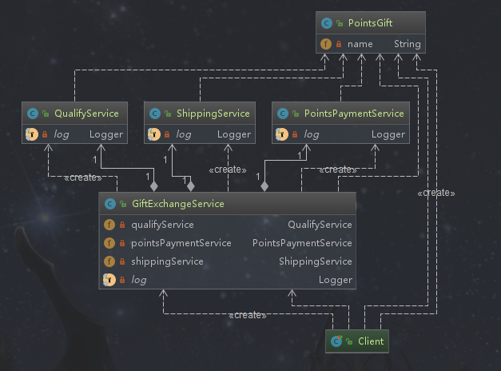

# 外观模式

## 定义

又叫门面模式，提供了一个统一的接口，用来访问子系统中的一群接口。外观模式定义了一个高层接口，让子系统更容易使用。


## 类型

结构型

## 使用场景

- 子系统越来越复杂，增加外观模式提供简单调用接口
- 构建多层系统结构，利用外观对象作为每层的入口，简化层间调用

## 优点

```tex
◆简化了调用过程，无需了解深入子系统，防止带来风险(将子系统集成到一起，不去修改子系统)。
◆减少系统依赖、松散耦合（客户端与子系统）
◆更好的划分访问层次
◆符合迪米特法则，即最少知道原则
```

## 缺点

```te
◆增加子系统、扩展子系统行为容易引入风险
◆增加子系统、扩展子系统行为不符合开闭原则
```


## 相关联设计模式对比

**外观模式和中介者模式**

```te
前者关注外界和子系统的交互，后者关注子系统内部的交互
```

**外观模式和单例模式**

```te
外观模式和单例模式可以结合使用,通常把外观模式中的外观做成单例的
```

**外观模式和抽象工厂模式**

```te
前者可以通过后者获取子系统的实例，子系统可以经内部对外观类进行屏蔽
```

## 简单需求

> 某网站有积分兑换礼物的功能，设计的时候需要校验三步：
>
> a 资格校验系统，是木木网会员。
>
> b 积分系统，该系统放的是各个积分的获取支出，需要拿出该用户目前的积分和该礼物所需要的积分进行对比
>
> c 物流系统，如果满足ab，则返回成功，并返回一个订单号。

 

**关注点：**

**应用层无需知道资格校验类等其他子系统的类**


## 外观模式演练



```text
1. 应用层不关心子系统，应用层只和外观类通信，子系统只和外观类通信
2. 如果扩展子系统的，使用实体外观类的话，不符合开闭原则，如果使用抽象外观类或者外观接口，然后用实体继承或实现的话，符合开闭原则。主要看外观对应的子系统群是否变更频繁，不频繁可以使用实体外观，这样更简单。

```

**实体类**

```java
package com.design.pattern.facade;

import lombok.AllArgsConstructor;
import lombok.Data;

/**
 * PointsGift  积分兑换礼物
 *
 * @author shunhua
 * @date 2019-09-17
 */
@Data
@AllArgsConstructor
public class PointsGift {

    /**
     * 礼物名称
     */
    private String name;
}
```

**资格验证系统类**

```java
package com.design.pattern.facade;

import lombok.extern.slf4j.Slf4j;

/**
 * QualifyService 校验系统
 *
 * @author shunhua
 * @date 2019-09-17
 */
@Slf4j
public class QualifyService {

    /**
     * 校验逻辑，积分是否够
     * @param pointsGift
     * @return
     */
    public boolean isAvailable(PointsGift pointsGift){
         log.info(pointsGift.getName() + "积分通过");
         return true;
    }
}
```

**积分系统类**

```jav
package com.design.pattern.facade;

import lombok.extern.slf4j.Slf4j;

/**
 * PointsPaymentService  积分支付
 *
 * @author shunhua
 * @date 2019-09-17
 */
@Slf4j
public class PointsPaymentService {

    /**
     * 积分兑换礼物
     * @param pointsGift
     * @return
     */
      public boolean pay(PointsGift pointsGift){
          log.info("支付" + pointsGift.getName() + "积分成功");
          return true;
      }
}
```

**物流系统类**

```java
package com.design.pattern.facade;

import lombok.extern.slf4j.Slf4j;

/**
 * ShippingService
 *
 * @author shunhua
 * @date 2019-09-17
 */
@Slf4j
public class ShippingService {

    /**
     * 物流系统对接
     * @param pointsGift
     * @return
     */
    public String shipGift(PointsGift pointsGift){
       log.info(pointsGift.getName() + "进入物流系统");
       return "123456";
    }
}
```

**客户端**

```java
package com.design.pattern.facade;

import org.junit.Test;

/**
 * Client
 *
 * @author shunhua
 * @date 2019-09-17
 */
public class Client {

    @Test
    public void test(){
        PointsGift pointsGift = new PointsGift("机械键盘");
        GiftExchangeService giftExchangeService = new GiftExchangeService();
        giftExchangeService.giftExchange(pointsGift);
    }

}
```

## 外观模式在源码中的使用

**Spring-jdbc**

```text
Spring对原生的JDBC进行了封装，我们只需要访问Spring提供的接口方法就可以达到目的。
```

**MyBatis的Configuration**

```java
/** Configuration#newMetaObject方法底层也是对一些列逻辑的封装，我们只需要调用newMetaObject即可，不需关系内部。
 *   如果需要修改内部逻辑，这外观接口是不需要改变的
 */
public MetaObject newMetaObject(Object object) {
    return MetaObject.forObject(object, objectFactory, objectWrapperFactory, reflectorFactory);
  }
```

**Tomcat源码**

```text
1. Tomcat中大量使用了外观模式，如RequestFacade、ResponseFacade等。
2. RequestFacade implements HttpServletRequest，Request implements HttpServletRequest，Request使用了RequestFacade包装了
   自己。Request#getRequest在获取HttpServletRequest时，返回的其实是RequestFacade，之后用这个返回的对象完成的操作都是RequestFacade
   来完成的。
```
