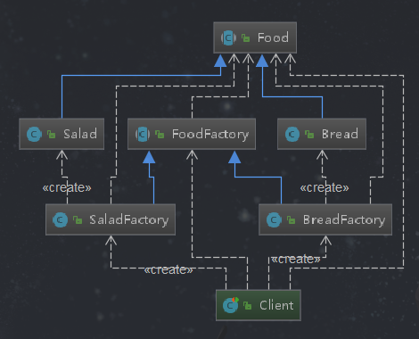

# 工厂方法

## 定义
  定义一个创建对象的接口（抽象方法），让实现这个接口的类（实现抽象方法）来决定实例化哪个类，工厂方法让类的实例化推迟到子类中进行，即通过子类实现抽象方法来创建对象。
  工厂方法就是用来解决同一产品等级的业务抽象问题。工厂创建对象用的，方法通过子类实现方法来创建对象。 
## 类型
  创建型
## 使用场景
 - 创建对象需要大量的重复代码
 - 客户端（应用层）不依赖于产品类实例如何被创建、实现等细节
 - 一个类通过其子类来指定创建哪个对象
## 优点
  用户只需要关心所需产品对应的工厂，无须关心创建细节。加入新的产品符合开闭原则，提高了可扩展性。
## 缺点
  实现类的个数容易过多（增加新产品的时候，不仅需要编写新的产品类还需要编写对应的工厂类，因此类的个数增加）、增加复杂度。
  工厂方法本身使用了抽象，我们需要引入抽象层，如果想要动态创建可能还会使用反射技术，这都增加了系统的抽象性和理解难度
## 产品等级和产品族
  - 工厂方法是为了决绝同一产品等级的业务抽象问题，抽象工厂是为了解决同以产品族的问题
  - 产品等级
    相同类型的产品为同一产品等级，如：汽车有大众、长安、奥迪等，它们属于同一产品等级
  - 产品族
    不同类型的产品，如长安汽车、长安摩托、长安自行车
    
## 工厂方法演练

    

**Food类**
```java
package com.design.pattern.factorymethod;

/**
 * 相同类型的产品属于同一产品等级，无论是面包还是沙拉，它们都是同一个等级，这里是Food
 *
 * @author shunhua
 * @date 2019-09-09
 */
public abstract class Food {
   /**
    * 生产产品方法
    */
   public abstract void produce();
}
```
**面包类**
```java
package com.design.pattern.factorymethod;

import lombok.Data;
import lombok.ToString;
import lombok.extern.slf4j.Slf4j;

/**
 * Bread
 *
 * @author shunhua
 * @date 2019-09-09
 */
@Slf4j
@ToString
public class Bread extends Food {

    @Override
    public void produce() {
        log.info("生产面包!");
    }
}
```

**沙拉类**
```java
package com.design.pattern.factorymethod;

import lombok.ToString;
import lombok.extern.slf4j.Slf4j;

/**
 * Salad
 *
 * @author shunhua
 * @date 2019-09-09
 */
@Slf4j
@ToString
public class Salad extends Food {

    @Override
    public void produce() {
        log.info("生成沙拉!");
    }
}
```

**抽象工厂**
```java
package com.design.pattern.factorymethod;

/**
 * 工厂方法,子类继承即可
 * 这里使用抽象类主要考虑到在类中有些是已知的，使用抽象类合适。如果全都是未知的使用接口比较合适。
 * @author shunhua
 * @date 2019-09-09
 */
public abstract class FoodFactory {
    /**
     * 工厂方法，起到规约的作用，并不生产具体的产品，具体产品的生成由其实现完成
     * @return
     */
    public abstract Food createFood();
}
```
**子工厂类-面包工厂**
```java
package com.design.pattern.factorymethod;

/**
 * BreadFactory  只生产Bread
 *
 * @author shunhua
 * @date 2019-09-10
 */
public class BreadFactory extends FoodFactory {

    /**
     * 生产面包的工厂方法
     * @return
     */
    @Override
    public Food createFood() {
        return new Bread();
    }
}
```
**子工厂类-沙拉工厂**
```java
package com.design.pattern.factorymethod;

/**
 * SaladFactory 只生产Salad
 *
 * @author shunhua
 * @date 2019-09-10
 */
public class SaladFactory extends FoodFactory {
    /**
     * 生产面包的工厂方法
     * @return
     */
    @Override
    public Food createFood() {
        return new Salad();
    }
}
```
**客户端**
```java
package com.design.pattern.factorymethod;

import lombok.extern.slf4j.Slf4j;
import org.junit.Test;

/**
 * Client
 *
 * @author shunhua
 * @date 2019-09-10
 */
@Slf4j
public class Client {

    @Test
    public void test(){
        // 面包工厂方法
        FoodFactory breadFactory = new BreadFactory();
        Food bread = breadFactory.createFood();
        log.info(String.valueOf(bread));
        // 沙拉工厂方法
        FoodFactory saladFactory = new SaladFactory();
        Food salad = saladFactory.createFood();
        log.info(String.valueOf(salad));

    }

}
```

        
## 工厂方法在源码中的使用

### Collection的Iterator解析

Collection接口相当于抽象工厂（因为它处理的是等级组问题即多个类型的产品），其中它里面的*Iterator<E> iterator()*方法相当于工厂方法。ArrayList实现了这个方法，该方法为ArrayList生产
*Itr*，Itr是Iterator类型。还有ILoggerFactory和Logger产品族对应的工厂方法的使用。

```java
  public Iterator<E> iterator() {
        return new Itr();
    }
    /**
     * An optimized version of AbstractList.Itr
     */
    private class Itr implements Iterator<E> {
        int cursor;       // index of next element to return
        int lastRet = -1; // index of last element returned; -1 if no such
        int expectedModCount = modCount;

        public boolean hasNext() {
            return cursor != size;
        }

        @SuppressWarnings("unchecked")
        public E next() {
            checkForComodification();
            int i = cursor;
            if (i >= size)
                throw new NoSuchElementException();
            Object[] elementData = ArrayList.this.elementData;
            if (i >= elementData.length)
                throw new ConcurrentModificationException();
            cursor = i + 1;
            return (E) elementData[lastRet = i];
        }

        public void remove() {
            if (lastRet < 0)
                throw new IllegalStateException();
            checkForComodification();

            try {
                ArrayList.this.remove(lastRet);
                cursor = lastRet;
                lastRet = -1;
                expectedModCount = modCount;
            } catch (IndexOutOfBoundsException ex) {
                throw new ConcurrentModificationException();
            }
        }

        @Override
        @SuppressWarnings("unchecked")
        public void forEachRemaining(Consumer<? super E> consumer) {
            Objects.requireNonNull(consumer);
            final int size = ArrayList.this.size;
            int i = cursor;
            if (i >= size) {
                return;
            }
            final Object[] elementData = ArrayList.this.elementData;
            if (i >= elementData.length) {
                throw new ConcurrentModificationException();
            }
            while (i != size && modCount == expectedModCount) {
                consumer.accept((E) elementData[i++]);
            }
            // update once at end of iteration to reduce heap write traffic
            cursor = i;
            lastRet = i - 1;
            checkForComodification();
        }

        final void checkForComodification() {
            if (modCount != expectedModCount)
                throw new ConcurrentModificationException();
        }
    }
```


