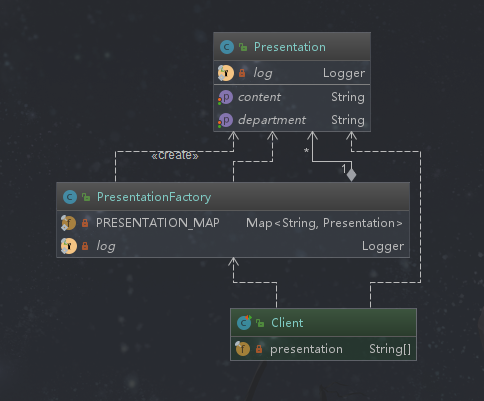

## 享元模式

## 定义

提供了*减少对象数量*从而改善应用的对象结构的方式。运用共享技术有效地支持大量细粒度的对象。*即减少创建对象的数量，共享对象，从而减少内存的占用并且提高性能* 。注意：**享元模式重要的就是共享**。

## 类型

结构型

## 应用场景

```text
◆ 常常应用于系统底层的开发，以便解决系统的性能问题
  如String类型就是使用了享元模式，String对象存在即返回，没有就创建然后放入到字符串常量池中。再比如数据库连接池，里面都是创建好的数据库连接，需要的时候拿来用不需要的时候归还回去。即系统中如果有大量的对象，可能会造成内存溢出，我们可以把共同的部分抽象出来，有相同的业务请求，则返回在内存中的已有对象，避免重新创建
◆ 系统有大量相似对象、需要缓冲池的场景
 某个对象的复用度越高，越倾向于使用享元模式
```

## 优点

```text
◆减少对象的创建，降低内存中对象的数量，降低系统的内存，提高效率
◆减少内存之外的其他资源占用(时间资源、文件句柄、窗口句柄等)
```

## 缺点

```text
◆关注内/外部状态、关注线程安全问题
    我们使用共享模式的时候，大都是使用hashMap，不会用HashTable（因为hashTable会由于同步锁造成效率过低，这样得不偿失），这样就需要在有些场景下关注线程安全问题。同时还要关注内、外部状态。
◆使系统、程序的逻辑复杂化 
   使用了享元对象提高了系统的复杂度，还要分离内外不状态，并且外部状态不应该随着内部状态的变化而变化，否则系统就混乱了。
```

## 扩展

*内部状态*

```text
在享元模式内部并且不会随着环境改变而改变的共享部分；无论外部环境如何变化，我都不变，并且该状态在享元模式内部。可理解为是享元对象的一个属性，这个属性不会与外部交互。
```

*外部状态*

```text
随着环境改变而改变的就是外部状态，这种状态是不可以共享的状态，并且记录在享元模式的外部。可理解为享元对象的一个可以和外界交互的属性，它会随时发生改变。
```

## 相关设计模式

*享元模式和代理模式*

```text
代理模式是代理一个类，如果生成这个代理类花的资源和时间比较多，可以使用享元模式处理这个类的速度
```

*享元模式和单例模式*

```text
容器单例是两种方式的一种结合。享元模式是一种复用对象的思想
```

## 简单需求

年终了，研发部门Leader可能需要多次地去汇报工作情况，已经有报告结果的就不需要再整理报告了，直接拿到报告就可以去汇报了。没有做过汇报的就需要先整理报告。

## 享元模式演练



*报告*
```java
package com.design.pattern.flyweight;

import lombok.Data;
import lombok.extern.slf4j.Slf4j;

/**
 * Presentation  报告类
 *
 * @author shunhua
 * @date 2019-09-23
 */
@Data
@Slf4j
public class Presentation {
    /**
     * 报告相关部门
     */
    private String department;
    /**
     * 汇报内容
     */
    private String content;

    /**
     * 通过外部状态属性进行构造
     * @param department
     */
    public Presentation(String department){
        this.department = department;
    }

    /**
     * 报告内容
     */
    public void report() {
      log.info(content);
    }
}
```
*报告工厂*
```java
package com.design.pattern.flyweight;

import lombok.extern.slf4j.Slf4j;
import org.springframework.util.ObjectUtils;

import java.util.HashMap;
import java.util.Map;

/**
 * PresentationFactory   报告工厂
 *
 * @author shunhua
 * @date 2019-09-23
 */
@Slf4j
public class PresentationFactory {
    /**
     *  此处应用了 final修饰 引用成员变量，引用对象的内容可以修改，但是引用地址不可以修改。这里作为报告池。
     */
    private static final Map<String,Presentation> PRESENTATION_MAP = new HashMap<>(16);

    /**
     * 这里不考虑安全问题
     * @param department
     * @return
     */
    public static Presentation getPresentation(String department){
        // 先从报告池中获取
       Presentation leaderPresentation =  PRESENTATION_MAP.get(department);
       // 报告池中没有再创建一个，然后放到报告池中
       if(ObjectUtils.isEmpty(leaderPresentation)){
           leaderPresentation = new Presentation(department);
           log.info("----------- 报告池中没有需先创建----------");
           PRESENTATION_MAP.put(department,leaderPresentation);
           leaderPresentation.setContent("部门：" + department +" 汇报...");
           leaderPresentation.report();

       }
       return leaderPresentation;
    }
}
```

*客户端*
```java
package com.design.pattern.flyweight;

import org.junit.Test;

/**
 * Client
 *
 * @author shunhua
 * @date 2019-09-23
 */
public class Client {
    private final String presentation[] = {"业务部","研发部","管理部"};

    @Test
    public void test(){
        for(int i = 0; i < 20; i++){
            String department = presentation[(int)(Math.random() * presentation.length)];
            Presentation leaderPresentation =  PresentationFactory.getPresentation(department);
            leaderPresentation.report();
        }
    }
}
```
## 享元模式源码解析

*Integer*
```java
public final class Integer extends Number implements Comparable<Integer> {

 /**
     * This method will always cache values in the range -128 to 127,
     * inclusive, and may cache other values outside of this range.
     *　如果传入的数值在缓存的-127和128之间，那么都会在cache中，否则的话，会new出新的对象，这也是为什么100==100为true，1000==1000为false
     * @param  i an {@code int} value.
     * @return an {@code Integer} instance representing {@code i}.
     * @since  1.5
     */
    public static Integer valueOf(int i) {
        assert IntegerCache.high >= 127;
        if (i >= IntegerCache.low && i <= IntegerCache.high)
            return IntegerCache.cache[i + (-IntegerCache.low)];
        return new Integer(i);
    }

/**  只要在-128-127，使用 == 判断是可以的，不再这个范围就不能使用==,需要使用equqls 
     * Cache to support the object identity semantics of autoboxing for values between
     * -128 and 127 (inclusive) as required by JLS.
     *
     */

    private static class IntegerCache {
        static final int low = -128;
        static final int high;
        static final Integer cache[];

        static {
            // high value may be configured by property
            int h = 127;
            String integerCacheHighPropValue =
                sun.misc.VM.getSavedProperty("java.lang.Integer.IntegerCache.high");
            if (integerCacheHighPropValue != null) {
                int i = parseInt(integerCacheHighPropValue);
                i = Math.max(i, 127);
                // Maximum array size is Integer.MAX_VALUE
                h = Math.min(i, Integer.MAX_VALUE - (-low) -1);
            }
            high = h;

            cache = new Integer[(high - low) + 1];
            int j = low;
            for(int k = 0; k < cache.length; k++)
                cache[k] = new Integer(j++);
        }

        private IntegerCache() {}
    }
}
```


