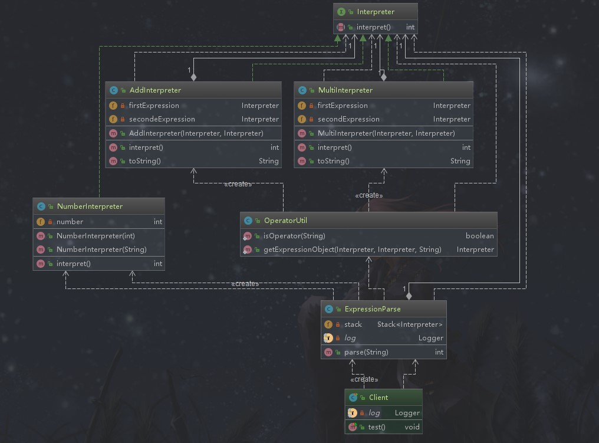

## 解释器模式

### 定义

给定一个语言，定义它的文法（语法）的一种表示，并定义一个解释器，这个解释器使用该表示来解释语言中的句子。即 *为了解释一种语言（语言的语法），而为语言创建的解释器*

### 类型

行为型

### 适用场景

```text
在处理日志的时候，由于多个服务产生的日志格式不一定统一，但是数据里面的要素是相同的，这种情况下我们就可以通过程序来解决该问题，而这个程序我们就可以理解为解释器，只不过可以解释不同日志格式。在实际项目中解释器模式使用的比较少，多使用开源包。
```

### 优点

```text
语法由很多类表示，容易改变及扩展此“语言”（涉及的代码还不足以说明是种语言）
```

### 缺点

```text
当语法规则数目太多时，增加了系统复杂度
```

### 简单需求

自定义一套可以加法、乘法的语法，使用栈来表示，这和日常的加法和乘法是不一样的。然后定义加法和乘法解释器，处理对应的表达式然后拿到最终的结果。

### 解释器模式演练



*解释器接口*
```java
package com.design.pattern.interpreter;

/**
 * Interpreter 解释接口
 *
 * @author shunhua
 * @date 2019-10-02
 */
public interface Interpreter {
    /**
     * 解释方法
     * @return
     */
    int interpret();
}

```
*加法解释器*
```java
package com.design.pattern.interpreter;

/**
 * AddInterpreter 加法解释器
 *
 * @author shunhua
 * @date 2019-10-02
 */
public class AddInterpreter implements Interpreter {

    /**
     * 它们的方法返回值作为加数和被加数
     */
    private Interpreter firstExpression,secondeExpression;

    /**
     * 加法需要 加数和被加数
     * @param firstExpression
     * @param secondeExpression
     */
    public AddInterpreter(Interpreter firstExpression,Interpreter secondeExpression){
        this.firstExpression = firstExpression;
        this.secondeExpression = secondeExpression;
    }

    /**
     * 返回两个表达式结果的和
     * @return
     */
    @Override
    public int interpret() {
        return this.firstExpression.interpret() + this.secondeExpression.interpret();
    }

    @Override
    public String toString() {
        return  "+";
    }
}
```

*乘法解释器*
```java
package com.design.pattern.interpreter;

/**
 * MultiInterpreter 乘法解释器
 *
 * @author shunhua
 * @date 2019-10-02
 */
public class MultiInterpreter implements Interpreter {
    /**
     * 它们的表达式结果作为乘数和被乘除数
     */
    private Interpreter firstExpression,secondExpression;

    /**
     * 乘法需要 乘数和被乘数
     * @param firstExpression
     * @param secondExpression
     */
    public MultiInterpreter(Interpreter firstExpression,Interpreter secondExpression){
        this.firstExpression = firstExpression;
        this.secondExpression = secondExpression;
    }

    /**
     * 乘法解释器的解释方法
     * @return
     */
    @Override
    public int interpret() {
        return this.firstExpression.interpret() * this.secondExpression.interpret();
    }

    @Override
    public String toString() {
        return "*";
    }
}
```
*表达式处理解释器*
```java
// 注意这个解释器就是简单转换数据的

package com.design.pattern.interpreter;

/**
 * NumberInterpreter 表达式处理解释器
 *
 * @author shunhua
 * @date 2019-10-02
 */
public class NumberInterpreter implements Interpreter {
    /**
     *  表达式要返回的值
     */
    private int number;

    /**
     * 数值构造器
     * @param number
     */
    public NumberInterpreter(int number){
        this.number = number;
    }

    /**
     * 字符串转换构造器
     * @param number
     */
    public NumberInterpreter(String number){
        this.number = Integer.parseInt(number);
    }

    /**
     * 解释方法
     * @return
     */
    @Override
    public int interpret() {
        return this.number;
    }
}
```

*封装解释器的处理类--暴露给用户的解释器（它内部是对几个解释器的封装）*

```java
package com.design.pattern.interpreter;

import lombok.extern.slf4j.Slf4j;

import java.util.Arrays;
import java.util.Stack;

/**
 * ExpressionParse
 *
 * @author shunhua
 * @date 2019-10-02
 */
@Slf4j
public class ExpressionParse {
    /**
     * 定义一个栈，这里是解释器类型栈
     */
    private Stack<Interpreter> stack = new Stack<>();

    public int parse(String str){

        String[] strItemArray = str.split(" ");
        Arrays.stream(strItemArray).forEach(symbol ->{
            // 不是运算符，需要入栈
            if(!OperatorUtil.isOperator(symbol)){
                Interpreter numberExpression = new NumberInterpreter(symbol);
                stack.push(numberExpression);
                log.info(String.format("入栈：%d",numberExpression.interpret()));
            }else {
                // 是运算符，可以进行计算
                Interpreter firstExpression = stack.pop();
                Interpreter secondExpression = stack.pop();
                log.info(String.format("出栈： %d 和 %d",firstExpression.interpret(),secondExpression.interpret()));
                Interpreter operator = OperatorUtil.getExpressionObject(firstExpression,secondExpression,symbol);
                log.info(String.format("解释器类型：%s",operator.toString()));
                int result = operator.interpret();
                NumberInterpreter resultExpression  = new NumberInterpreter(result);
                stack.push(resultExpression);
                log.info(String.format("阶段结果入栈： %d",resultExpression.interpret()));
            }
        });

        int result = stack.pop().interpret();
        return result;
    }
}
```

*工具类*
```java
package com.design.pattern.interpreter;

/**
 * OperatorUtil
 *
 * @author shunhua
 * @date 2019-10-02
 */
public class OperatorUtil {
    /**
     * 是否可操作
     * @param symbol
     * @return
     */
    public static boolean isOperator(String symbol){
        return "+".equals(symbol) || "*".equals(symbol);
    }

    /**
     * 使用解释器进行解释，表达式的结果
     * @param firstExpression
     * @param secondExpression
     * @param symbol
     * @return
     */
    public static Interpreter getExpressionObject(Interpreter firstExpression,Interpreter secondExpression,String symbol){
        if("+".equals(symbol)){
            return new AddInterpreter(firstExpression,secondExpression);
        }
        else if ("*".equals(symbol)){
            return new MultiInterpreter(firstExpression,secondExpression);
        }
        return null;
    }
}
```

*应用*
```java
package com.design.pattern.interpreter;

import lombok.extern.slf4j.Slf4j;
import org.junit.Test;

/**
 * Client
 *
 * @author shunhua
 * @date 2019-10-02
 */
@Slf4j
public class Client {

    @Test
    public void test(){
        // 输入表达式
        String inputStr = "18 70 12 + *";
        // 对表达式进行解释
        ExpressionParse expressionParse = new ExpressionParse();
        int result = expressionParse.parse(inputStr);
        log.info("最终解释结果：" + result);
    }

}
```
### 解释器模式在源码中的使用


*java.util.regex.Pattern*
 
```text
正则表达式就是一种语法，通过jdk中的正则解释器把它解释出来
```
```java
package com.design.pattern.interpreter;

import lombok.extern.slf4j.Slf4j;
import org.junit.Test;

import java.util.regex.Matcher;
import java.util.regex.Pattern;

/**
 * PatternTest
 *
 * @author shunhua
 * @date 2019-10-02
 */
@Slf4j
public class PatternTest {
    @Test
    public void test(){
        String str = "china";
        String patternStr = "\\s+" + str + "\\s+";
        // 正则解释器，解释正则表达式
        Pattern pattern = Pattern.compile(patternStr);
        String content = " china becames more and more beautiful! ";
        Matcher matcher = pattern.matcher(content);
        if (matcher.find()) {
            String content_new  = matcher.replaceAll("China ");
            log.info(String.format("old: %s, new: %s",content,content_new));
        }
    }
}
```

*Spring的EL解释器*

```text
El表达式是一种语法，通过Spring的解释器去解释
```

```java
package com.design.pattern.interpreter.resource;

import lombok.extern.slf4j.Slf4j;
import org.junit.Test;
import org.springframework.expression.Expression;
import org.springframework.expression.ExpressionParser;
import org.springframework.expression.spel.standard.SpelExpressionParser;

/**
 * SpelParserTest
 *
 * @author shunhua
 * @date 2019-10-02
 */
@Slf4j
public class SpelParserTest {

    /**
     *  使用Spring的语言解释器(ExpressionParser) 解释Spring的EL（解释语言）表达式
     */
    @Test
    public void test() {
        // 创建Spring的语言解释器
        ExpressionParser parser = new SpelExpressionParser();
        // 使用解释解析Spring的El表达式
        Expression expression = parser.parseExpression("2 * 100 * 10 + 19");
        // 取出结果
        int result = (Integer) expression.getValue();
        log.info("解释后的结果：" + result);
    }
}
```

