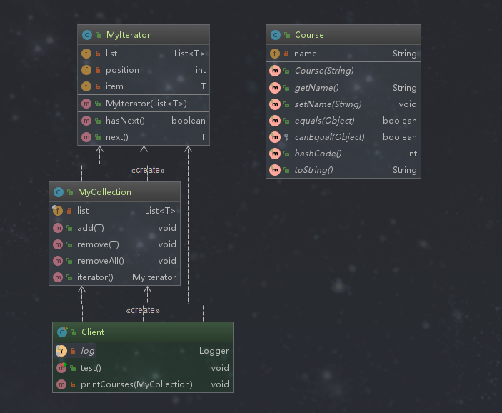

# 迭代器模式

## 定义

提供一种方法，顺序访问一个集合对象中的各个元素，而又不暴露该对象的内部细节。

## 类型

行为型

## 适用场景

```text
1 访问一个集合对象的内容而无需暴露它的内部表示
2 为遍历不同的集合结构提供一个统一的接口
```

## 优点

```text
分离了集合对象的遍历行为，因为抽象出了迭代器来遍历对象，这样就可以通过迭代器来访问集合对象内部元素了。
```

## 缺点

```text
类的个数成对增加，由于迭代器模式是将存储数据和遍历数据这个两个职责进行分离，所以当新出现一种集合类就需要增加一种新的对应的迭代器。这样类的个数增加，这在一定程度上增加了系统的复杂性。
```

## 迭代器相关的设计模式

*迭代器模式和访问者模式*

 ```text
1 这两者都是迭代地访问集合对象中的各个元素
2 访问者模式中扩展开放的部分在作用于对象的操作上，而在迭代器模式中扩展开放的部分是在集合对象的种类上
 ```

## 说明

迭代器模式在日常开发中一般不会自己写，除非我们定义自己的数据结构，然后为这个数据结构实现对应的迭代器。 

## 简单需求

课程的增加和删除以及迭代该课程集

## 迭代器模式演练



**实体类**
```java
package com.design.pattern.iterator.v2;

import lombok.AllArgsConstructor;
import lombok.Data;

/**
 * Course  相当于集合中的元素
 *
 * @author shunhua
 * @date 2019-09-27
 */
@Data
@AllArgsConstructor
public class Course {
    /**
     * 课程的名字
     */
    private String name;

}
```
**集合类**
```java
package com.design.pattern.iterator.v2;

import java.util.ArrayList;
import java.util.List;

/**
 * MyCollection
 *
 * @author shunhua
 * @date 2019-09-27
 */
public class MyCollection<T> {
    /**
     * 元素集合
     */
   private final List<T> list = new ArrayList<>();

    /**
     * 增加元素
     * @param item
     */
    public void add(T item){
        list.add(item);
    }

    /**
     * 移出元素
     */
    public void remove(T item){
        this.list.remove(item);
    }

    /**
     * 删除所有元素
     */
    public void removeAll(){
        this.list.removeAll(list);
    }

    /**
     * 获取迭代器，注意需要把实体对象列表传给迭代器
     * @return
     */
    public MyIterator iterator(){
       return new MyIterator(list);
    }
}
```
**迭代器**
```java
package com.design.pattern.iterator.v2;

import java.util.List;

/**
 * MyIterator
 *
 * @author shunhua
 * @date 2019-09-27
 */
public class MyIterator<T> {

    /**
     * 集合
     */
    private List<T> list ;
    /**
     * 游标
     */
    private int position;

    /**
     * 集合中的元素
     */
    private T item;

    public MyIterator(List<T> list){
        this.list = list;
    }

    /**
     * 是否有下一个元素
     * @return
     */
    public boolean hasNext(){
        if( this.position < list.size()){
            return true;
        }
        return false;
    }
   /**
   * 迭代元素
   * @return 
   */
    public T next(){
        T item = list.get(position);
        position ++;
        return item;
    }
}
```
**应用层**
```java
package com.design.pattern.iterator.v2;

import com.design.pattern.iterator.v1.Course;
import com.design.pattern.iterator.v1.CourseHandler;
import com.design.pattern.iterator.v1.CourseHandlerImpl;
import com.design.pattern.iterator.v1.CourseIterator;
import lombok.extern.slf4j.Slf4j;
import org.junit.Test;

/**
 * Client
 *
 * @author shunhua
 * @date 2019-09-27
 */
@Slf4j
public class Client {

    @Test
    public void test() {
        Course course1 = new Course("Java从入门到放弃");
        Course course2 = new Course("MySql从删库到跑路");
        Course course3 = new Course("Python从入门到精通");

        MyCollection<Course> collection = new MyCollection();
        collection.add(course1);
        collection.add(course2);
        collection.add(course3);

        log.info("----------课程列表-------------");
        printCourses(collection);

        collection.remove(course1);

        log.info("----------删除操作之后的课程----  ");
        printCourses(collection);

    }

    private void printCourses(MyCollection collection) {
        MyIterator iterator = collection.iterator();
        while (iterator.hasNext()) {
            Course course = (Course) iterator.next();
            log.info(course.toString());
        }
    }
}
```
## 迭代器模式源码解析

**ArrayList的迭代器**
```java
    /** ArrayList的内部类实现了Iterator
     * An optimized version of AbstractList.Itr
     */
    private class Itr implements Iterator<E> {
        int cursor;       // index of next element to return
        int lastRet = -1; // index of last element returned; -1 if no such
        int expectedModCount = modCount;

        public boolean hasNext() {
            return cursor != size;
        }

        @SuppressWarnings("unchecked")
        public E next() {
            checkForComodification();
            int i = cursor;
            if (i >= size)
                throw new NoSuchElementException();
            Object[] elementData = ArrayList.this.elementData;
            if (i >= elementData.length)
                throw new ConcurrentModificationException();
            cursor = i + 1;
            return (E) elementData[lastRet = i];
        }

        public void remove() {
            if (lastRet < 0)
                throw new IllegalStateException();
            checkForComodification();

            try {
                ArrayList.this.remove(lastRet);
                cursor = lastRet;
                lastRet = -1;
                expectedModCount = modCount;
            } catch (IndexOutOfBoundsException ex) {
                throw new ConcurrentModificationException();
            }
        }

        @Override
        @SuppressWarnings("unchecked")
        public void forEachRemaining(Consumer<? super E> consumer) {
            Objects.requireNonNull(consumer);
            final int size = ArrayList.this.size;
            int i = cursor;
            if (i >= size) {
                return;
            }
            final Object[] elementData = ArrayList.this.elementData;
            if (i >= elementData.length) {
                throw new ConcurrentModificationException();
            }
            while (i != size && modCount == expectedModCount) {
                consumer.accept((E) elementData[i++]);
            }
            // update once at end of iteration to reduce heap write traffic
            cursor = i;
            lastRet = i - 1;
            checkForComodification();
        }

        final void checkForComodification() {
            if (modCount != expectedModCount)
                throw new ConcurrentModificationException();
        }
    }
```


