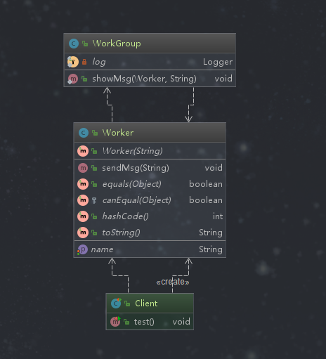

## 中介者模式

## 定义

定义了一个封装一组对象如何交互的对象（这个对象用来协调这一组对象（“同事类”））。通过使对象明确地相互引用来促进松散耦合，并允许独立地改变它们的交互。 

### 类型

行为型

### 适用场景

```text
1. 系统中对象之间存在复杂的引用关系，产生的相互依赖关系结构混乱难以理解，使用中介者进行协调
2. 交互的公共行为，如果需要改变行为则可以增加新的中介者类
```

### 优点

```text
1. 将一对多转化成了一对一、降低程序复杂度
2. 类之间的解耦
```

### 缺点

```text
中介者过多，导致系统复杂
```

### 相关的设计模式

*中介者模式和观察者模式*

```text
两者有时结合使用，使用观察者模式实现中介者模式中角色间的通信
```

### 简单需求
公司的员工之间发送公有消息，使用工作群统一发送，不需要发送者逐一发给其他员工

### 中介者模式演练



*中介者*
```java
package com.design.pattern.mediator;


import lombok.extern.slf4j.Slf4j;

import java.util.Date;

/**
 * WorkGroup 中介者 - 工作群
 *
 * @author shunhua
 * @date 2019-10-04
 */
@Slf4j
public class WorkGroup {
    /**
     * 中介者显示员工发送的消息
     * @param worker
     * @param msg
     */
    public static void showMsg(Worker worker, String msg){
        log.info(String.format("%s 【%s】: %s",new Date().toString(),worker.getName(),msg));
    }

}
```
*参与交互的对象类*
```java
package com.design.pattern.mediator;

import lombok.AllArgsConstructor;
import lombok.Data;

/**
 * Worker 员工 通常称为“同事类”
 *
 * @author shunhua
 * @date 2019-10-04
 */
@Data
@AllArgsConstructor
public class Worker {
    /**
     * 花名
     */
    private String name;

    /**
     * 员工只和中介者（工作群）打交道，这是中介者模式的核心
     * @param msg
     */
    public void sendMsg(String msg){
        WorkGroup.showMsg(this,msg);
    }
}
```

*应用层*
```java
package com.design.pattern.mediator;

import org.junit.Test;

/**
 * Client
 *
 * @author shunhua
 * @date 2019-10-04
 */
public class Client {

    @Test
    public void test(){

        Worker worker = new Worker("舜华");

        Worker worker1= new Worker("高斯林");

        worker1.sendMsg("小伙子，就你还想学我的Java！！！");

        worker.sendMsg("有句话不知当讲不当讲？");
    }

}
```
### 中介者模式在源码中的使用

*Timer*

```text
Timer是一个中介者，它协调TimerTask任务
```

```java
package java.util;
import java.util.Date;
import java.util.concurrent.atomic.AtomicInteger;

public class Timer {
    /**
     * The timer task queue.  This data structure is shared with the timer
     * thread.  The timer produces tasks, via its various schedule calls,
     * and the timer thread consumes, executing timer tasks as appropriate,
     * and removing them from the queue when they're obsolete.
     */
    private final TaskQueue queue = new TaskQueue();

    /**
     * The timer thread.
     */
    private final TimerThread thread = new TimerThread(queue);

   
    /**
     *  Timer中有多个schedule重载方法，里面都调用了sched方法
     */
    public void schedule(TimerTask task, long delay) {
        if (delay < 0)
            throw new IllegalArgumentException("Negative delay.");
        sched(task, System.currentTimeMillis()+delay, 0);
    }
    
    
     /**
     * 
     * Timer是一个中介者，通过sched方法统一协调TimerTask
     * 
     * @param task 被协调的对象
     * @param time
     * @param period
     */
     private void sched(TimerTask task, long time, long period) {
            if (time < 0)
                throw new IllegalArgumentException("Illegal execution time.");
    
            // Constrain value of period sufficiently to prevent numeric
            // overflow while still being effectively infinitely large.
            if (Math.abs(period) > (Long.MAX_VALUE >> 1))
                period >>= 1;
    
            synchronized(queue) {
                if (!thread.newTasksMayBeScheduled)
                    throw new IllegalStateException("Timer already cancelled.");
    
                synchronized(task.lock) {
                    if (task.state != TimerTask.VIRGIN)
                        throw new IllegalStateException(
                            "Task already scheduled or cancelled");
                    task.nextExecutionTime = time;
                    task.period = period;
                    task.state = TimerTask.SCHEDULED;
                }
    
                queue.add(task);
                if (queue.getMin() == task)
                    queue.notify();
            }
        }
}
```