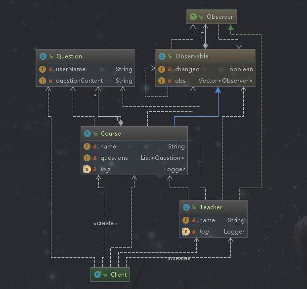

## 观察者模式

### 定义

定义了对象之间的一对多依赖，让多个观察者对象同时监听某一个主题对象，当主题对象发生变化时，它的所有依赖者（观察者）都会收到通知并更新。

### 类型

行为型

### 适用场景

```text
关联行为场景，建立一套触发机制。如：注某个产品的价格，然后进行通知，其中价格的变动可能会影响一条链，就像是一个触发链条。这样就可以使用观察者模式创建一个种链式发机制。
```

### 优点

```text
1. 观察者和被观察者之间建立一个抽象的耦合
  - 因为是抽象的耦合关系，不管是增加观察者还是被观察者都很容易扩展
2. 支持广播通信
  - 类似消息广播，需要监听主题的只需要注册就可以了
```

### 缺点

```text
1. 观察者之间有过多的细节依赖、提高了时间消耗及程序复杂度
  - 过多的依赖：触发机制和触发链条 
  - 提高了时间消耗及程序复杂度：如果一个被观察对象有多个直接或间接观察者，一旦被观察者变化，然后发出通知，将所有观察者都通知到会花费一些时间
2. 使用要得当，避免循环调用
  - 如果在观察者和被观察者之间有循环依赖的话，被观察者（主题对象）会触发它们之间进行循环调用，这样会导致系统崩溃
```
### 简单需求

学生在学习课程的时候可能会提出问题，而老师则是关注自己的课程，有学生提出自己课程的问题就给出解答

### 观察者模式演练



*被观察者需要继承的类*

```java
package java.util;

/**
 * @since   JDK1.0
 */
public class Observable {
    private boolean changed = false;
    private Vector<Observer> obs;

    /** Construct an Observable with zero Observers. */

    public Observable() {
        obs = new Vector<>();
    }

    /**
     * 
     * 在观察者列表中增加一个观察者
     * 
     * @param   o  要添加的观察者对象
     * @throws NullPointerException  如果参数传入null会抛出异常
     */
    public synchronized void addObserver(Observer o) {
        if (o == null)
            throw new NullPointerException();
        if (!obs.contains(o)) {
            obs.addElement(o);
        }
    }

    /**
     * 从观察者列表中删除指定的观察者
     * 
     * @param   o  要被移出的观察者 出入为null不会抛出异常
     */
    public synchronized void deleteObserver(Observer o) {
        obs.removeElement(o);
    }

    /**
     * 通知观察者们，主题对象（被观察者发生了改变），该方法不传参数给观察者们
     */
    public void notifyObservers() {
        notifyObservers(null);
    }

    /**
     * 通知观察者们，主题对象（被观察者发生了改变），该方法传参数给观察者们
     */
    public void notifyObservers(Object arg) {
        /*
         * a temporary array buffer, used as a snapshot of the state of
         * current Observers.
         */
        Object[] arrLocal;

        synchronized (this) {
            /*
             * 在通知观察者们之前会先校验标识主题对象（被观察者）改变的属性，如果没有改变就直接返回不进行通知
             */
            if (!changed)
                return;
            arrLocal = obs.toArray();
            clearChanged();
        }

        for (int i = arrLocal.length-1; i>=0; i--)
            // 通过调用观察者的update方法通知观察者，会把当前主题对象（被观察者对象）传给观察者
            ((Observer)arrLocal[i]).update(this, arg);
    }

    /**
     * 清除观察者列表
     */
    public synchronized void deleteObservers() {
        obs.removeAllElements();
    }

    /**
     * 调用这个方法就是说明了主题对象（被观察者发生了改变），设置标识对象为true
     */
    protected synchronized void setChanged() {
        changed = true;
    }

    /**
     *
     * 调用这个方法说明主题对象（被观察者）已经不再改变了或者要通知的观察者都通知完了。这个方法会在调用notifyObservers方法自动调用
     */
    protected synchronized void clearChanged() {
        changed = false;
    }

    /**
     * 获取主题对象是否改变的标识
     */
    public synchronized boolean hasChanged() {
        return changed;
    }

    /**
     * 返回关注主题对象的观察的个数
     *
     * @return  the number of observers of this object.
     */
    public synchronized int countObservers() {
        return obs.size();
    }
}

```

*观察者需要实现的接口*

```java
package java.util;

/**
 * @since   JDK1.0
 */
public interface Observer {
    /**
     *                
     * 当订阅的主题对象（被观察者）发生改变时，会通过调用 notifyObservers方法来通知所有设计到的观察者，就是通过调用观察者的update方法进行通知的              
     */
    void update(Observable o, Object arg);
}

```

*主题类（被观察者）*

```java
package com.design.pattern.observer;

import lombok.Data;
import lombok.extern.slf4j.Slf4j;

import java.util.ArrayList;
import java.util.List;
import java.util.Observable;

/**
 * Course
 * 1 它下面有问题，Course属于被观察者，也就是主题对象
 * 2 作为被观察者必须继承Observable类，标志是可观察的
 *
 * @author shunhua
 * @date 2019-10-02
 */
@Data
@Slf4j
public class Course extends Observable {
    /**
     * 课程名
     */
    private String name;
    /**
     * 课程对应的问题列表
     */
    private List<Question> questions = new ArrayList<>();

    public Course(String name) {
        this.name = name;
    }

    public void addQuestion(Question question) {
        questions.add(question);
    }

    /**
     * 主题改变方法
     *
     * @param course
     */
    public void produceQuestion(Course course) {
        questions.stream().forEach(question -> {
                    log.info(String.format("%s在%s提出了问题", question.getUserName(), course.getName()));
                    /**
                     * 调用父类Observabel中的setChanged方法，把changed标识设置为true,表示主题对象发生了改变,此时观察者和被观察者之间进行通信
                     */

                    setChanged();

                    /**
                     * 通知观察者
                     */
                    notifyObservers(question);
                }
        );
    }
}
```

*观察者*

```java
package com.design.pattern.observer;

import lombok.AllArgsConstructor;
import lombok.Data;
import lombok.extern.slf4j.Slf4j;

import java.util.Observable;
import java.util.Observer;

/**
 * Teacher
 *
 * 1 观察的是课程，而不是问题，问题属于课程 。 Teacher属于观察者
 * 2 必须实现Observer接口，表示它是一个观察者
 *
 * @author shunhua
 * @date 2019-10-02
 */
@Data
@AllArgsConstructor
@Slf4j
public class Teacher implements Observer {
    /**
     * 老师名称
     */
    private String name;

    /**
     *
     * @param o  被观察对象
     * @param arg  被观察者的notifyObservers方法传递过来的对象
     */
    @Override
    public void update(Observable o, Object arg) {
        Course course = (Course) o;
        Question question = (Question) arg;
        log.info(String.format("%s课程被%s同学提出%s的问题，需要%s解答",course.getName(),question.getUserName(),question.getQuestionContent(),name));
    }
}
```
*应用辅助类*
```java
package com.design.pattern.observer;

import lombok.Builder;
import lombok.Data;

/**
 * Question
 *
 * @author shunhua
 * @date 2019-10-02
 */
@Data
@Builder
public class Question {
    /**
     * 问题提问者名称
     */
    private String userName;
    /**
     * 具体问题
     */
    private String questionContent;
}
```

*应用层*
```java
package com.design.pattern.observer;

import org.junit.Test;

/**
 * Client
 *
 * @author shunhua
 * @date 2019-10-02 
 */
public class Client {

    @Test
    public void test(){
        Course course = new Course("《Java从入门到放弃》");
        Teacher teacher = new Teacher("Java学院老师");
        Teacher teacher1 = new Teacher("鼓励师");
        // 为课程添加观察者
        course.addObserver(teacher);
        course.addObserver(teacher1);

        // 添加课程的问题
        course.addQuestion(Question.builder()
                .userName("gentryhuang")
                .questionContent("Java学不完，需要放弃吗？")
                .build());
        course.addQuestion(Question.builder()
                .userName("xw")
                .questionContent("快看，又一个学Java的转行了，要跑路吗？")
                .build());

        // 主题对象发生变化（有问题提出了）
        course.produceQuestion(course);

    }
}
```

### 观察者模式源码解析

*监听器实现方案就是观察者模式实现的一种*

*Guava中观察者模式的使用*

使用@Subscribe进行方法标注

```java
package com.design.pattern.observer.guava;

import com.google.common.eventbus.Subscribe;
import lombok.extern.slf4j.Slf4j;

/**
 * GuavaEvent
 *
 * @author shunhua
 * @date 2019-10-02
 */
@Slf4j
public class GuavaEvent {

    @Subscribe
    public void subscribe(String event){
        log.info("执行subscribe方法，传入参数是：" + event);
    }
}
```

在应用层把订阅者进行注册

```java
package com.design.pattern.observer.guava;

import com.google.common.eventbus.EventBus;
import org.junit.Test;

/**
 * GuavaEventTest
 *
 * @author shunhua
 * @date 2019-10-02
 */
public class GuavaEventTest {

    @Test
    public void test() {

        /**
         * Guava实现观察者模式的核心类
         */
        EventBus eventBus = new EventBus();
        /**
         * GuavaEvent中有使用@Subscribe注解标注的方法
         */
        GuavaEvent guavaEvent = new GuavaEvent();
        /**
         * GuavaEvent的@Subscribe标注的方法 加入到观察者模式中，作为订阅者即观察者
         */
        eventBus.register(guavaEvent);
        /**
         * 调用EventBus的post方法会回调Subscribe标注的方法
         */
        eventBus.post("post的内容");
    }
}
```

