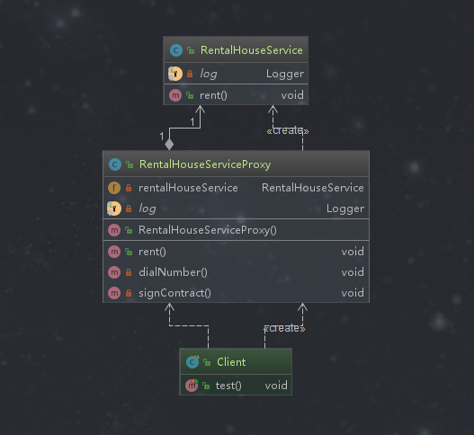
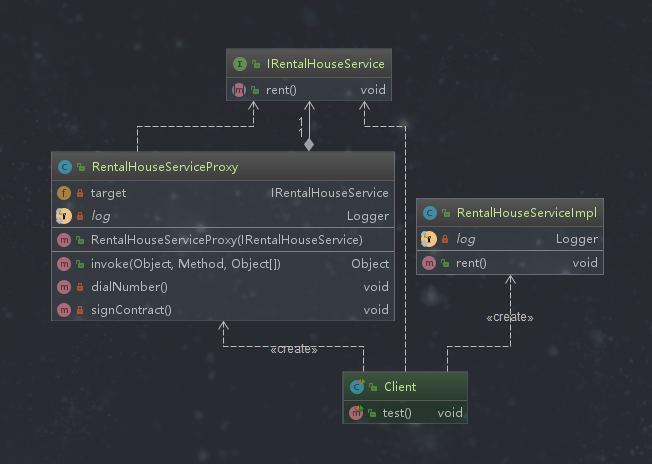
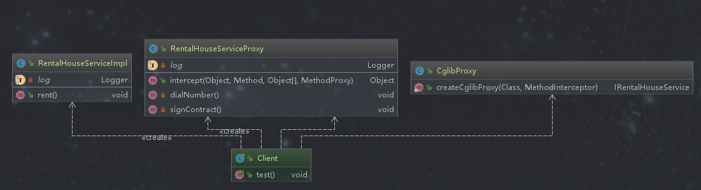

## 代理模式

### 定义

为其他对象提供一种代理，以控制对这个对象的访问。代理对象在客户端和目标对象之间起到中介的作用。

> 举例：租房子，目标对象代表房东，客户端代表用户，房屋中介代表中介。房屋中介起到代理的作用，签合同和缴纳水电费直接找中介就可以了，不需要和房东直接接触，即中介代理房东。


### 类型

结构型

### 使用场景

```text
◆ 保护目标对象
◆ 增强目标对象
```

### 优点

```text
◆ 代理模式能将代理对象与真实被调用的目标对象分离
◆ 一定程度上降低了系统的耦合度，扩展性好
◆ 保护目标对象
◆ 在不修改目标类的前提下，增强目标对象
```

### 缺点

```text
◆ 代理模式会造成系统设计中类的数目增加
◆ 在客户端和目标对象增加一个代理对象，会造成请求处理速度变慢
◆ 增加系统的复杂度
```

### 扩展

> 根据代理对象与目标对象代理关系的创建时机的不同，可以分为静态代理和动态代理。动态代理又根据实现技术的不同分为JDK的Proxy动态代理和CGLIB动态代理。

*静态代理*

```text
静态代理就是在代码中指定显式的代理,在编译之前代理关系就已经确定了。在代理类中对同名的方法进行包装，用户通过对代理类的被包装过的方法来调用目标对象的业务方法，同时对目标对象的业务方法进行增强。
```

*JDK动态代理*

```text
jdk的动态代理是通过接口中的方法名对在动态生成的代理类中，调用业务实现类的同名方法。注意:必须是接口,因为jdk底层先创建一个代理类，然后再创建代理类的实例，它的类型是接口类型，不是目标类的类型。
```

*CGLIB代理*

```text
cglib是通过继承来实现的，生成的代理类是业务类的子类，通过重写业务方法执行代理。使用CGLib进行代理时一定要注意final修改的类和方法以及是否有无参构造器。CGLib底层使用asm字节码生成的。
```

### 代理模式相关的设计模式

*代理模式和装饰者模式*

```text
目的不同，装饰者模式是为对象加上行为，而代理模式是控制访问，代理模式更加关注通过控制代理人的方式来增强目标对象。增强对象的方式一般是增强对象的某些行为。
```

*代理模式和适配器模式*

```text
适配器模式主要改变所要考虑对象的接口，代理模式不可以改变所代理类的接口。
```

### 代理模式演练

#### 静态代理

>静态代理的代理类是手动编写的，代理关系在编译之前就确立了。通常目标对象在代理类中创建。



*目标类接口*

```java
package com.design.pattern.proxy.staticproxy;

/**
 * IRentalHouseService
 *
 * @author shunhua
 * @date 2019-10-03
 */
public interface IRentalHouseService {
    /**
     * 租房方法
     */
    void rent();
}

```

*目标类*
```java
package com.design.pattern.proxy.jdkproxy;

import com.design.pattern.proxy.staticproxy.IRentalHouseService;
import lombok.extern.slf4j.Slf4j;

/**
 *RentalHouseServiceImpl
 *
 * @author shunhua
 * @date 2019-10-03
 */
@Slf4j
public class RentalHouseService implements IRentalHouseService {

    /**
     * 出租房子，目标方法
     * @return
     */
    @Override
    public void rent(){
        log.info("1800/月，2室1厅1厨1卫！");
    }

}
```

*代理类*
```java
package com.design.pattern.proxy.staticproxy;

import lombok.extern.slf4j.Slf4j;

/**
 * RentalHouseServiceProxy 代理类
 *
 * @author shunhua
 * @date 2019-10-03
 */
@Slf4j
public class RentalHouseServiceProxy {
    /**
     * 代理对象需要目标对象
     */
    private RentalHouseService rentalHouseService;

    /**
     * 构造方法
     */
    public RentalHouseServiceProxy(){
        rentalHouseService = new RentalHouseService();
    }

    /**
     * 代理方法
     */
    public void rent(){
        dialNumber();
        rentalHouseService.rent();
        signContract();
    }


    /**
     * 需要房租请联系我，目标方法的前置方法
     */
    private void dialNumber() {
        log.info("需要租房请致电：123456");
    }

    /**
     * 签合同，目标方法的后置方法
     */
    private void signContract() {
        log.info("房子还满意就可以签合同了！");
    }
}
```

*应用层*
```java
package com.design.pattern.proxy.staticproxy;

import org.junit.Test;

/**
 * Client
 *
 * @author shunhua
 * @date 2019-10-03
 */
public class Client {

    @Test
    public void test(){
        // 租房直接找代理
        RentalHouseServiceProxy proxy = new RentalHouseServiceProxy();
        proxy.rent();
    }

}
```

#### jdk动态代理

>jdk动态代理用于目标类有接口的情况。代理类不是手动创建，而是程序运行时动态生成。有时目标对象需要在客户端中创建，这样情况下不能够保护和隐藏目标对象，只是增强了目标方法功能。
代理类的名称由三部分构成：$ + Proxy + 数字，数字表示当前JDK的Proxy所生成的代理类的索引，索引从0开始计数。



*目标类接口*
```java
package com.design.pattern.proxy.jdkproxy;

/**
 * IRentalHouseService
 *
 * @author shunhua
 * @date 2019-10-03
 */
public interface IRentalHouseService {
    /**
     * 租房方法
     */
    void rent();
}

```
*目标类*
```java
package com.design.pattern.proxy.jdkproxy;

import com.design.pattern.proxy.staticproxy.IRentalHouseService;
import lombok.extern.slf4j.Slf4j;

/**
 * RentalHouseServiceImpl 目标类
 *
 * @author shunhua
 * @date 2019-10-03
 */
@Slf4j
public class RentalHouseServiceImpl implements IRentalHouseService {

    /**
     * 出租房子，目标方法
     * @return
     */
    @Override
    public void rent(){
        log.info("1800/月，2室1厅1厨1卫！");
    }

}
```
*InvocationHandler实现*
```java
package com.design.pattern.proxy.jdkproxy;

import lombok.extern.slf4j.Slf4j;

import java.lang.reflect.InvocationHandler;
import java.lang.reflect.Method;

/**
 * RentalHouseServiceProxy
 *
 * @author shunhua
 * @date 2019-10-03
 */
@Slf4j
public class RentalHouseServiceProxy implements InvocationHandler {

    private IRentalHouseService target;

    public RentalHouseServiceProxy(IRentalHouseService target) {
        this.target = target;
    }

    /**
     * 当执行代理对象的代理方法时，代理方法会调用该invoke()
     *
     * @param proxy 代理对象
     * @param method 目标方法
     * @param args 目标方法的参数列表
     * @return
     * @throws Throwable
     */
    @Override
    public Object invoke(Object proxy, Method method, Object[] args) throws Throwable {
        // 调用目标方法前
        dialNumber();
        // 执行目标方法
        Object result = method.invoke(target, args);
        // 调用目标方法后
        signContract();

        return result;

    }

    /**
     * 需要房租请联系我，目标方法的前置方法
     */
    private void dialNumber() {
        log.info("需要租房请致电：123456");
    }

    /**
     * 签合同，目标方法的后置方法
     */
    private void signContract() {
        log.info("房子还满意就可以签合同了！");
    }
}
```
*客户端*
```java
package com.design.pattern.proxy.jdkproxy;

import org.junit.Test;

import java.lang.reflect.Proxy;

/**
 * Client
 *
 * @author shunhua
 * @date 2019-10-04
 */
public class Client {

    @Test
    public void test(){
        // 创建目标对象
        IRentalHouseService target =  new RentalHouseServiceImpl();

        // 创建代理对象（接口实现类的代理对象）
        IRentalHouseService proxy = (IRentalHouseService) Proxy.newProxyInstance(
                target.getClass().getClassLoader(),
                target.getClass().getInterfaces(),
                new RentalHouseServiceProxy(target)
        );

        /**
         * 调用代理对象的代理方法,注意当调用代理对象的代理方法时，InvocationHandler的invoke方法会被自动调用
         */
        proxy.rent();
    }

}
```

#### CGLIB动态代理

>CGLIB的底层是通过使用字节码处理框架ASM来转换字节码并生成新的类，代理的目标类可以没有实现接口，也可以有实现的接口。CGLIB使用子类扩展父类的方式来生成代理对象，
即CGLIB会动态生成目标类的子类作为代理类，并创建其对象即代理对象。



*目标类*
```java
package com.design.pattern.proxy.cglibproxy;

import com.design.pattern.proxy.staticproxy.IRentalHouseService;
import lombok.extern.slf4j.Slf4j;

/**
 * RentalHouseServiceImpl 目标类
 *
 * @author shunhua
 * @date 2019-10-03
 */
@Slf4j
public class RentalHouseServiceImpl implements IRentalHouseService {

    /**
     * 出租房子，目标方法
     * @return
     */
    @Override
    public void rent(){
        log.info("1800/月，2室1厅1厨1卫！");
    }

}
```

*MethodInterceptor的实现*
```java
package com.design.pattern.proxy.cglibproxy;

import lombok.extern.slf4j.Slf4j;
import net.sf.cglib.proxy.MethodInterceptor;
import net.sf.cglib.proxy.MethodProxy;

import java.lang.reflect.InvocationHandler;
import java.lang.reflect.Method;

/**
 * RentalHouseServiceProxy
 *
 * @author shunhua
 * @date 2019-10-03
 */
@Slf4j
public class RentalHouseServiceProxy implements MethodInterceptor {


    /**
     *
     * @param o  代理对象
     * @param method 目标方法
     * @param objects 目标方法参数列表
     * @param methodProxy 目标方法的代理对象
     * @return
     * @throws Throwable
     */
    @Override
    public Object intercept(Object o, Method method, Object[] objects, MethodProxy methodProxy) throws Throwable {
        return null;
    }

    /**
     * 需要房租请联系我，目标方法的前置方法
     */
    private void dialNumber() {
        log.info("需要租房请致电：123456");
    }

    /**
     * 签合同，目标方法的后置方法
     */
    private void signContract() {
        log.info("房子还满意就可以签合同了！");
    }
}
```

*生成代理类的逻辑类*
```java
package com.design.pattern.proxy.cglibproxy;

import net.sf.cglib.proxy.Enhancer;
import net.sf.cglib.proxy.MethodInterceptor;

/**
 * CglibProxy  手动创建
 *
 * @author shunhua
 * @date 2019-10-04
 */
public class CglibProxy {

    /**
     * 创建Cglib的代理对象
     *
     * @param targetClass 目标类
     * @param callBack  委托类对象
     * @return
     */
    public static IRentalHouseService createCglibProxy(Class targetClass, MethodInterceptor callBack){
        // 创建增强其
        Enhancer enhancer = new Enhancer();

        // 指定目标类
        enhancer.setSuperclass(targetClass);

        // 设置回调接口
        enhancer.setCallback(callBack);

        // 创建并返回代理对象，即目标类的子类对象
        return (IRentalHouseService) enhancer.create();
    }

}
```

*客户端*
```java
package com.design.pattern.proxy.cglibproxy;


import org.junit.Test;

/**
 * Client
 *
 * @author shunhua
 * @date 2019-10-04
 */
public class Client {

    @Test
    public void test() {
        // 创建目标对象
        IRentalHouseService target = new RentalHouseServiceImpl();

        // 创建委托对象
        RentalHouseServiceProxy rentalHouseServiceProxy = new RentalHouseServiceProxy();

        // 创建代理对象（接口实现类的代理对象）
        IRentalHouseService cglibProxy = CglibProxy.createCglibProxy(target.getClass(), rentalHouseServiceProxy);

        /**
         * 调用代理对象的代理方法,注意当调用代理对象的代理方法时，InvocationHandler的invoke方法会被自动调用
         */
        cglibProxy.rent();
    }

}
```

### 代理模式在源码中的使用

##### jdk中的应用

```jav
package java.lang.reflect;

import java.lang.ref.WeakReference;
import java.security.AccessController;
import java.security.PrivilegedAction;
import java.util.Arrays;
import java.util.IdentityHashMap;
import java.util.Map;
import java.util.Objects;
import java.util.concurrent.atomic.AtomicLong;
import java.util.function.BiFunction;
import sun.misc.ProxyGenerator;
import sun.misc.VM;
import sun.reflect.CallerSensitive;
import sun.reflect.Reflection;
import sun.reflect.misc.ReflectUtil;
import sun.security.util.SecurityConstants;

public class Proxy implements java.io.Serializable {

    private static final long serialVersionUID = -2222568056686623797L;

    /** parameter types of a proxy class constructor */
    private static final Class<?>[] constructorParams =
        { InvocationHandler.class };

    /**
     * a cache of proxy classes
     */
    private static final WeakCache<ClassLoader, Class<?>[], Class<?>>
        proxyClassCache = new WeakCache<>(new KeyFactory(), new ProxyClassFactory());

    /**
     * the invocation handler for this proxy instance.
     * @serial
     */
    protected InvocationHandler h;

    /**
     * Prohibits instantiation.
     */
    private Proxy() {
    }

    /**
     * Constructs a new {@code Proxy} instance from a subclass
     * (typically, a dynamic proxy class) with the specified value
     * for its invocation handler.
     *
     * @param  h the invocation handler for this proxy instance
     *
     * @throws NullPointerException if the given invocation handler, {@code h},
     *         is {@code null}.
     */
    protected Proxy(InvocationHandler h) {
        Objects.requireNonNull(h);
        this.h = h;
    }

    @CallerSensitive
    public static Class<?> getProxyClass(ClassLoader loader,
                                         Class<?>... interfaces)
        throws IllegalArgumentException
    {
        final Class<?>[] intfs = interfaces.clone();
        final SecurityManager sm = System.getSecurityManager();
        if (sm != null) {
            checkProxyAccess(Reflection.getCallerClass(), loader, intfs);
        }

        return getProxyClass0(loader, intfs);
    }

    /*
     * Check permissions required to create a Proxy class.
     *
     * To define a proxy class, it performs the access checks as in
     * Class.forName (VM will invoke ClassLoader.checkPackageAccess):
     * 1. "getClassLoader" permission check if loader == null
     * 2. checkPackageAccess on the interfaces it implements
     *
     * To get a constructor and new instance of a proxy class, it performs
     * the package access check on the interfaces it implements
     * as in Class.getConstructor.
     *
     * If an interface is non-public, the proxy class must be defined by
     * the defining loader of the interface.  If the caller's class loader
     * is not the same as the defining loader of the interface, the VM
     * will throw IllegalAccessError when the generated proxy class is
     * being defined via the defineClass0 method.
     */
    private static void checkProxyAccess(Class<?> caller,
                                         ClassLoader loader,
                                         Class<?>... interfaces)
    {
        SecurityManager sm = System.getSecurityManager();
        if (sm != null) {
            ClassLoader ccl = caller.getClassLoader();
            if (VM.isSystemDomainLoader(loader) && !VM.isSystemDomainLoader(ccl)) {
                sm.checkPermission(SecurityConstants.GET_CLASSLOADER_PERMISSION);
            }
            ReflectUtil.checkProxyPackageAccess(ccl, interfaces);
        }
    }

    /**
     * 生成代理类的核心方法
     */
    private static Class<?> getProxyClass0(ClassLoader loader,
                                           Class<?>... interfaces) {
        if (interfaces.length > 65535) {
            throw new IllegalArgumentException("interface limit exceeded");
        }

        // 如果缓存中有对应的代理类就直接获取，没有就创建然后放入缓存
       
        return proxyClassCache.get(loader, interfaces);
    }

    /*
     * a key used for proxy class with 0 implemented interfaces
     */
    private static final Object key0 = new Object();

    /*
     * Key1 and Key2 are optimized for the common use of dynamic proxies
     * that implement 1 or 2 interfaces.
     */

    /*
     * a key used for proxy class with 1 implemented interface
     */
    private static final class Key1 extends WeakReference<Class<?>> {
        private final int hash;

        Key1(Class<?> intf) {
            super(intf);
            this.hash = intf.hashCode();
        }

        @Override
        public int hashCode() {
            return hash;
        }

        @Override
        public boolean equals(Object obj) {
            Class<?> intf;
            return this == obj ||
                   obj != null &&
                   obj.getClass() == Key1.class &&
                   (intf = get()) != null &&
                   intf == ((Key1) obj).get();
        }
    }

    /*
     * a key used for proxy class with 2 implemented interfaces
     */
    private static final class Key2 extends WeakReference<Class<?>> {
        private final int hash;
        private final WeakReference<Class<?>> ref2;

        Key2(Class<?> intf1, Class<?> intf2) {
            super(intf1);
            hash = 31 * intf1.hashCode() + intf2.hashCode();
            ref2 = new WeakReference<Class<?>>(intf2);
        }

        @Override
        public int hashCode() {
            return hash;
        }

        @Override
        public boolean equals(Object obj) {
            Class<?> intf1, intf2;
            return this == obj ||
                   obj != null &&
                   obj.getClass() == Key2.class &&
                   (intf1 = get()) != null &&
                   intf1 == ((Key2) obj).get() &&
                   (intf2 = ref2.get()) != null &&
                   intf2 == ((Key2) obj).ref2.get();
        }
    }

    /*
     * a key used for proxy class with any number of implemented interfaces
     * (used here for 3 or more only)
     */
    private static final class KeyX {
        private final int hash;
        private final WeakReference<Class<?>>[] refs;

        @SuppressWarnings("unchecked")
        KeyX(Class<?>[] interfaces) {
            hash = Arrays.hashCode(interfaces);
            refs = (WeakReference<Class<?>>[])new WeakReference<?>[interfaces.length];
            for (int i = 0; i < interfaces.length; i++) {
                refs[i] = new WeakReference<>(interfaces[i]);
            }
        }

        @Override
        public int hashCode() {
            return hash;
        }

        @Override
        public boolean equals(Object obj) {
            return this == obj ||
                   obj != null &&
                   obj.getClass() == KeyX.class &&
                   equals(refs, ((KeyX) obj).refs);
        }

        private static boolean equals(WeakReference<Class<?>>[] refs1,
                                      WeakReference<Class<?>>[] refs2) {
            if (refs1.length != refs2.length) {
                return false;
            }
            for (int i = 0; i < refs1.length; i++) {
                Class<?> intf = refs1[i].get();
                if (intf == null || intf != refs2[i].get()) {
                    return false;
                }
            }
            return true;
        }
    }

    /**
     * A function that maps an array of interfaces to an optimal key where
     * Class objects representing interfaces are weakly referenced.
     */
    private static final class KeyFactory
        implements BiFunction<ClassLoader, Class<?>[], Object>
    {
        @Override
        public Object apply(ClassLoader classLoader, Class<?>[] interfaces) {
            switch (interfaces.length) {
                case 1: return new Key1(interfaces[0]); // the most frequent
                case 2: return new Key2(interfaces[0], interfaces[1]);
                case 0: return key0;
                default: return new KeyX(interfaces);
            }
        }
    }

    /**
     * A factory function that generates, defines and returns the proxy class given
     * the ClassLoader and array of interfaces.
     */
    private static final class ProxyClassFactory
        implements BiFunction<ClassLoader, Class<?>[], Class<?>>
    {
        // prefix for all proxy class names
        private static final String proxyClassNamePrefix = "$Proxy";

        // next number to use for generation of unique proxy class names
        private static final AtomicLong nextUniqueNumber = new AtomicLong();

        @Override
        public Class<?> apply(ClassLoader loader, Class<?>[] interfaces) {

            Map<Class<?>, Boolean> interfaceSet = new IdentityHashMap<>(interfaces.length);
            for (Class<?> intf : interfaces) {
                /*
                 * Verify that the class loader resolves the name of this
                 * interface to the same Class object.
                 */
                Class<?> interfaceClass = null;
                try {
                    interfaceClass = Class.forName(intf.getName(), false, loader);
                } catch (ClassNotFoundException e) {
                }
                if (interfaceClass != intf) {
                    throw new IllegalArgumentException(
                        intf + " is not visible from class loader");
                }
                /*
                 * Verify that the Class object actually represents an
                 * interface.
                 */
                if (!interfaceClass.isInterface()) {
                    throw new IllegalArgumentException(
                        interfaceClass.getName() + " is not an interface");
                }
                /*
                 * Verify that this interface is not a duplicate.
                 */
                if (interfaceSet.put(interfaceClass, Boolean.TRUE) != null) {
                    throw new IllegalArgumentException(
                        "repeated interface: " + interfaceClass.getName());
                }
            }

            String proxyPkg = null;     // package to define proxy class in
            int accessFlags = Modifier.PUBLIC | Modifier.FINAL;

            /*
             * Record the package of a non-public proxy interface so that the
             * proxy class will be defined in the same package.  Verify that
             * all non-public proxy interfaces are in the same package.
             */
            for (Class<?> intf : interfaces) {
                int flags = intf.getModifiers();
                if (!Modifier.isPublic(flags)) {
                    accessFlags = Modifier.FINAL;
                    String name = intf.getName();
                    int n = name.lastIndexOf('.');
                    String pkg = ((n == -1) ? "" : name.substring(0, n + 1));
                    if (proxyPkg == null) {
                        proxyPkg = pkg;
                    } else if (!pkg.equals(proxyPkg)) {
                        throw new IllegalArgumentException(
                            "non-public interfaces from different packages");
                    }
                }
            }

            if (proxyPkg == null) {
                // if no non-public proxy interfaces, use com.sun.proxy package
                proxyPkg = ReflectUtil.PROXY_PACKAGE + ".";
            }

            /*
             * Choose a name for the proxy class to generate.
             */
            long num = nextUniqueNumber.getAndIncrement();
            String proxyName = proxyPkg + proxyClassNamePrefix + num;

            /*
             * Generate the specified proxy class.
             */
            byte[] proxyClassFile = ProxyGenerator.generateProxyClass(
                proxyName, interfaces, accessFlags);
            try {
                return defineClass0(loader, proxyName,
                                    proxyClassFile, 0, proxyClassFile.length);
            } catch (ClassFormatError e) {
                /*
                 * A ClassFormatError here means that (barring bugs in the
                 * proxy class generation code) there was some other
                 * invalid aspect of the arguments supplied to the proxy
                 * class creation (such as virtual machine limitations
                 * exceeded).
                 */
                throw new IllegalArgumentException(e.toString());
            }
        }
    }

    // 该方法最终返回一个新的对象（目标对象）
    @CallerSensitive
    public static Object newProxyInstance(ClassLoader loader,
                                          Class<?>[] interfaces,
                                          InvocationHandler h)
        throws IllegalArgumentException
    {
        Objects.requireNonNull(h);

        final Class<?>[] intfs = interfaces.clone();
        final SecurityManager sm = System.getSecurityManager();
        if (sm != null) {
            checkProxyAccess(Reflection.getCallerClass(), loader, intfs);
        }

        /*
         * 生成代理类的核心方法
         */
        Class<?> cl = getProxyClass0(loader, intfs);

        /*
         * Invoke its constructor with the designated invocation handler.
         */
        try {
            if (sm != null) {
                checkNewProxyPermission(Reflection.getCallerClass(), cl);
            }

            final Constructor<?> cons = cl.getConstructor(constructorParams);
            final InvocationHandler ih = h;
            if (!Modifier.isPublic(cl.getModifiers())) {
                AccessController.doPrivileged(new PrivilegedAction<Void>() {
                    public Void run() {
                        cons.setAccessible(true);
                        return null;
                    }
                });
            }
            return cons.newInstance(new Object[]{h});
        } catch (IllegalAccessException|InstantiationException e) {
            throw new InternalError(e.toString(), e);
        } catch (InvocationTargetException e) {
            Throwable t = e.getCause();
            if (t instanceof RuntimeException) {
                throw (RuntimeException) t;
            } else {
                throw new InternalError(t.toString(), t);
            }
        } catch (NoSuchMethodException e) {
            throw new InternalError(e.toString(), e);
        }
    }

    private static void checkNewProxyPermission(Class<?> caller, Class<?> proxyClass) {
        SecurityManager sm = System.getSecurityManager();
        if (sm != null) {
            if (ReflectUtil.isNonPublicProxyClass(proxyClass)) {
                ClassLoader ccl = caller.getClassLoader();
                ClassLoader pcl = proxyClass.getClassLoader();

                // do permission check if the caller is in a different runtime package
                // of the proxy class
                int n = proxyClass.getName().lastIndexOf('.');
                String pkg = (n == -1) ? "" : proxyClass.getName().substring(0, n);

                n = caller.getName().lastIndexOf('.');
                String callerPkg = (n == -1) ? "" : caller.getName().substring(0, n);

                if (pcl != ccl || !pkg.equals(callerPkg)) {
                    sm.checkPermission(new ReflectPermission("newProxyInPackage." + pkg));
                }
            }
        }
    }

    /**
     * Returns true if and only if the specified class was dynamically
     * generated to be a proxy class using the {@code getProxyClass}
     * method or the {@code newProxyInstance} method.
     *
     * <p>The reliability of this method is important for the ability
     * to use it to make security decisions, so its implementation should
     * not just test if the class in question extends {@code Proxy}.
     *
     * @param   cl the class to test
     * @return  {@code true} if the class is a proxy class and
     *          {@code false} otherwise
     * @throws  NullPointerException if {@code cl} is {@code null}
     */
    public static boolean isProxyClass(Class<?> cl) {
        return Proxy.class.isAssignableFrom(cl) && proxyClassCache.containsValue(cl);
    }

    /**
     * Returns the invocation handler for the specified proxy instance.
     *
     * @param   proxy the proxy instance to return the invocation handler for
     * @return  the invocation handler for the proxy instance
     * @throws  IllegalArgumentException if the argument is not a
     *          proxy instance
     * @throws  SecurityException if a security manager, <em>s</em>, is present
     *          and the caller's class loader is not the same as or an
     *          ancestor of the class loader for the invocation handler
     *          and invocation of {@link SecurityManager#checkPackageAccess
     *          s.checkPackageAccess()} denies access to the invocation
     *          handler's class.
     */
    @CallerSensitive
    public static InvocationHandler getInvocationHandler(Object proxy)
        throws IllegalArgumentException
    {
        /*
         * Verify that the object is actually a proxy instance.
         */
        if (!isProxyClass(proxy.getClass())) {
            throw new IllegalArgumentException("not a proxy instance");
        }

        final Proxy p = (Proxy) proxy;
        final InvocationHandler ih = p.h;
        if (System.getSecurityManager() != null) {
            Class<?> ihClass = ih.getClass();
            Class<?> caller = Reflection.getCallerClass();
            if (ReflectUtil.needsPackageAccessCheck(caller.getClassLoader(),
                                                    ihClass.getClassLoader()))
            {
                ReflectUtil.checkPackageAccess(ihClass);
            }
        }

        return ih;
    }

    private static native Class<?> defineClass0(ClassLoader loader, String name,
                                                byte[] b, int off, int len);
}

```

##### Spring中的应用

```java
public class ProxyFactoryBean extends ProxyCreatorSupport implements FactoryBean<Object>, BeanClassLoaderAware, BeanFactoryAware {    
    
   //如果不声明，默认单例对象，注解声明多例，则声明多例对象
　　public Object getObject() throws BeansException {
        this.initializeAdvisorChain();
        if (this.isSingleton()) {
            return this.getSingletonInstance();
        } else {
            if (this.targetName == null) {
                this.logger.warn("Using non-singleton proxies with singleton targets is often undesirable. Enable prototype proxies by setting the 'targetName' property.");
            }

            return this.newPrototypeInstance();
        }
    }
}
```

```java
JdkDynamicAopProxy:对jdk动态代理的封装
CglibAopProxy:对类进行代理增强
```

##### MyBatis中的应用

```java
package org.apache.ibatis.binding;

import java.lang.reflect.Method;
import java.lang.reflect.Proxy;
import java.util.Map;
import java.util.concurrent.ConcurrentHashMap;

import org.apache.ibatis.session.SqlSession;

/**
 * @author Lasse Voss
 */
public class MapperProxyFactory<T> {

  private final Class<T> mapperInterface;
  private final Map<Method, MapperMethod> methodCache = new ConcurrentHashMap<>();

  public MapperProxyFactory(Class<T> mapperInterface) {
    this.mapperInterface = mapperInterface;
  }

  public Class<T> getMapperInterface() {
    return mapperInterface;
  }

  public Map<Method, MapperMethod> getMethodCache() {
    return methodCache;
  }

  @SuppressWarnings("unchecked")
  protected T newInstance(MapperProxy<T> mapperProxy) {
    // 生成一个代理对象并返回
    return (T) Proxy.newProxyInstance(mapperInterface.getClassLoader(), new Class[] { mapperInterface },);
  }

  public T newInstance(SqlSession sqlSession) {
    final MapperProxy<T> mapperProxy = new MapperProxy<>(sqlSession, mapperInterface, methodCache);
    return newInstance(mapperProxy);
  }
}

/**
 * MapperProxy代理类的信息
 */
public class MapperProxy<T> implements InvocationHandler, Serializable {

  private static final long serialVersionUID = -6424540398559729838L;
  private final SqlSession sqlSession;
  private final Class<T> mapperInterface;
  private final Map<Method, MapperMethod> methodCache;

  public MapperProxy(SqlSession sqlSession, Class<T> mapperInterface, Map<Method, MapperMethod> methodCache) {
    this.sqlSession = sqlSession;
    this.mapperInterface = mapperInterface;
    this.methodCache = methodCache;
  }

  @Override
  public Object invoke(Object proxy, Method method, Object[] args) throws Throwable {
    try {
      if (Object.class.equals(method.getDeclaringClass())) {
        return method.invoke(this, args);
      } else if (isDefaultMethod(method)) {
        return invokeDefaultMethod(proxy, method, args);
      }
    } catch (Throwable t) {
      throw ExceptionUtil.unwrapThrowable(t);
    }
    final MapperMethod mapperMethod = cachedMapperMethod(method);
    return mapperMethod.execute(sqlSession, args);
  }

  private MapperMethod cachedMapperMethod(Method method) {
    return methodCache.computeIfAbsent(method, k -> new MapperMethod(mapperInterface, method, sqlSession.getConfiguration()));
  }
  // ... 等等
  ｝
```


