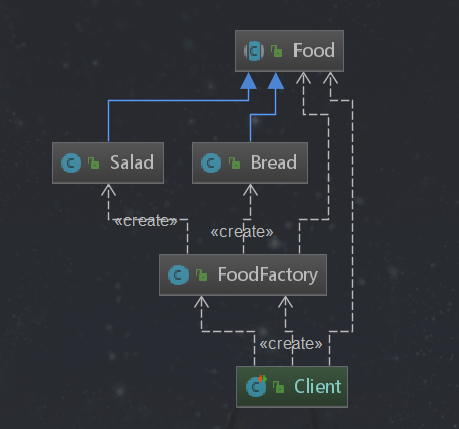

# 简单工厂

## 定义
  由一个工厂对象决定创建出哪一种产品类的实例
## 类型
  创建型，但不属于GOF23种设计模式。简单工厂模式严格意义上说并不是一种设计模式，它是一种编码上的风格和习惯
## 使用场景
 - 工厂类负责创建的对象比较少
 - 客户端（应用层）只知道传入工厂类的参数，对于如何创建对象（逻辑）不关心
## 优点
  只需要传入一个正确的参数，就可以获取所需要的对象而无须知道其创建细节
## 缺点
  简单工厂类的职责相对过重，增加新的产品需要修改工厂类的判断逻辑，违背了开闭原则。
  
## coding
### 未使用简单工厂模式的代码

**父类**
```java
public abstract class Video{
    public abstract void printVideo();
}
```  
**子类JavaVideo**
```java
@Slf4j
public class JavaVideo extends Video{
    @Override
    public void printVideo() {
       log.info("录制java视频");
    }
}
```
**子类PythonVideo**
```java
@Slf4j
public class PythonVideo extends Video{
    @Override
    public void printVideo() {
       log.info("录制python视频");
    }
}
```
**应用**
```java
public class client{
    @Test
    public void test(){
        Video video = new JavaVideo();
        video.printVideo();
    }
}
```

### 使用简单工厂模式



**工厂类**

```java
package com.design.pattern.simplefactory;

/**
 * 简单工厂
 *
 * @author shunhua
 * @date 2019-09-09
 */
public class FoodFactory {

    /**
     * 随着要产品增多，以下逻辑必须要修改
     * @param type  这里使用字符串根据类型进行创建不同的实例
     * @return
     */
    public Food createFood(String type){
        if("salad".equalsIgnoreCase(type)){
            return new Salad();
        }else if("bread".equalsIgnoreCase(type)){
            return new Bread();
        }
        return null;
    }

    /**
     *
     * @param c  这里使用反射创建不同的实例
     * @return
     */
    public Food createFood(Class c){
        Food food = null;
        try {
            food = (Food) Class.forName(c.getName()).newInstance();
        } catch (InstantiationException e) {
            e.printStackTrace();
        } catch (IllegalAccessException e) {
            e.printStackTrace();
        } catch (ClassNotFoundException e) {
            e.printStackTrace();
        }
        return food;
    }
}
```

**父类**
```java
package com.design.pattern.simplefactory;

/**
 * Food
 *
 * @author shunhua
 * @date 2019-09-09
 */
public abstract class Food {
   /**
    * 生产产品方法
    */
   public abstract void produce();
}
```

**子类面包**
```java
package com.design.pattern.simplefactory;

import lombok.extern.slf4j.Slf4j;

/**
 * Bread
 *
 * @author shunhua
 * @date 2019-09-09
 */
@Slf4j
public class Bread extends Food {

    @Override
    public void produce() {
        log.info("生产面包!");
    }
}
```

**子类沙拉**
```java
package com.design.pattern.simplefactory;

import lombok.extern.slf4j.Slf4j;

/**
 * Salad
 *
 * @author shunhua
 * @date 2019-09-09
 */
@Slf4j
public class Salad extends Food {

    @Override
    public void produce() {
        log.info("生成沙拉!");
    }
}
```

**客户端**
```java
package com.design.pattern.simplefactory;

import com.common.base.ObjectUtils;
import com.design.pattern.simplefactory.Bread;
import com.design.pattern.simplefactory.Food;
import com.design.pattern.simplefactory.FoodFactory;
import com.design.pattern.simplefactory.Salad;
import org.junit.Test;

/**
 * Client
 *
 * @author shunhua
 * @date 2019-09-09
 */
public class Client {

   /*
    非简单工厂模式 
    @Test
    public void simpleFactoryBefore(){
        // 这里需要依赖具体的生产类
        Food food = new Bread();
        Food food1 = new Salad();
        food.produce();
        food1.produce();
    }*/

   /*
    @Test
    public void simpleFactoryByType(){
        // 创建一个简单工厂
        FoodFactory factory = new FoodFactory();
        // 由工厂创建实例对象
        Food food = factory.createFood("salad");
        food.produce();
    }
    */
   
    @Test
    public void simpleFactoryByClass(){
        FoodFactory factory = new FoodFactory();
        Food food = factory.createFood(Bread.class);
        if(ObjectUtils.isNotNull(food)){
            food.produce();
        }
    }
}
```


## 简单工厂在源码中的使用

### jdk的Calendar源码解析

```java
// 这里使用的是静态方法，因为不需要再通过继承进行扩展。如需扩展就不使用static关键字
public static Calendar getInstance(TimeZone zone, Locale aLocale){
        return createCalendar(zone, aLocale);
    }

    private static Calendar createCalendar(TimeZone zone, Locale aLocale)
    {
        CalendarProvider provider = LocaleProviderAdapter.getAdapter(CalendarProvider.class, aLocale).getCalendarProvider();
        if (provider != null) {
            try {
                return provider.getInstance(zone, aLocale);
            } catch (IllegalArgumentException iae) {
                // fall back to the default instantiation
            }
        }
        Calendar cal = null;
        if (aLocale.hasExtensions()) {
            String caltype = aLocale.getUnicodeLocaleType("ca");
            if (caltype != null) {
                // 根据不同的类型创建日期对象
                switch (caltype) {
                case "buddhist":
                cal = new BuddhistCalendar(zone, aLocale);
                    break;
                case "japanese":
                    cal = new JapaneseImperialCalendar(zone, aLocale);
                    break;
                case "gregory":
                    cal = new GregorianCalendar(zone, aLocale);
                    break;
                }
            }
        }
        if (cal == null) {
            if (aLocale.getLanguage() == "th" && aLocale.getCountry() == "TH") {
                cal = new BuddhistCalendar(zone, aLocale);
            } else if (aLocale.getVariant() == "JP" && aLocale.getLanguage() == "ja"
                       && aLocale.getCountry() == "JP") {
                cal = new JapaneseImperialCalendar(zone, aLocale);
            } else {
                cal = new GregorianCalendar(zone, aLocale);
            }
        }
        return cal;
    }
```
### DriverManager源码解析（通过classForName获取）

```java
public static Connection getConnection(String url, 
    java.util.Properties info) throws SQLException {
  
        // Gets the classloader of the code that called this method, may 
    // be null.
    ClassLoader callerCL = DriverManager.getCallerClassLoader();

        return (getConnection(url, info, callerCL));
    }

//  Worker method called by the public getConnection() methods.
    private static Connection getConnection(
    String url, java.util.Properties info, ClassLoader callerCL) throws SQLException {
    java.util.Vector drivers = null;
        /*
     * When callerCl is null, we should check the application's
     * (which is invoking this class indirectly)
     * classloader, so that the JDBC driver class outside rt.jar
     * can be loaded from here.
     */
    synchronized(DriverManager.class) {     
      // synchronize loading of the correct classloader.
      if(callerCL == null) {
          callerCL = Thread.currentThread().getContextClassLoader();
       }    
    } 
     
    if(url == null) {
        throw new SQLException("The url cannot be null", "08001");
    }
    
    println("DriverManager.getConnection(\"" + url + "\")");
    
    if (!initialized) {
        initialize();
    }

    synchronized (DriverManager.class){ 
            // use the readcopy of drivers
        drivers = readDrivers;  
        }

    // Walk through the loaded drivers attempting to make a connection.
    // Remember the first exception that gets raised so we can reraise it.
    SQLException reason = null;
    for (int i = 0; i < drivers.size(); i++) {
        DriverInfo di = (DriverInfo)drivers.elementAt(i);
      
        // If the caller does not have permission to load the driver then 
        // skip it.
        if ( getCallerClass(callerCL, di.driverClassName ) != di.driverClass ) {
        println("    skipping: " + di);
        continue;
        }
        try {
        println("    trying " + di);
        Connection result = di.driver.connect(url, info);
        if (result != null) {
            // Success!
            println("getConnection returning " + di);
            return (result);
        }
        } catch (SQLException ex) {
        if (reason == null) {
            reason = ex;
        }
        }
    }
    
    // if we got here nobody could connect.
    if (reason != null)    {
        println("getConnection failed: " + reason);
        throw reason;
    }
    
    println("getConnection: no suitable driver found for "+ url);
    throw new SQLException("No suitable driver found for "+ url, "08001");
    }
```


