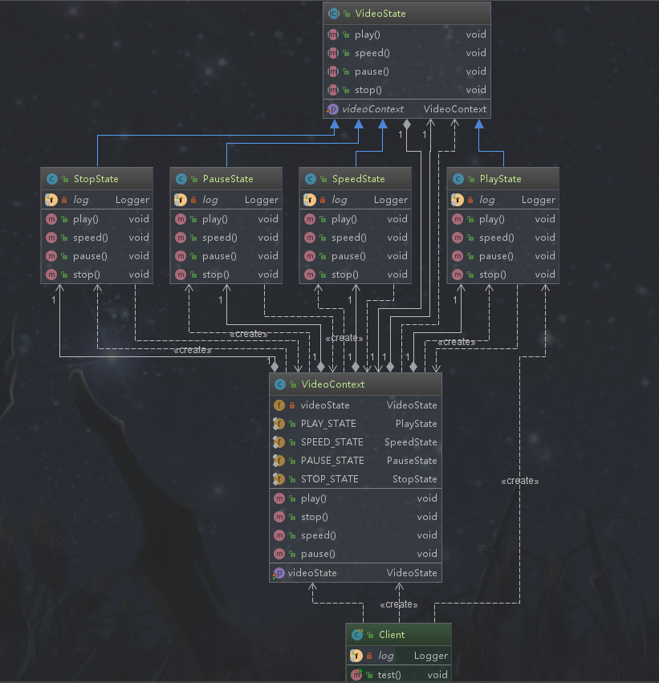

## 状态模式

### 定义

允许一个对象在其内部状态改变时，改变它的行为，如果行为不需要改变就不要改变。一般这个存在多个状态的对象是一个“上下文”。

### 类型

行为型

### 使用场景

```text
 一个对象存在多个状态（不同状态下行为不同），且状态可相互转换
```

### 优点

```text
1. 将不同的状态隔离
  - 每个状态都是一个类
2. 把各种状态的转换逻辑分布到State的子类中，减少相互间依赖  
3. 增加新的状态非常简单（也就增加一个状态类，如果还要满足相互转换，其他已有的状态内部也需要修改）
```

### 缺点

```text
状态多的业务场景导致类数目增加，系统变得复杂
```

### 相关的设计模式

*状态模式和享元模式*

```text
它们有时可以配合使用
```

### 简单需求
播放视频的时候，有播放状态、快进播放状态、暂停状态以及停止状态，这些状态大都可以相互转换。当状态发生改变时对应的播放行为也发生了改变。



*状态父类*
```java
package com.design.pattern.state;

import lombok.Setter;

/**
 * VideoState 视频状态
 *
 * @author shunhua
 * @date 2019-10-05
 */
@Setter
public abstract class VideoState {
    /**
     * 视频资源上下文
     */
    protected VideoContext videoContext;

    /**
     * 播放
     */
    public abstract void play();

    /**
     * 快进
     */
    public abstract void speed();

    /**
     * 暂停
     */
    public abstract void pause();

    /**
     * 停止
     */
    public abstract void stop();
    
}
```

*播放状态类*
```java
package com.design.pattern.state;

import lombok.extern.slf4j.Slf4j;

/**
 * PlayState  视频播放状态
 *
 * @author shunhua
 * @date 2019-10-05
 */
@Slf4j
public class PlayState extends VideoState {

    @Override
    public void play() {
      log.info("视频正常播放状态");
    }

    /**
     * 可切换快进
     */
    @Override
    public void speed() {
        super.videoContext.setVideoState(VideoContext.SPEED_STATE);
    }

    /**
     * 可切换暂停
     */
    @Override
    public void pause() {
      super.videoContext.setVideoState(VideoContext.PAUSE_STATE);
    }

    /**
     * 可切换停止
     */
    @Override
    public void stop() {
      super.videoContext.setVideoState(VideoContext.STOP_STATE);
    }
}
```

*暂停播放状态类*
```java
package com.design.pattern.state;

import lombok.extern.slf4j.Slf4j;

/**
 * PauseState  视频暂停状态
 *
 * @author shunhua
 * @date 2019-10-05
 */
@Slf4j
public class PauseState extends VideoState {

    @Override
    public void play() {
        super.videoContext.setVideoState(VideoContext.PLAY_STATE);
    }

    @Override
    public void speed() {
      super.videoContext.setVideoState(VideoContext.SPEED_STATE);
    }

    @Override
    public void pause() {
        log.info("视频暂停播放状态");
    }

    @Override
    public void stop() {
        super.videoContext.setVideoState(VideoContext.STOP_STATE);
    }
}
```

*快进播放状态类*
```java
package com.design.pattern.state;

import lombok.extern.slf4j.Slf4j;

/**
 * SpeedState 视频加速状态
 *
 * @author shunhua
 * @date 2019-10-05
 */
@Slf4j
public class SpeedState extends VideoState {

    @Override
    public void play() {
        super.videoContext.setVideoState(VideoContext.PLAY_STATE);
    }

    @Override
    public void speed() {
      log.info("视频快进播放状态");
    }

    @Override
    public void pause() {
      super.videoContext.setVideoState(VideoContext.PAUSE_STATE);
    }

    @Override
    public void stop() {
        super.videoContext.setVideoState(VideoContext.STOP_STATE);
    }
}
```

*停止状态类*
```java
package com.design.pattern.state;

import lombok.extern.slf4j.Slf4j;

/**
 * StopState 视频停止状态
 *
 * @author shunhua
 * @date 2019-10-05
 */
@Slf4j
public class StopState extends VideoState {

    @Override
    public void play() {
        super.videoContext.setVideoState(VideoContext.PLAY_STATE);
    }

    @Override
    public void speed() {
       log.info("停止状态不能快进");
    }

    @Override
    public void pause() {
       log.info("停止状态不能暂停");
    }

    @Override
    public void stop() {
        log.info("视频停止播放状态");
    }
}
```

*状态对应的上下文*
```java
package com.design.pattern.state;

import lombok.extern.slf4j.Slf4j;
import org.junit.Test;

/**
 * Client
 *
 * @author shunhua
 * @date 2019-10-04
 */
@Slf4j
public class Client {

    @Test
    public void test(){
        // 声明一个上下文
        VideoContext videoContext = new VideoContext();

        videoContext.setVideoState(new PlayState());
        log.info("当前状态：" + videoContext.getVideoState().getClass().getSimpleName());

        videoContext.pause();
        log.info("当前状态：" + videoContext.getVideoState().getClass().getSimpleName());

        videoContext.speed();
        log.info("当前状态：" + videoContext.getVideoState().getClass().getSimpleName());

        videoContext.stop();
        log.info("当前状态：" + videoContext.getVideoState().getClass().getSimpleName());

    }
}
```

### 状态模式在源码中的使用

>状态模式和业务场景更紧密相关，比如电商中订单的状态、根据业务设置状态机、办公系统流程的状态等，源码中相对很少使用


