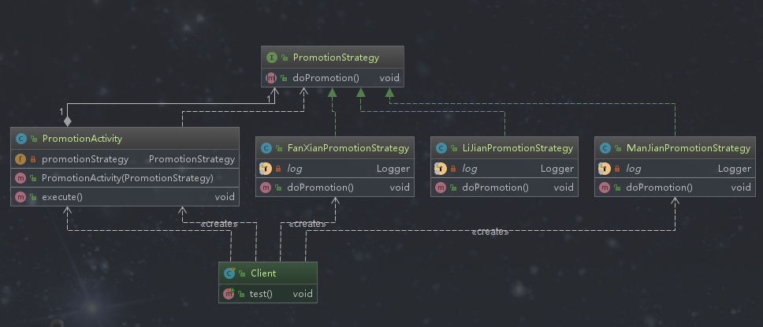

## 策略模式

### 定义

定义了算法家族，分别封装起来，让它们之间可以互相替换，此模式让算法的变化不会影响到使用算法的用户。即把不同的算法封装到不同的类里面，让它们之间可以相互替换， 应用层不会受到影响。

### 类型

行为型

### 使用场景

```text
1 系统有很多类，而他们的区别仅仅在于它们的行为不同
  - 使用策略模式就可以动态地让一个对象在多个行为中选择一种行为，也就是说我们把这个对象不同的行为放到不同的类里面，而每一种行为对应着一种策略
2 一个系统需要动态地在几种算法中选择一种
  - 这里算法就是策略，策略里面封装的就是一系列逻辑以及计算方式
```

### 优点

```text
1 符合开闭原则
  - 策略模式提供了对开闭原则的完美支持，我们可以在不修改原有系统的基础上选择具体的行为
2 避免使用多重条件转移语句
  - 大量的if...else, switch。 我们把具体的策略行为分离为一个一个的单独的类来替换if...else里面的逻辑，这样写也可以降低代码的耦合
3 提高算法的保密性和安全性  
  - 在使用的时候我们只知道策略的功能，不需要知道具体的细节。在具体的策略类中封装了不同的行为和算法以及相关的数据结构，对于应用层来说，是不需要知道内部的细节的。比如使用Dubbo的服务提供者，不需要知道内部逻辑的细节。
```

### 缺点

```text
1 应用层必须知道所有的策略类，并自行决定使用哪一个策略类
2 产生很多策略类
```

### 策略模式相关的设计模式

**策略模式和工厂模式**

```text
1 工厂模式是创建型的设计模式，策略模式是行为型的设计模式
2 工厂模式接受指令，创建符合要求的对象。策略模式接受创建好的对象，从而实现不同的行为
```

**策略模式和状态模式**

```text
1 使用策略模式的时候，应用层需要知道应该选择哪一种策略。在使用状态模式的时候，应用层是不需要关心具体的状态，这些状态会自动转换
2 如果系统中某个类的对象存在多种状态，不同状态下行为又有差异，而且这些状态可以发生转换时可以使用状态模式。如果系统中某个类的某种行为存在多种实现方式，如促销是个行为，这种行为就有多种实现方式，这种情况下应该使用策略模式。
```

### 简单需求

当当网在双十一或者618的时候会有很多的促销活动，促销是书籍的一个行为，这个促销行为有多种实现。

### 策略模式演练

#### 最基本的使用


**策略父类型（这里是接口的方式）**
```java
package com.design.pattern.strategy.base;

/**
 * PromotionStrategy 促销策略父类型
 * @author shunhua
 * @date 2019-09-28
 */
public interface PromotionStrategy {
    /**
     * 进行促销
     */
    void doPromotion();
}
```

**具体策略实例**

*发现策略*
```java
package com.design.pattern.strategy.base;

import lombok.extern.slf4j.Slf4j;

/**
 * FanXianPromotionStrategy 返现（支付金额达到一定数额进行返现到账号）策略
 *
 * @author shunhua
 * @date 2019-09-28
 */
@Slf4j
public class FanXianPromotionStrategy implements PromotionStrategy  {

    /**
     * 促销
     */
    @Override
    public void doPromotion() {
       log.info("返现促销，返回的金额存放到账号的余额中");
    }
}

```
*立减优惠策略*
```java
package com.design.pattern.strategy.base;

import lombok.extern.slf4j.Slf4j;

/**
 * LiJianPromotionStrategy 立减（下单立减一定的金额）策略
 *
 * @author shunhua
 * @date 2019-09-28
 */
@Slf4j
public class LiJianPromotionStrategy implements PromotionStrategy {

    /**
     * 促销
     */
    @Override
    public void doPromotion() {
        log.info("立减促销，书籍的价格直接减去立减活动设置的价格");
    }
}
```
*满减策略*
```java
package com.design.pattern.strategy.base;

import lombok.extern.slf4j.Slf4j;

/**
 * ManJianPromotionStrategy 满减（当支付金额达到规定的最低数就进行优惠）策略
 *
 * @author shunhua
 * @date 2019-09-28
 */
@Slf4j
public class ManJianPromotionStrategy implements PromotionStrategy {

    /**
     * 促销
     */
    @Override
    public void doPromotion() {
        log.info("满减促销，满200减50");
    }
}
```

**策略包装类**
```java
package com.design.pattern.strategy.base;

/**
 * PromotionActivity 促销活动，包装（使用）策略模式
 *
 * @author shunhua
 * @date 2019-09-28
 */
public class PromotionActivity {

    /**
     * 促销策略
     */
    private PromotionStrategy promotionStrategy;

    public PromotionActivity(PromotionStrategy promotionStrategy){
        this.promotionStrategy = promotionStrategy;
    }

    /**
     * 执行具体的促销策略
     */
    public void execute(){
        promotionStrategy.doPromotion();
    }
}
```

**应用层**
```java
package com.design.pattern.strategy.base;

import com.design.pattern.strategy.base.FanXianPromotionStrategy;
import com.design.pattern.strategy.base.ManJianPromotionStrategy;
import com.design.pattern.strategy.base.PromotionActivity;
import org.junit.Test;

/**
 * Client
 *
 * @author shunhua
 * @date 2019-09-28
 */
public class Client {

    @Test
    public void test(){
        /**
         * 618满减活动策略
         */
        PromotionActivity activity618 = new PromotionActivity(new ManJianPromotionStrategy());

        /**
         * 双11 返现活动策略
         */
        PromotionActivity activity11 = new PromotionActivity(new FanXianPromotionStrategy());

        activity618.execute();
        activity11.execute();
    }
}
```

**小结**

```text
这是策略模式的简单使用，整体上扩展性比较好，想增加策略很方便。
```

#### 基本使用演进

**应用层**
```java
package com.design.pattern.strategy.v1;

import org.junit.Test;
import org.springframework.util.ObjectUtils;

/**
 * Client
 *
 * @author shunhua
 * @date 2019-09-28
 */
public class Client {

    @Test
    public void test(){
        PromotionActivity activity ;
       // 应用层参数
        String promotion = "FANXIAN";
        switch (promotion){
            case "FANXIAN" :
                activity = new PromotionActivity(new FanXianPromotionStrategy());
                break;
            case "LIJIAN":
                activity = new PromotionActivity(new LiJianPromotionStrategy());
                break;
            case "MANJIAN":
                activity = new PromotionActivity(new ManJianPromotionStrategy());
                break;
            default:
                activity = null;
        }
        if(!ObjectUtils.isEmpty(activity)){
            activity.execute();
        }
    }
}
```
**小结**
```text
这种方式和应用交互容易使代码过于臃肿，因为每次需要的时候都会创建策略对象和包装策略的对象，并且过多的选择判断，
整个代码看起来不优雅。
```

#### 优化后版本

**策略工厂**

```java
package com.design.pattern.strategy.v2;

import java.util.Map;
import java.util.concurrent.ConcurrentHashMap;

/**
 * PromotionStrategyFactory 促销策略工厂
 *
 * @author shunhua
 * @date 2019-09-28
 */
public class PromotionStrategyFactory {
    /**
     * 策略集合
     */
    private final static Map<String,PromotionStrategy> PROMOTION_STRATEGY_MAP = new ConcurrentHashMap<>();

    /**
     * 类加载的时候就开始创建对象
     */
    static {
        PROMOTION_STRATEGY_MAP.put(PromotionKey.LIJIAN_STRATEGY,new LiJianPromotionStrategy());
        PROMOTION_STRATEGY_MAP.put(PromotionKey.FANXIAN_STRATEGY,new FanXianPromotionStrategy());
        PROMOTION_STRATEGY_MAP.put(PromotionKey.MANJIAN_STRATEGY,new ManJianPromotionStrategy());
    }

    /**
     * 单例的
     */
    private PromotionStrategyFactory(){}

    /**
     * 根据策略模式名获取对应的策略
     * @param strategy
     * @return
     */
    public static PromotionStrategy getPromotionStrategy(String strategy){
        return PROMOTION_STRATEGY_MAP.get(strategy);
    }


    private interface PromotionKey{
        /**
         * 立减策略
         */
        String LIJIAN_STRATEGY = "LIJIAN";
        /**
         * 满减策略
         */
        String MANJIAN_STRATEGY = "LIJIAN";
        /**
         * 返现策略
         */
        String FANXIAN_STRATEGY = "FANXIAN";
    }

}
```
**应用层**
```java
package com.design.pattern.strategy.v2;
import org.junit.Test;
import org.springframework.util.ObjectUtils;

/**
 * Client
 *
 * @author shunhua
 * @date 2019-09-28
 */
public class Client {

    @Test
    public void test(){

       // 应用层参数
        String promotion = "FANXIAN";
        // 使用工厂模式
        PromotionActivity activity = new PromotionActivity(PromotionStrategyFactory.getPromotionStrategy(promotion));
        if(!ObjectUtils.isEmpty(activity)){
            activity.execute();
        }
    }
}
```
**小结**
```text
1. 使用策略工厂防止策略对象频繁创建
2. 策略模式常常结合单例、工厂以及享元模式等使用
```
### 策略模式源码解析

**jdk的Comparator**

```text
Comparator就是一个比较策略接口，它有很多的实现，也支持自定义策略，这些策略实现就是一个个策略。
```
```java
   /**
     * 排序会根据具体的排序策略执行
     * @since 1.8
     */
 @SuppressWarnings("unchecked")
 public static <T> void parallelSort(T[] a, Comparator<? super T> cmp) {
        if (cmp == null)
            cmp = NaturalOrder.INSTANCE;
        int n = a.length, p, g;
        if (n <= MIN_ARRAY_SORT_GRAN ||
            (p = ForkJoinPool.getCommonPoolParallelism()) == 1)
            TimSort.sort(a, 0, n, cmp, null, 0, 0);
        else
            new ArraysParallelSortHelpers.FJObject.Sorter<T>
                (null, a,
                 (T[])Array.newInstance(a.getClass().getComponentType(), n),
                 0, n, 0, ((g = n / (p << 2)) <= MIN_ARRAY_SORT_GRAN) ?
                 MIN_ARRAY_SORT_GRAN : g, cmp).invoke();
    }

```
**Spring的Resource**

```text
Resource是资源访问接口，它就是一个资源访问相关的策略接口，它有很多的实现类，也就意味着有很多访问资源的策略。
```
```java

package org.springframework.core.io;

import java.io.File;
import java.io.IOException;
import java.net.URI;
import java.net.URL;
import java.nio.channels.Channels;
import java.nio.channels.ReadableByteChannel;
import org.springframework.lang.Nullable;

public interface Resource extends InputStreamSource {
    boolean exists();

    default boolean isReadable() {
        return this.exists();
    }

    default boolean isOpen() {
        return false;
    }

    default boolean isFile() {
        return false;
    }

    URL getURL() throws IOException;

    URI getURI() throws IOException;

    File getFile() throws IOException;

    default ReadableByteChannel readableChannel() throws IOException {
        return Channels.newChannel(this.getInputStream());
    }

    long contentLength() throws IOException;

    long lastModified() throws IOException;

    Resource createRelative(String var1) throws IOException;

    @Nullable
    String getFilename();

    String getDescription();
}

```

**Spring的InstantiationStrategy**

```text
Spring初始化策略接口，它的实现类：SimpleInstantiationStrategy和CglibSubclassingInstantiationStrategy初始化策略
```

