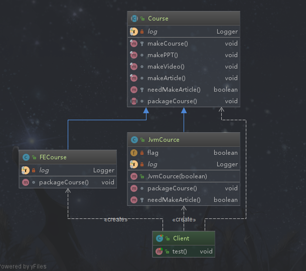

# 模版方法模式

## 定义

定义了一个算法的骨架，并允许子类为一个或多个步骤提供实现。模版方法使得子类可以在不改变算法结构的情况下，重新定义算法的某些步骤。

##  类型

行为型

## 使用场景

```text
◆ 各子类中公共的行为被提取出来并集中到一个公共父类中，从而避免代码重复
◆ 一次性实现一个算法的不变的部分，并将可变的行为留给子类来实现
```

## 优点

```text
◆提高复用性（将相同代码部分放到抽象父类中）
◆提高扩展性
◆符合开闭原则
```

## 缺点

```text
◆继承关系自身缺点，如果父类添加新的抽象方法，所有子类都要改一遍
◆类数目增加
◆增加了系统实现的复杂度
```

## 模版方法扩展

> 模版方法中有一个定义：钩子方法。它提供了缺省的行为，子类可以在必要时进行扩展，利用它和父类交互。即构造方法是这个模版对子类更进一步的开放以及扩展。

## 相关的设计模式

**模版方法模式和工厂方法模式**

工厂方法是模版方法的一种特殊实现

**模版方法模式和策略模式**

模版方法模式不改变算法流程，策略模式可以改变算法流程，并且策略方法之间是可以相互替换的。策略模式的目的是使不同的算法可以相互替换，并且不影响应用层客户端的使用。模板方法模式是针对定义一个算法的流程，将一些不太一样的具体步骤交给子类去实现。

## 简单需求
某机构要制作一门课程，制作这个课程需要一定的步骤，由于课程的种类不同可能某个步骤不同，但是整体步骤都是一致的。

## 模版方法演练



*抽象课程类*

```java
package com.design.pattern.template;

import lombok.extern.slf4j.Slf4j;

/**
 * Course  课程抽象类
 *
 * @author shunhua
 * @date 2019-09-27
 */
@Slf4j
public abstract class Course {

    /**
     * 模版方法 定义流程的
     * 1 该方法的流程是固定的，有些步骤的细节可能因子类不同
     * 2 该方法必须申明为final，子类不能重写。
     */
    protected final void makeCourse(){
        // 制作PPT
        makePPT();
        // 制作视频
        makeVideo();
        // 通过构造方法实现所需逻辑
        if(needMakeArticle()){
            // 编写手稿
            makeArticle();
        }
        // 打包课程上线
        packageCourse();
    }

    /**
     * 制作PPT是共有的方法，因此是固定的，子类不需要有自己的实现
     */
    final void makePPT(){
       log.info("制作ppt");
    }

    /**
     * 制作视频是共有的方法，因此是固定的，子类不需要有自己的实现
     */
    final void makeVideo(){
        log.info("制作视频");
    }

    /**
     * 编写手记，这个是固定的不需要之类有自己的实现，不过它不一定是共有的，需要看情况
     */
    final void makeArticle(){
        log.info("编写手记");
    }

    /**
     * 钩子方法  子类可以重写用来跟父类交互的。默认是false，不需要手记
     */
    protected boolean needMakeArticle(){
        return false;
    }

    /**
     * 打包课程的方法，不同的课程可能包装的不一样，根据子类情况重写
     */
    abstract void packageCourse();

}
```

*课程类1*
```java
package com.design.pattern.template;

import lombok.extern.slf4j.Slf4j;

/**
 * FECourse
 *
 * @author shunhua
 * @date 2019-09-27
 */
@Slf4j
public class FECourse extends Course {

    /**
     * 重写打包课程的方法
     */
    @Override
    void packageCourse() {
        log.info("提供前端课程的源代码和图片素材");
    }
}
```

*课程类2*
```java
package com.design.pattern.template;

import lombok.extern.slf4j.Slf4j;

/**
 * JvmCource
 *
 * @author shunhua
 * @date 2019-09-27
 */
@Slf4j
public class JvmCource extends Course {

    private boolean flag = Boolean.FALSE;

    /**
     * 通过构造方法设置钩子方法的参数，把钩子方法开放给客户端更加灵活
     *
     * @param flag
     */
    public JvmCource(boolean flag){
        this.flag = flag;
    }

    @Override
    void packageCourse() {
        log.info("Jvm课程提供调优工具软件包");
    }

    /**
     * 使用钩子方法来和父类交互，增加自己的逻辑
     * @return
     */
    @Override
    protected boolean needMakeArticle() {
        return flag;
    }
}
```

*客户端*
```java
package com.design.pattern.template;

import org.junit.Test;

/**
 * Client
 *
 * @author shunhua
 * @date 2019-09-27
 */
public class Client {

    @Test
    public void test(){

        Course jvmCourse = new JvmCource(Boolean.TRUE);
        jvmCourse.makeCourse();

        Course feCourse = new FECourse();
        feCourse.makeCourse();

    }
}
```

## 模版方法模式源码解析

#### AbstractList(父)-ArrayList(子)

*AbstractList*

```java
public abstract class AbstractList<E> extends AbstractCollection<E> implements List<E> {

//get方法为抽象方法，完全交给子类去实现

abstract public E get(int index);

}
```
*ArrayList*
```java
public class ArrayList<E> extends AbstractList<E>
        implements List<E>, RandomAccess, Cloneable, java.io.Serializable
{
//子类来实现get方法
 public E get(int index) {
        rangeCheck(index);

        return elementData(index);
    }
}
```

>同理：AbstractSet、AbstractMap同样采用了模版方法模式

#### HttpServlet

```text
我们一般继承HttpServlet，然后重写doGet或者doPost等doXxx方法，HttpServlet中定义了一套模版，只要覆写这些方法即可
```
```java
 protected void service(HttpServletRequest req, HttpServletResponse resp) throws ServletException, IOException {
	
    String method = req.getMethod();

	if (method.equals(METHOD_GET)) {
	    long lastModified = getLastModified(req);
	    if (lastModified == -1) {
		// servlet doesn't support if-modified-since, no reason
		// to go through further expensive logic
		doGet(req, resp);
	    } else {
		long ifModifiedSince = req.getDateHeader(HEADER_IFMODSINCE);
		if (ifModifiedSince < (lastModified / 1000 * 1000)) {
		    // If the servlet mod time is later, call doGet()
                    // Round down to the nearest second for a proper compare
                    // A ifModifiedSince of -1 will always be less
		    maybeSetLastModified(resp, lastModified);
		    doGet(req, resp);
		} else {
		    resp.setStatus(HttpServletResponse.SC_NOT_MODIFIED);
		}
	    }

	} else if (method.equals(METHOD_HEAD)) {
	    long lastModified = getLastModified(req);
	    maybeSetLastModified(resp, lastModified);
	    doHead(req, resp);

	} else if (method.equals(METHOD_POST)) {
	    doPost(req, resp);
	    
	} else if (method.equals(METHOD_PUT)) {
	    doPut(req, resp);	
	    
	} else if (method.equals(METHOD_DELETE)) {
	    doDelete(req, resp);
	    
	} else if (method.equals(METHOD_OPTIONS)) {
	    doOptions(req,resp);
	    
	} else if (method.equals(METHOD_TRACE)) {
	    doTrace(req,resp);
	    
	} else {
	    //
	    // Note that this means NO servlet supports whatever
	    // method was requested, anywhere on this server.
	    //

	    String errMsg = lStrings.getString("http.method_not_implemented");
	    Object[] errArgs = new Object[1];
	    errArgs[0] = method;
	    errMsg = MessageFormat.format(errMsg, errArgs);
	    
	    resp.sendError(HttpServletResponse.SC_NOT_IMPLEMENTED, errMsg);
	}
    
  }
    
```