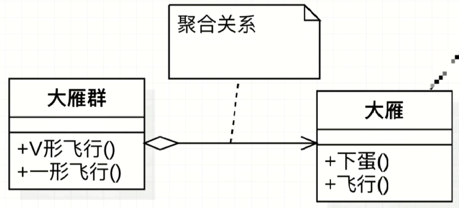
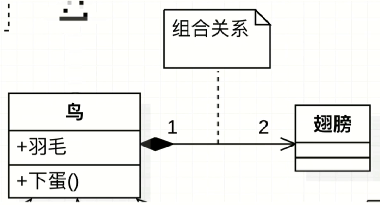

# UML概述


## 定义

统一建模语言（缩写UML），非专利的第三代建模和规约语言

## 特点

1. UML是一种开放的方法
2. UML用于说明、可视化、构建和编写一个正在开发的面向对象的、软件密集系统的制品的开放方法
3. UML展现了一系列最佳工程的实践，这些最佳实践在对大规模，复杂系统进行建模方面，特别是在软件架构层面已经被验证有效

## UML分类

1. 结构式图形

   强调的是系统式的建模，具体包含静态图（*类图*、对象图、包图）、实现图（组件图、部署图）、剖面图以及复合结构图

2. 行为式图形

    强调系统模型中触发的事件，具体包含活动图、状态图以及用例图

3. 交互式图形

   属于行为式图形子集合，强调系统模型中资源流程。具体包含通信图、交互概念图、*时序图*  以及时间图

   ​

## UML类图

用于表示类、接口、实例等之间相互的静态关系。虽然名字叫类图，但类图中并不只有类，还可能包括权限、属性、方法等

## UML记忆方式

```text
1. uml箭头：从子类指向父类，只有知道对方信息时才能指向对方方向
2. 空心三角箭头：继承或实现，实线-继承：积极的，强关联，关联，通常一个类中有一个类的对象做属性；虚线-实现：消极的，弱关联，依赖
3. 空心菱形：聚合，（注：可以看作一个盘子，可以放很多相同的东西（箭头方向所指的类），聚在一起。是has a的关系）弱关联
4. 实心菱形：组合，（注：代表器皿里有实体结构存在，组合起来成为一个。是contains-a的关系）强关联
```

1. uml箭头：从子类指向父类，定义子类时需要通过*extends*关键字指定父类，只有知道对方信息时才能指向对方方向

2. 实线-继承 | 虚线-实现

   

   ​

   3. 空心菱形-聚合

      

   4. 实心菱形-组合

      

   5. 组合关系中常见的数字表达

         ``` tex
   ◆常见数字表达及含义，假设有A类和B类，数字标记在A类侧
   ◆0..1：0或1个实例    在系统某一时刻，b的实例可以与0个或1个A实例相关
   ◆0..*：0或多个实例　  在系统某一时刻，b的实例可以与0个或多个A实例相关
   ◆1..1：1个实例.       b的实例可以和1个A实例相关
   ◆1只能有一个实例.     b的实例可以和1个A实例相关
   ◆1..*：至少有一个实例.　　b实例可以与一个或多个A实例相关
         ```


## UML时序图

1. 是显示对象之间交互的图，这些对象是按照时间顺序排列的

2. 时序图中 包含的建模元素

   对象（Actor）、生命线（lifeline）、控制焦点（Focus of control）、消息（Message）等

3. 时序图示例

   

   ``` tex
   竖线代表生命线

   对象：c：client ，s：server，d：device 代表实例

   消息：箭头代表的元素(open,work等)

   竖矩形代表实例处于某种活动中，

   实线实心箭头：代表方法调用，同步调用

   实线非实心箭头：代表异步调用

   虚线：代表返回
   ```

## UML类图讲解

``` tex
+　　　　公共方法

-　　　　private权限

#　　　　protected权限 包内和包外继承的子类都能引用

~　　　　default权限（包权限）只有包内能引用

下划线　  静态 Static

斜体　　  抽象类（或抽象方法）（包含抽象方法的必是抽象类）（类和至少一个方法都是斜体）

方法　　  可以带参，可以不带参

　　　　  返回值写到冒号后边，void不用加

注意：下图类名应该为斜体，因为有抽象方法study（），所以GeelyClass为抽象类，应该为斜体。
```


## UML整体讲解

``` tex
设计模式中的对象关系:

 依赖关系　　虚线箭头，箭头方向指向被依赖的部分
 组合关系　　实心菱形
 聚合关系　　空心菱形（想象成盘子，盛东西，盘子的多，另一方少）
 关联关系　　实线箭头，箭头指向被关联的部分  类与类的连接，（它使一个类知道另一个类的属性和方法，关联关  系一般用成员变量实现）
 继承　　　　空心三角形实线
 实现　　　　空心三角形虚线
注意：
 实现接口有两种方式，一种是棒棒糖的形式，另一种是虚线空心三角形的方式
```


## UML中部分对比

``` tex
1.1　　关联和依赖的对比
关联是a类中存在b类对象，企鹅类中有气候类的属性
依赖是a类成员方法中有b类的属性，动物新陈代谢方法中有水和空气的属性，只有调这个方法的时候，才可能临时用一下
1.2　　组合和聚合的对比
组合有相同的生命周期，鸟有翅膀，鸟死了，翅膀不复存在
大雁群有大雁，一只大雁挂了，大雁群不会消失
1.3　　继承和实现的对
实线：继承
虚线：实现
```


