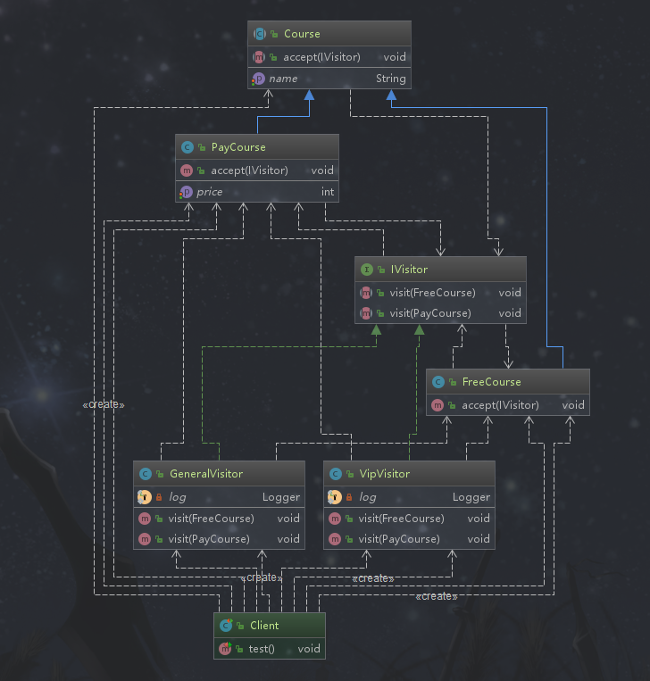

## 访问者模式

### 定义

封装作用于某数据结构(如List/Set/Map等)中的各元素的操作。可以在不改变各元素的类的前提下，定义作用于这些元素的操作。*即当访问某个资源时，不去修改资源本身而是定义访问资源的操作*

### 类型

行为型

### 使用场景

```text
1. 一个数据结构如（List/Set/Map等）包含很多类型对象
2. 数据结构于数据操作分离
```

### 优点

```text
增加新的操作很容易，即增加一个新的访问者
```

### 缺点

```text
1. 增加新的数据结构困难，需要修改的地方比较多
2. 具体元素变更比较麻烦
  - 增加或者删除元素里面的属性都算变更
```

### 相关的设计模式

*访问者模式和迭代器模式*

```text
1. 它们都是在某种数据结构上进行处理
2. 访问者模式主要对保存在数据结构中的元素进行某种特定的处理，迭代器用于逐个遍历保存在数据结构中的一些元素
```

### 简单需求
网络课程有免费的也有付费的，免费的课程普通用户都可以访问，付费的课程需要购买称为Vip用户才能访问。相同的资源不同的用户身份，访问的结果不同

### 访问者模式演练
>当访问某个资源时，不去修改资源本身而是定义访问资源的操作。相同的资源不同的访问身份，产生不同的操作行为



*抽象课程资源*
```java
package com.design.pattern.visitor;

import lombok.Getter;
import lombok.Setter;

/**
 * Course 被访问的资源
 * 
 * 不改变Course,而是定义访问Course的操作，这里体现在IVisitor的方法上
 *
 * @author shunhua
 * @date 2019-10-05
 */
@Getter
@Setter
public abstract class Course {
    /**
     * 课程名称
     */
    private String name;

    /**
     * 接受访问  把访问者传入
     * @param visitor
     */
    public abstract void accept(IVisitor visitor);
    
}
```
*免费课程资源*
```java
package com.design.pattern.visitor;

/**
 * FreeCourse
 *
 * @author shunhua
 * @date 2019-10-05
 */
public class FreeCourse extends Course {

    /**
     * 接受访问
     * @param visitor
     */
    @Override
    public void accept(IVisitor visitor) {
        visitor.visit(this);
    }
}
```

*付费课程资源*
```java
package com.design.pattern.visitor;

import lombok.Getter;
import lombok.Setter;

/**
 * PayCourse
 *
 * @author shunhua
 * @date 2019-10-05
 */
@Getter
@Setter
public class PayCourse extends Course {
    /**
     * 价格
     */
    private int price;

    /**
     * 接受访问
     * @param visitor
     */
    @Override
    public void accept(IVisitor visitor) {
        visitor.visit(this);
    }
}
```

*访问者抽象*

```java
package com.design.pattern.visitor;

/**
 * IVisitor 访问接口
 *
 * 这里定义了访问资源的操作，具体的访问细节体现在实现类中，不同的实现类对相同的资源产生不同的操作行为，这是访问者的核心
 *
 * @author shunhua
 * @date 2019-10-05
 */
public interface IVisitor {

    /**
     * 访问免费课程
     * @param freeCourse
     */
    void visit(FreeCourse freeCourse);

    /**
     * 访问付费课程
     * @param payCourse
     */
    void visit(PayCourse payCourse);

}

```

*普通访问者*
```java
package com.design.pattern.visitor;

import lombok.extern.slf4j.Slf4j;

/**
 * GeneralVisitor 普通访问者
 *
 * @author shunhua
 * @date 2019-10-05
 */
@Slf4j
public class GeneralVisitor implements IVisitor {

    /**
     * 访问免费课程
     * @param freeCourse
     */
    @Override
    public void visit(FreeCourse freeCourse) {
        log.info("免费课程名：" + freeCourse.getName());
    }

    /**
     * 访问付费课程
     * @param payCourse
     */
    @Override
    public void visit(PayCourse payCourse) {
       log.info("这是付费课程，你还没有购买，没有访问权限");
    }
}
```

*Vip访问者*
```java
package com.design.pattern.visitor;

import lombok.extern.slf4j.Slf4j;

/**
 * VipVisitor Vip访问者
 *
 * @author shunhua
 * @date 2019-10-05
 */
@Slf4j
public class VipVisitor implements IVisitor{

    /**
     * 访问免费课程
     * @param freeCourse
     */
    @Override
    public void visit(FreeCourse freeCourse) {
         log.info("免费课程名：" + freeCourse.getName());
    }

    /**
     * 访问付费课程
     * @param payCourse
     */
    @Override
    public void visit(PayCourse payCourse) {
       log.info("付费课程名：" + payCourse.getName() + " 价格为：" + payCourse.getPrice());
    }
}
```

*客户端*
```java
package com.design.pattern.visitor;

import org.junit.Test;

import java.util.ArrayList;
import java.util.List;

/**
 * Client
 *
 * @author shunhua
 * @date 2019-10-05
 */
public class Client {

    @Test
    public void test(){
        List<Course> courseList = new ArrayList<>();

        FreeCourse freeCourse = new FreeCourse();
        freeCourse.setName("这是一个免费的课程");

        PayCourse payCourse = new PayCourse();
        payCourse.setName("这是一个付费的课程");
        payCourse.setPrice(300);

        courseList.add(freeCourse);
        courseList.add(payCourse);

        // 普通访问者
        GeneralVisitor generalVisitor = new GeneralVisitor();
        // Vip用户
        VipVisitor vipVisitor = new VipVisitor();

        System.out.println("//----------普通访问者----------------/");
        courseList.stream().forEach(course -> {
            course.accept(generalVisitor);
        });

        System.out.println("//----------vip用户------------------/");
        courseList.stream().forEach(course -> {
            course.accept(vipVisitor);
        });

    }
}
```
### 访问者模式在源码中的使用

*FileVisitor*
```java

package java.nio.file;

import java.nio.file.attribute.BasicFileAttributes;
import java.io.IOException;
import java.util.Objects;

/**
 *  资源是文件
 *
 * @since 1.7
 */

public class SimpleFileVisitor<T> implements FileVisitor<T> {
    /**
     * Initializes a new instance of this class.
     */
    protected SimpleFileVisitor() {
    }

    /**
     * Invoked for a directory before entries in the directory are visited.
     *
     * <p> Unless overridden, this method returns {@link FileVisitResult#CONTINUE
     * CONTINUE}.
     */
    @Override
    public FileVisitResult preVisitDirectory(T dir, BasicFileAttributes attrs)
        throws IOException
    {
        Objects.requireNonNull(dir);
        Objects.requireNonNull(attrs);
        return FileVisitResult.CONTINUE;
    }

    /**
     * Invoked for a file in a directory.
     *
     * <p> Unless overridden, this method returns {@link FileVisitResult#CONTINUE
     * CONTINUE}.
     */
    @Override
    public FileVisitResult visitFile(T file, BasicFileAttributes attrs)
        throws IOException
    {
        Objects.requireNonNull(file);
        Objects.requireNonNull(attrs);
        return FileVisitResult.CONTINUE;
    }

    /**
     * Invoked for a file that could not be visited.
     *
     * <p> Unless overridden, this method re-throws the I/O exception that prevented
     * the file from being visited.
     */
    @Override
    public FileVisitResult visitFileFailed(T file, IOException exc)
        throws IOException
    {
        Objects.requireNonNull(file);
        throw exc;
    }

    /**
     * Invoked for a directory after entries in the directory, and all of their
     * descendants, have been visited.
     *
     * <p> Unless overridden, this method returns {@link FileVisitResult#CONTINUE
     * CONTINUE} if the directory iteration completes without an I/O exception;
     * otherwise this method re-throws the I/O exception that caused the iteration
     * of the directory to terminate prematurely.
     */
    @Override
    public FileVisitResult postVisitDirectory(T dir, IOException exc)
        throws IOException
    {
        Objects.requireNonNull(dir);
        if (exc != null)
            throw exc;
        return FileVisitResult.CONTINUE;
    }
}

```

*BeanDefinitionVisitor*

```java
package org.springframework.beans.factory.config;

import java.util.LinkedHashMap;
import java.util.LinkedHashSet;
import java.util.List;
import java.util.Map;
import java.util.Set;

import org.springframework.beans.MutablePropertyValues;
import org.springframework.beans.PropertyValue;
import org.springframework.lang.Nullable;
import org.springframework.util.Assert;
import org.springframework.util.ObjectUtils;
import org.springframework.util.StringValueResolver;

/**
 *  资源：Bean的定义
 *  
 * @author Juergen Hoeller
 * @author Sam Brannen
 * @since 1.2
 * @see BeanDefinition
 * @see BeanDefinition#getPropertyValues
 * @see BeanDefinition#getConstructorArgumentValues
 * @see PropertyPlaceholderConfigurer
 */
public class BeanDefinitionVisitor {

	@Nullable
	private StringValueResolver valueResolver;


	/**
	 * Create a new BeanDefinitionVisitor, applying the specified
	 * value resolver to all bean metadata values.
	 * @param valueResolver the StringValueResolver to apply
	 */
	public BeanDefinitionVisitor(StringValueResolver valueResolver) {
		Assert.notNull(valueResolver, "StringValueResolver must not be null");
		this.valueResolver = valueResolver;
	}

	/**
	 * Create a new BeanDefinitionVisitor for subclassing.
	 * Subclasses need to override the {@link #resolveStringValue} method.
	 */
	protected BeanDefinitionVisitor() {
	}


	/**
	 * Traverse the given BeanDefinition object and the MutablePropertyValues
	 * and ConstructorArgumentValues contained in them.
	 * @param beanDefinition the BeanDefinition object to traverse
	 * @see #resolveStringValue(String)
	 */
	public void visitBeanDefinition(BeanDefinition beanDefinition) {
		visitParentName(beanDefinition);
		visitBeanClassName(beanDefinition);
		visitFactoryBeanName(beanDefinition);
		visitFactoryMethodName(beanDefinition);
		visitScope(beanDefinition);
		if (beanDefinition.hasPropertyValues()) {
			visitPropertyValues(beanDefinition.getPropertyValues());
		}
		if (beanDefinition.hasConstructorArgumentValues()) {
			ConstructorArgumentValues cas = beanDefinition.getConstructorArgumentValues();
			visitIndexedArgumentValues(cas.getIndexedArgumentValues());
			visitGenericArgumentValues(cas.getGenericArgumentValues());
		}
	}
 }
```